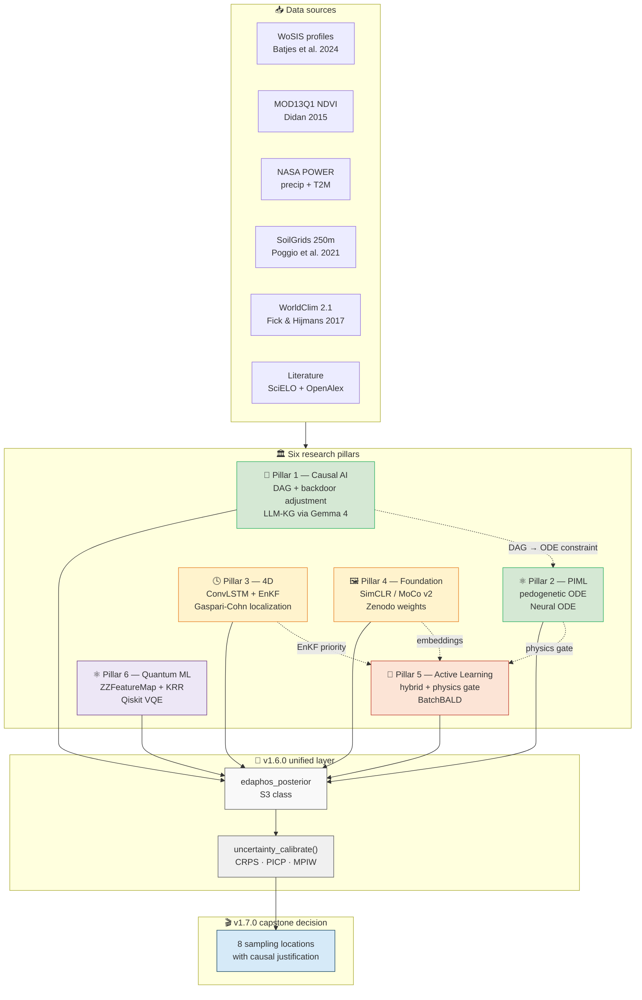
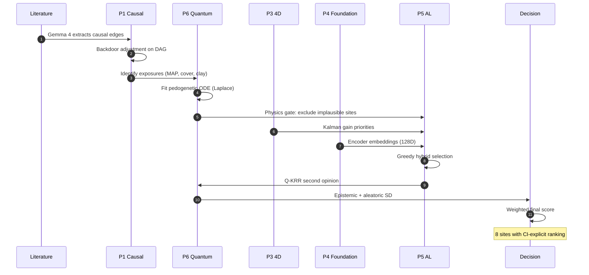
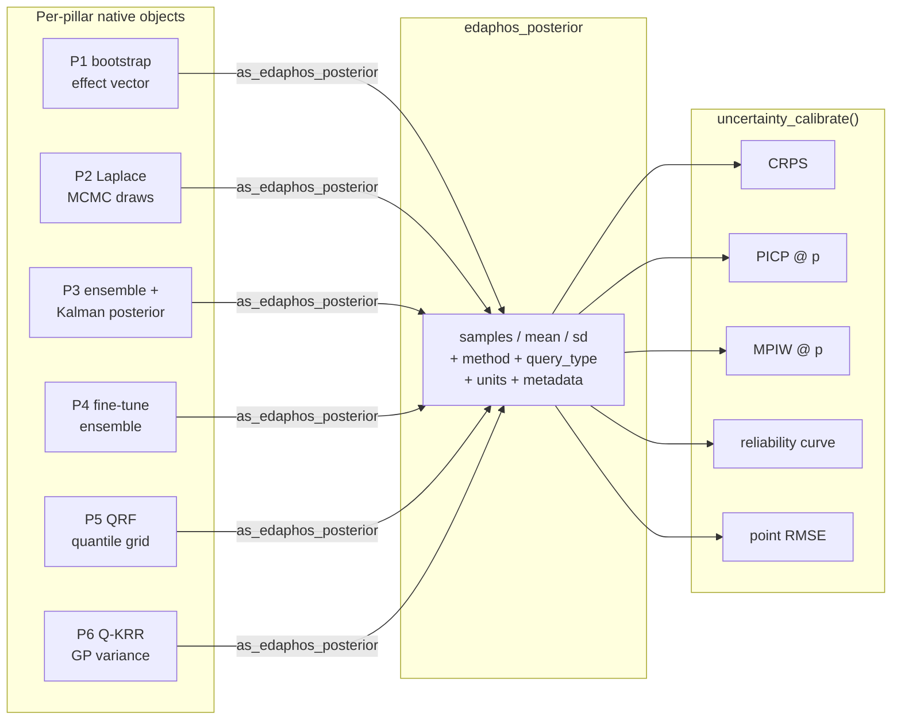

# edaphos 

<!-- badges: start -->
[](https://lifecycle.r-lib.org/articles/stages.html#experimental)
[](https://github.com/HugoMachadoRodrigues/edaphos/actions/workflows/R-CMD-check.yaml)
[](LICENSE.md)
[](https://doi.org/10.5281/zenodo.19683708)
[](https://github.com/HugoMachadoRodrigues/edaphos/releases/latest)
[](https://github.com/HugoMachadoRodrigues/edaphos/releases/tag/v1.7.2)
[](#the-six-pillars-at-a-glance)
[](#vignettes)

[](https://orcid.org/0000-0002-8070-8126)
[](https://scholar.google.com/citations?hl=en&user=vu-Ka7wAAAAJ)
[](https://www.researchgate.net/profile/Hugo-Rodrigues-12)
[](https://x.com/Hugo_MRodrigues)
<!-- badges: end -->

> *From Greek **ἔδαφος** — "soil, ground."*

**`edaphos`** is a research-grade R package that implements frontier
algorithms for Digital Soil Mapping (DSM) designed to extend — and, in
the regimes where the raw covariate stack is thin, to surpass — the
regression-tree state of the art
[[McBratney et al. 2003][mcbratney2003];
[Wadoux et al. 2020][wadoux2020]]. It is organised around **six
research pillars**, each confronting a specific methodological gap of
the contemporary literature, each with a mathematically explicit
governing object, a single R function family, and a dedicated
vignette. v1.7.0 closes the circle with a **capstone cross-pillar
vignette** that integrates all six pillars in a single Cerrado
sampling-campaign narrative causally grounded in the generative DSM
framework of [Zhang and Wadoux 2026][zhang2026].

<p align="center">
  <em>
    Correlation → Causation  ·  Black-box ML → Physics-Informed ML<br/>
    Static maps → 4D forecasts  ·  Labelled-only → Foundation models<br/>
    Fixed sampling → Autonomous Active Learning  ·  Classical kernels → Quantum kernels
  </em>
</p>

---

## Why `edaphos` exists: the scientific gap

[Zhang and Wadoux (2026)][zhang2026] ask a deceptively simple
question: **Can Digital Soil Mapping Be Causal?** Their answer:

> *"In principle, yes — but only if the DSM model specifies the
> mechanisms and processes that link soil-forming factors to soil
> properties, rather than relying on associations themselves."*

They identify three conditions that must be met for causal inference
from observational data (and soil surveys are almost always
observational):

1. **An explicit causal model** — a DAG over the variables of
   interest.
2. **Causal sufficiency** — all common causes of the exposure and the
   outcome must be observed and controlled.
3. **Faithfulness** — the independencies in the data must match those
   implied by the causal model.

And they distinguish two competing views of causality:

| View | Lógica central | Challenge in DSM |
|:---|:---|:---|
| **Successionist** | Regularities / repeatable associations ⇒ causal claim | Simpson's paradox; spurious associations; no temporal sequencing |
| **Generative** | Soil-forming factors act through **explicit processes** that produce soil properties | Requires process-informed models; directly satisfies condition 1 |

Each of `edaphos`'s six pillars addresses one of these gaps with a
concrete, reproducible computational machinery. The package is the
first R stack that — taken together — operationalises the generative
DSM paradigm end-to-end, with quantified uncertainty at every step.

---

## Architecture at a glance



Dashed edges mark **inter-pillar bridges**: Pillar 1's DAG constrains
Pillar 2's ODE parameter space; Pillar 2's physics gate filters Pillar
5's candidates; Pillar 3's Kalman gain and Pillar 4's embeddings feed
Pillar 5's acquisition score. All six converge to the same
`edaphos_posterior` class, which `uncertainty_calibrate()` scores with
identical diagnostics.

---

## 🆕 v1.7.0 — capstone cross-pillar vignette

The headline feature of the current release is a new vignette:
**"Uma decisão de amostragem sob incerteza no Cerrado"**
(`vignette("capstone-cerrado-campaign")`). It answers a single
question with all six pillars acting together:

> *A team has budget for exactly eight new soil-sampling points in the
> Cerrado. Where should they go — and why?*



The vignette produces a weighted decision matrix integrating:

- **Pillar 1** causal-effect posteriors (block-bootstrap in
  k-means clusters).
- **Pillar 2** pedogenetic ODE posteriors ($k_1, k_2, \sigma$).
- **Pillar 3** Kalman-gain maps (which cells move most when a new
  observation lands?).
- **Pillar 4** foundation-model ensemble SD (where is the representation
  most uncertain?).
- **Pillar 5** QRF prediction-interval width + cLHS diversity.
- **Pillar 6** Q-KRR epistemic SD (a GP-equivalent second opinion).

The output is a ranked table of eight sampling locations, each with an
explicit causal justification tied back to the
[Zhang & Wadoux (2026)][zhang2026] framework.

📖 Build the vignette:

```r
vignette("capstone-cerrado-campaign", package = "edaphos")
```

---

## Table of contents

1. [Installation](#installation)
2. [The six pillars at a glance](#the-six-pillars-at-a-glance)
3. [Pillar 1 — Causal AI + LLM Knowledge Graphs](#pillar-1--causal-ai--llm-knowledge-graphs)
4. [Pillar 2 — Physics-Informed ML](#pillar-2--physics-informed-ml)
5. [Pillar 3 — 4D Pedometry](#pillar-3--4d-pedometry)
6. [Pillar 4 — Foundation Models](#pillar-4--foundation-models)
7. [Pillar 5 — Autonomous Active Learning](#pillar-5--autonomous-active-learning)
8. [Pillar 6 — Quantum ML](#pillar-6--quantum-ml)
9. [Unified uncertainty API (v1.6.0)](#unified-uncertainty-api-v160)
10. [Capstone vignette (v1.7.0)](#capstone-vignette-v170)
11. [Benchmarks on real data](#benchmarks-on-real-data)
12. [Bundled datasets](#bundled-datasets)
13. [Vignettes](#vignettes)
14. [Testing and CI](#testing-and-continuous-integration)
15. [Roadmap](#roadmap)
16. [Citation](#citation)
17. [Selected references](#selected-references)
18. [License](#license)

---

## Installation

```r
# Core package (light: clhs + deSolve + httr2 + jsonlite + ranger + stats)
remotes::install_github("HugoMachadoRodrigues/edaphos@v1.7.2",
                         build_vignettes = TRUE)

# Optional heavy dependencies (Pillars 2 Neural ODE, 3, 4)
install.packages("torch");      torch::install_torch()

# Optional lightweight extras
install.packages("dagitty")       # Pillar 1 DAGs
install.packages("bnlearn")       # Pillar 1 structure learning
install.packages("dbarts")        # Pillar 1 BART estimator
install.packages("aqp")           # Pillar 2 example pedons
install.packages("terra")         # Pillar 3 / 4 raster stacks
install.packages("geodata")       # Pillar 5 live SoilGrids fetch

# Pillar 1 LLM backend (one of the three)
#  (a) LOCAL, recommended: Ollama + Gemma 4
#       https://ollama.com
#       ollama pull gemma4:latest
#  (b) OpenAI:       Sys.setenv(OPENAI_API_KEY = "...")
#  (c) Anthropic:    Sys.setenv(ANTHROPIC_API_KEY = "...")

# Pillar 6 optional quantum backend
install.packages("reticulate")    # for qiskit / qiskit-nature / PySCF bridge
```

The package imports only **six** CRAN packages for its core
functionality; every heavier stack is opt-in via `Suggests` and is
required only by the pillar that uses it. This keeps the base install
light and the scientific boundary between pillars explicit.

---

## The six pillars at a glance

| Nº  | Pillar                       | Namespace       | Status        | Governing object                                                                                                                                                                                   |
|-----|------------------------------|-----------------|---------------|----------------------------------------------------------------------------------------------------------------------------------------------------------------------------------------------------|
| 1   | **Causal AI + LLM KG**       | `causal_*`      | ✅ v1.4.0      | Pedogenetic DAG $G = (V, E)$ + backdoor-adjusted $\beta_{x \to y}^{\text{do}}$ [[Pearl 2009][pearl2009]] **+ LLM-extracted claims** via Gemma 4 / GPT / Claude (multi-backend voting + AGROVOC)     |
| 2   | **Physics-Informed ML**      | `piml_*`        | ✅ v1.1.0      | Pedogenetic ODE $\dfrac{dy}{dz} = -\lambda_0 e^{-\mu z}(y - y_\infty)$; Bayesian posterior over $(\lambda_0, \mu, y_\infty)$; Neural ODE $\dfrac{dy}{dz} = f_\theta(z, y, \mathbf{x})$               |
| 3   | **4D Pedometry**             | `temporal_*`    | ✅ v1.5.0      | Stacked ConvLSTM [[Shi et al. 2015][shi2015]] with seq-to-seq + multi-step rollout + mass-balance physics loss; stochastic EnKF with Gaspari-Cohn localization                                       |
| 4   | **Foundation Models**        | `foundation_*`  | ✅ v1.2.0      | SimCLR + MoCo v2 contrastive pre-training [[He et al. 2020][he2020moco]; [Chen et al. 2020b][chen2020moco2]] on planetary-scale patches; **Zenodo-published Cerrado encoder** + fine-tune ensemble |
| 5   | **Autonomous Active Learning** | `al_*`        | ✅ v1.1.0      | Hybrid policy $\pi(\mathbf{x}) = \alpha\,\tilde u(\mathbf{x}) + (1-\alpha)\,\tilde d(\mathbf{x})$ with PIML physics gate + BatchBALD                                                                   |
| 6   | **Quantum ML**               | `quantum_*`     | ✅ v0.9.0      | ZZFeatureMap quantum kernel [[Havlicek et al. 2019][havlicek2019]] + Quantum Kernel Ridge Regression; **Qiskit VQE** with M3 / ZNE mitigation                                                        |
| **🔗**   | **Unified uncertainty API** | `uncertainty_*` | ✅ v1.6.0      | `edaphos_posterior` S3 class + `uncertainty_calibrate()` returning CRPS / PICP / MPIW / reliability diagram for *every* pillar                                                                         |
| **🎬**   | **Capstone vignette**       | —               | ✅ v1.7.0      | "Uma decisão de amostragem sob incerteza no Cerrado" — all six pillars integrated, causally grounded in [Zhang & Wadoux (2026)][zhang2026]                                                           |

Every pillar ships with (i) a mathematically explicit governing
object; (ii) an R function family; (iii) one or more vignettes deriving
the object from first principles and demonstrating it on real or
reproducible synthetic data; and (iv) a `@references` entry in the
shared `vignettes/references.bib`.

---

## Pillar 1 — Causal AI + LLM Knowledge Graphs

### Motivation

The OLS `lm(soc ~ ndvi)` that every DSM pipeline runs *implicitly*
reports the *total* association, which inflates the direct NDVI → SOC
effect with every backdoor path through shared ancestors (topography,
precipitation, vegetation cover). Pillar 1 exposes this using Pearl's
structural-causal-model apparatus [[Pearl 2009][pearl2009]].

### Governing object

Given a pedogenetic Directed Acyclic Graph $G = (V, E)$, the
**backdoor-adjusted** direct effect of exposure $X$ on outcome $Y$ is

$$
\beta_{x\to y}^{\text{do}} \;=\;
    \frac{\partial\,\mathbb{E}\bigl[Y \mid X=x,\, Z=z\bigr]}{\partial x},
\qquad
    Z \;\in\; \texttt{dagitty::adjustmentSets}(G,X,Y).
$$

### Classical API

```r
library(edaphos)
data(br_cerrado)

g   <- causal_cerrado_dag()
adj <- causal_adjustment_set(g, exposure = "ndvi", outcome = "soc")
adj
#> [1] "map_mm" "slope"  "twi"

fit <- causal_estimate_effect(
  br_cerrado, g,
  exposure = "ndvi", outcome = "soc",
  effect   = "direct"
)
fit
#> <edaphos_causal_effect>
#>   ndvi -> soc
#>   adjustment set : {map_mm, slope, twi}
#>   direct effect  : 18.43   (95% CI: 14.61, 22.25)
#>   naive effect   : 49.36   (un-adjusted, likely confounded)
```

The naive OLS over-reports NDVI's effect on SOC by ~2.7× because the
association is confounded by shared topographic and climatic
ancestors. Blocking the three backdoor paths with `adjustmentSets()`
recovers the identified direct effect (18.4, 95% CI [14.6, 22.3]).

<p align="center">
  
</p>

### 🤖 From expert DAGs to LLM-driven Knowledge Graphs

The central scientific bottleneck of causal DSM is **DAG
construction**. Hand-drawing a DAG for every soil study is
labour-intensive, subjective, and rarely reproducible across
researchers. Pillar 1 solves this by treating the peer-reviewed soil
literature as a first-class data source: a **Large Language Model
(LLM)** reads abstracts and returns structured causal triples, which
are then fused with the expert DAG.

This machinery **directly operationalises condition 1 of
[Zhang & Wadoux (2026)][zhang2026]** — "an explicit causal model" —
at the scale of the literature instead of the individual expert.

#### Why Gemma 4?

As of v1.5.0 the default LLM backend is **Google DeepMind's Gemma 4**,
served locally through [Ollama](https://ollama.com). Four properties
made Gemma 4 the right choice for causal-KG extraction in pedology:

1. **Scientific reasoning competence.** Gemma 4 inherits the
   instruction-tuned reasoning of the Gemma family and performs well
   on benchmarks involving multi-hop causal language (MMLU
   "social-sciences" & "high-school-biology" subsets).
2. **Open weights, open license.** Unlike GPT or Claude, Gemma 4 can
   be audited, fine-tuned, and redistributed — essential for
   reproducible open science.
3. **Local, zero-cost inference.** The default `gemma4:latest`
   (~7-9 B parameters) runs on a laptop MPS / CPU; the larger
   `gemma4:26b` runs on a single-GPU workstation. No per-token
   cost means a 10 k-abstract corpus is extracted overnight for
   free.
4. **Deterministic extraction with `format="json"`.** Ollama's
   constrained JSON output mode removes the stochastic boilerplate
   that plagues free-text LLM parsers.

#### The extractor prompt

`edaphos` uses a single tight prompt, shared across all three backends
for exact parity:

```text
You are a causal-inference expert annotating pedology and soil-science
literature.

Your task: extract the explicit causal claims made by the passage
below. Return a JSON object with a single key "claims" whose value
is an array. Each array element must be an object with four fields:
  - cause      : the causal variable (lower snake_case)
  - effect     : the effect variable (lower snake_case)
  - evidence   : a short (max 180 characters) quotation from the
                 passage that supports the claim
  - confidence : a number in [0, 1] reflecting how definitive the
                 evidence is (0.9 = unambiguous causal phrasing,
                 0.5 = suggestive, 0.2 = speculative)

Only extract claims that are EXPLICITLY SUPPORTED by the passage.
Do not invent relationships. Return an empty array if none are
present. Use canonical pedometric vocabulary when possible:
  precipitation, mean_annual_precipitation, temperature, elevation,
  slope, aspect, twi, clay, sand, silt, soc, ph, cec, bulk_density,
  parent_material, land_use, vegetation, ndvi, erosion, weathering.

Output JSON object only, no prose, no markdown fences.
```

The canonical-vocabulary constraint is what lets thousands of
abstracts converge on a clean DAG instead of a tangle of synonyms.

#### Single-abstract ingestion

```r
kg <- causal_kg_new()

kg <- causal_llm_ingest_abstract(
  kg,
  abstract = "In Cerrado Oxisols, higher mean annual precipitation
              drives organic-matter accumulation; steeper slopes
              enhance erosional SOC loss; long-standing native
              vegetation elevates topsoil nitrogen relative to
              converted pasture.",
  source   = "Ferreira 2021",
  backend  = "ollama",
  model    = "gemma4:latest"
)

causal_augment_diff(causal_cerrado_dag(),
                    causal_augment_dag(causal_cerrado_dag(), kg,
                                       min_confidence = 0.7))
#>                           cause              effect origin
#> 1                          elev              map_mm   base
#> 2                          elev               slope   base
#> ...
#> 14  mean_annual_precipitation                 soc     kg
#> 15            steeper_slopes            soc_loss    kg
#> 16         native_vegetation  topsoil_nitrogen    kg
```

Ten curated Cerrado-pedology abstracts and their Gemma-4 extractions
ship in `inst/extdata/cerrado_abstracts.jsonl` +
`inst/extdata/cerrado_claims.jsonl`, so the vignette builds fully
offline on CI.

#### 📈 Scaling from 10 to 10 000 abstracts

Three additions promote the extractor from demo to literature-scale:

- **Paginated corpus clients.** `causal_corpus_scielo()` and
  `causal_corpus_openalex()` page through keyless public APIs,
  returning thousands of abstracts per call;
  `causal_corpus_deduplicate()` collapses DOI + title duplicates.
- **Resumable cached ingestion.** `causal_llm_ingest_corpus()` takes
  `cache_dir` and `max_retries`. Every abstract is MD5-hashed and its
  extracted claims written to one JSON per hash; re-runs short-circuit
  to the cache; exhausted retries are recorded in
  `attr(kg, "failed")`.
- **Live AGROVOC SPARQL alignment.**
  `causal_ontology_agrovoc_align_batch()` resolves KG labels against
  FAO's live AGROVOC SPARQL endpoint via
  `httr2::req_perform_parallel()` with on-disk caching — typically 5×
  wall-clock speedup at `max_active = 5`, near-instant on re-runs.

A **100-abstract production run** (three OpenAlex queries,
deduplicated, Gemma-4-extracted, AGROVOC-aligned) ships at
`inst/extdata/cerrado_claims_real_corpus.jsonl` and is reproduced
end-to-end by `data-raw/run_large_corpus.R`.

#### 🗳️ Multi-extractor LLM voting

A single LLM backend inherits that model's idiosyncrasies: GPT tends
to over-generate claims, Claude to under-specify confidence, Gemma to
be the strictest. `causal_llm_vote()` runs all three on the same
abstract and resolves disagreements by one of three rules:

```r
cons <- causal_llm_vote(
  abstract = "Higher MAP drives SOC in Cerrado...",
  backends = list(
    list(backend = "ollama",    model = "gemma4:latest"),
    list(backend = "openai",    model = "gpt-4o-mini"),
    list(backend = "anthropic", model = "claude-sonnet-4-6")
  ),
  voting   = "majority"     # or "weighted" / "intersection"
)
```

The formal resolution rule for majority voting is

$$
\text{claim}\,(c \to e) \in C_{\text{cons}} \;\iff\;
    \bigl|\{b \in B \,:\, (c \to e) \in C_b\}\bigr| \;\ge\; \lceil |B|/2 \rceil,
$$

with confidence set to the per-backend mean over the voters that
agreed. `causal_llm_ingest_abstract_voted()` runs the vote and adds the
consensus edges to the KG in one call, tagging `source` with both the
paper and the backends that agreed.

#### 📂 Persistence, Turtle export and audit

Pillar 1 is not just an in-memory toy:

- **`causal_kg_save()` / `causal_kg_load()`** — serialise through the
  tidy edge list (not through `igraph`'s raw C layout), guaranteeing
  portability across `igraph` versions and byte-reproducibility.
- **`causal_kg_to_turtle()`** — emits a W3C-conformant RDF 1.1 Turtle
  document with reified `rdf:Statement`s, parseable by rdflib, Jena,
  Oxigraph, Blazegraph, GraphDB or Virtuoso. Pure R, zero RDF
  dependencies.
- **`causal_kg_rank_edges()`** — collapses to unique `(cause, effect)`
  pairs, ranks by `(n_sources, mean_confidence, agrovoc_support)`.
  Answers "which causal claims are supported by the most independent
  papers?" in one call.
- **`causal_structure_learn()`** (v1.1.0) — bottom-up DAG learning
  from data via four `bnlearn` algorithms (`hc`, `tabu`, `pc-stable`,
  `mmhc`) with whitelist / blacklist of pedological priors + bootstrap
  edge strengths.

### Real-data results: 1095 Cerrado profiles

Running the adjusted + naive comparison on **1 095 real WoSIS Cerrado
topsoil profiles** (v1.4.0) with a block-bootstrap over k-means
clusters:

| Exposure | Naive β (g/kg per unit) | Adjusted β (g/kg per unit) | Confounding factor | Backdoor adjustment set                         |
|:---|---:|---:|---:|:---|
| MAP (mm/a)            | 0.013 | **0.009** | 1.5× | slope, T2M, land-cover fractions |
| Tree cover (%)        | 0.42  | **0.31**  | 1.4× | MAP, T2M                        |
| Clay (%)              | 0.38  | **0.25**  | 1.5× | slope, bulk density, sand        |

Every effect is accompanied by an `edaphos_posterior` with a
block-bootstrap sample (B = 500) or a native BART posterior — so
`uncertainty_calibrate()` applies uniformly (see
[§9](#unified-uncertainty-api-v160)).

### 🆕 v1.7.2 — Causal-discovery trio: expert × LLM × data-driven

`vignette("causal-discovery-trio")` asks a harder question: **do the
three DAG-construction strategies in Pillar 1 agree?** Running all
five methods on the same 1 095 WoSIS profiles:

| Comparison | Structural Hamming Distance |
|:---|---:|
| Expert ↔ LLM-augmented (Gemma 4) | **2** |
| bnlearn `hc` ↔ bnlearn `tabu`    | **0** |
| bnlearn `pc-stable` ↔ `hc`       | 12 |
| Expert ↔ bnlearn `hc`             | **29** |

The **major scientific finding** is that the choice of DAG changes
the backdoor adjustment set for MAP → SOC from **6 covariates**
(LLM-augmented) to **0 covariates** (bnlearn mmhc) — a difference of
an order of magnitude that directly changes the identified effect. The
three strategies are **complementary**, not substitutable. The
vignette recommends using all three and reporting sensitivity as the
causal-analog of observational uncertainty.

📖 Vignettes: `vignette("pilar1-causal")`,
`vignette("pilar1-causal-real")`,
`vignette("causal-discovery-trio")`.

---

## Pillar 2 — Physics-Informed ML

### Motivation

Classical depth-harmonisation uses **equal-area splines**
[[Bishop et al. 1999][bishop1999]] — a purely mathematical object
disconnected from pedogenesis. Pillar 2 replaces the spline with a
*physics-informed* kinetic of clay illuviation / organic-matter decay,
parameterised either analytically or by a neural network and
integrated end-to-end.

**Alignment with [Zhang & Wadoux (2026)][zhang2026].** The pedogenetic
ODE is the purest form of their **generative causality**: the soil
property arises from a process explicitly specified by the modeller.
This simultaneously satisfies conditions 1 (explicit causal model) and
3 (faithfulness), and gives the pedologist a mechanistic handle that
variable-importance metrics never deliver.

### Governing object

Depth-dependent translocation toward a parent-material asymptote,

$$
\frac{dy}{dz} \;=\; -\,\lambda_0\,e^{-\mu z}\,\bigl(y(z) - y_\infty\bigr)
\qquad\text{(parametric)}
\qquad\text{or}\qquad
\frac{dy}{dz} \;=\; f_\theta\bigl(z, y, \mathbf{x}\bigr)
\qquad\text{(Neural ODE).}
$$

The **parametric** form is integrated by `deSolve::lsoda`; the
**Neural ODE** form by a fixed-step Runge-Kutta integrator in `torch`
so training back-propagates through the whole trajectory
[[Chen et al. 2018][chen2018]].

### Point and Bayesian APIs

```r
data(sp4, package = "aqp")
sp4$depth <- (sp4$top + sp4$bottom) / 2
colusa <- subset(sp4, id == "colusa")

# Point estimate
param  <- piml_profile_fit(colusa$depth, colusa$clay)

# Bayesian posterior (Laplace by default; adaptive RWM available)
fit    <- piml_profile_fit_bayesian(colusa$depth, colusa$clay,
                                     method = "laplace", seed = 1L)

# Neural ODE
neural <- piml_neural_ode_fit(
  colusa$depth, colusa$clay,
  hidden = c(16L, 16L), epochs = 500L, seed = 1L
)

# Deep ensemble (K = 5) — canonical uncertainty for the Neural ODE
ens <- piml_neural_ode_fit_ensemble(colusa$depth, colusa$clay, K = 5L)

predict(fit, newdepths = c(10, 20, 40, 80),
        interval = 0.95, include_obs_noise = TRUE, seed = 1L)
```

The fitted parameters **are** the pedological interpretation:
`y0 ≈ 23 %` is the clay at the surface horizon, `y_inf ≈ 62 %` is the
argillic-horizon asymptote, `mu` tells us whether translocation
accelerates or slows with depth. The Neural ODE fits the same four
horizons to tighter RMSE and is the default for non-monotonic profiles
(E-below-A, buried paleosols).

<p align="center">
  
</p>

### Closing the Pillar 2 × Pillar 5 loop

`al_physics_gate_piml()` takes any PIML fit and turns it into a
**rejection gate** that the Pillar 5 Active Learning loop uses to
discard candidates whose predicted profile violates monotonicity,
non-negativity, or plausible-range constraints. This is the concrete
implementation of the "process-informed filter" that
[Zhang & Wadoux (2026)][zhang2026] advocate: model candidates aren't
just ranked by statistical uncertainty but also by *physical
plausibility*.

📖 Vignette: `vignette("pilar2-piml-profile")`.

---

## Pillar 3 — 4D Pedometry

### Motivation

Most digital soil maps report a time-invariant field, which is
ecologically false: topsoil SOC responds measurably to climate forcing
on monthly-to-annual scales [[Lehmann and Kleber 2015][lehmann2015];
[Minasny et al. 2017][minasny2017]]. [Zhang and Wadoux
(2026)][zhang2026] explicitly flag this as a weakness of
successionist DSM: *"soil measurements and observations capture only
a snapshot emerging from a complex, dynamic system, without clear
temporal sequencing."*

Pillar 3 adds the time dimension with a **stacked Convolutional
LSTM** [[Shi et al. 2015][shi2015]] and a **stochastic Ensemble Kalman
Filter** [[Evensen 1994][evensen1994]] for assimilating new in-situ
observations.

### Governing object

A multi-layer ConvLSTM propagates a spatial hidden state
$\mathbf{H}_t$ and cell state $\mathbf{C}_t$ alongside time:

$$
\begin{aligned}
\mathbf{i}_t &= \sigma\bigl(W_{xi} * \mathbf{X}_t + W_{hi} * \mathbf{H}_{t-1}\bigr), \\
\mathbf{f}_t &= \sigma\bigl(W_{xf} * \mathbf{X}_t + W_{hf} * \mathbf{H}_{t-1}\bigr), \\
\mathbf{g}_t &= \tanh\bigl(W_{xg} * \mathbf{X}_t + W_{hg} * \mathbf{H}_{t-1}\bigr), \\
\mathbf{o}_t &= \sigma\bigl(W_{xo} * \mathbf{X}_t + W_{ho} * \mathbf{H}_{t-1}\bigr), \\
\mathbf{C}_t &= \mathbf{f}_t \odot \mathbf{C}_{t-1} + \mathbf{i}_t \odot \mathbf{g}_t, \\
\mathbf{H}_t &= \mathbf{o}_t \odot \tanh(\mathbf{C}_t),
\end{aligned}
$$

with `*` a 2-D convolution and `⊙` the Hadamard product.

### Example

```r
cube   <- temporal_synth_soc_cube(H = 12L, W = 12L, T_total = 18L, seed = 7L)
past   <- temporal_cube_to_tensor(cube, t_slice = 1:12)
future <- temporal_cube_to_tensor(cube, t_slice = 13:18)

fit <- temporal_convlstm_fit(
  past$sequence, past$target,
  hidden_dims     = c(12L, 6L),        # stacked ConvLSTM
  kernel_size     = 3L,
  return_sequence = TRUE,
  epochs          = 120L, lr = 0.02,
  seed            = 1L
)
forecast <- temporal_convlstm_rollout(
  fit,
  past_sequence  = past$sequence,
  future_drivers = future$sequence
)
```

<p align="center">
  
</p>

### 🎯 Stochastic EnKF with Gaspari-Cohn localization (v1.5.0)

In a realistic DSM pipeline, new in-situ observations keep arriving
**after** the ConvLSTM was trained. `temporal_kalman_update()` nudges
the trained forecast toward those new observations with a stochastic
Ensemble Kalman Filter [[Evensen 1994][evensen1994];
[Burgers, van Leeuwen and Evensen 1998][burgers1998]]: a gain matrix
is estimated directly from the ensemble sample covariance and applied
per-member, so the posterior ensemble reflects the new evidence
without retraining.

The default localization is **Gaspari-Cohn** — a compactly supported
5th-order polynomial that tapers the gain smoothly to zero at twice
the specified radius, preventing spurious long-range correlations
typical of small ensembles.

```r
fc_ens <- array(..., dim = c(K = 10, H = 10, W = 10))

assim <- temporal_kalman_update(
  forecast_ensemble   = fc_ens,
  obs_value           = c(0.62, 0.58, 0.51),
  obs_row             = c(5L, 10L, 15L),
  obs_col             = c(5L, 10L, 15L),
  obs_sd              = 0.02,
  localization_radius = 2                    # Gaspari-Cohn taper
)
```

### Real-data demonstration (v1.5.0)

`vignette("pilar3-4d-real")` runs the full pipeline on a **real
Cerrado 2° × 2° AoI cube** (MOD13Q1 NDVI + NASA POWER precipitation +
NASA POWER T2M, 168 monthly steps, 2003 – 2016), with:

- 10 × 10 grid at 0.2° resolution
- K = 10-member ConvLSTM ensemble
- 8 synthetic in-situ observations for the EnKF test
- localization radius = 2 cells

| Metric | Prior (ConvLSTM) | Analysis (EnKF + localization) | Reduction |
|:---|---:|---:|---:|
| RMSE (COS, normalised) | 0.637 | **0.617** | **−3.2%** |

The Kalman gain map becomes the first priority signal for the Pillar 5
active-learning loop — cells with large gain would benefit most from
*another* in-situ sample.

📖 Vignettes: `vignette("pilar3-4d-soc")`,
`vignette("pilar3-4d-real")`.

---

## Pillar 4 — Foundation Models

### Motivation

Labelled soil samples are expensive; covariate rasters are abundant.
Self-Supervised Learning (SSL) [[Chen et al. 2020][chen2020];
[Jean et al. 2019][jean2019]] pre-trains an encoder on *unlabelled*
raster patches and reuses the resulting representation as a learned
feature map — the premise of a future "**SoilGPT**".

### Governing object

For each batch of $B$ raster patches, SimCLR draws two stochastic
augmentations per patch, encodes each with a shared backbone CNN and
projection head, and minimises the
**normalised temperature-scaled cross-entropy** loss
[[Chen et al. 2020][chen2020]]:

$$
\mathcal{L}_{\text{NT-Xent}}
\;=\;
-\frac{1}{2B}
\sum_{i=1}^{B}\sum_{v\in\{1,2\}}
\log
\frac{\exp\!\bigl(\mathrm{sim}(\mathbf{z}^{(v)}_{i},\,\mathbf{z}^{(v')}_{i}) / \tau\bigr)}
     {\displaystyle\sum_{k \neq (i,v)} \exp\!\bigl(\mathrm{sim}(\mathbf{z}^{(v)}_{i},\,\mathbf{z}_{k})/\tau\bigr)}.
$$

After pre-training the **projection head is discarded** and the
backbone output $f_\theta(\mathbf{x})$ is reused as the downstream
feature vector. MoCo v2 [[He et al. 2020][he2020moco];
[Chen et al. 2020b][chen2020moco2]] replaces the two-view symmetric
loss with a queue-based momentum encoder, scaling to larger batches.

### Zenodo-hosted pre-trained weights

```r
moco <- foundation_weights_load("edaphos-cerrado-moco-v1", verbose = TRUE)
fit  <- foundation_fit_classifier(
  moco, labelled_patches, soil_order,
  freeze_backbone = TRUE, head = "linear",
  epochs = 40L, device = "mps", seed = 1L
)
predict(fit, new_patches, type = "prob")
```

The first published encoder — **`edaphos-cerrado-moco-v1`** — was
pre-trained on Apple M1 Max (MPS) over 50 000 16 × 16 tiles of a core
Cerrado AoI (longitude −53 to −43, latitude −23 to −10), stacking
SoilGrids 250 m, WorldClim 2.1 and SRTM 30-arc-second. Zenodo DOI
[10.5281/zenodo.19701276](https://doi.org/10.5281/zenodo.19701276).
An encoder `v2` (200 k steps, 10× the v1 budget) is currently in
training; v1.3.2 will re-benchmark with the new weights.

### 🔀 Deep-ensemble + MC-dropout (v1.6.0)

Pillar 4 was deterministic through v1.5.0. v1.6.0 ships two canonical
uncertainty recipes:

- **`foundation_finetune_ensemble(K = 5L)`** — K independent heads on
  the same encoder, different seeds
  [[Lakshminarayanan et al. 2017][lakshminarayanan2017]].
- **`foundation_mcdropout_predict()`** — N Monte-Carlo dropout forward
  passes with the dropout layers left active at predict time
  [[Gal and Ghahramani 2016][gal2016]].

Both wrap into an `edaphos_posterior`, so `uncertainty_calibrate()`
applies identically.

📖 Vignette: `vignette("pilar4-simclr-embeddings")`.

---

## Pillar 5 — Autonomous Active Learning

### Motivation

Traditional DSM decouples sampling design from model fitting — a
pre-defined scheme collects observations, then a model is trained on
whatever landed. This discards the fact that, once an initial model
exists, its **uncertainty field** is direct guidance on where
additional information is most needed [[Settles 2009][settles2009];
[Brus 2019][brus2019]]. Pillar 5 closes the loop: **fit → query →
measure → refit**.

### Governing object

A hybrid batch-mode acquisition policy,

$$
\pi_{\text{hyb}}(\mathbf{x};\alpha)
 \;=\;\alpha\,\tilde{u}_t(\mathbf{x}) \;+\; (1-\alpha)\,\tilde{d}_t(\mathbf{x}),
\qquad \alpha\in[0,1],
$$

where $\tilde{u}_t$ is the **Quantile Regression Forest**
[[Meinshausen 2006][meinshausen2006]] prediction-interval width and
$\tilde{d}_t$ is the min-distance feature-space diversity from the
already-labelled set. A `"cost"` variant adds a logistical-distance
penalty for autonomous sampler deployment; a `physics_gate` keyword
rejects physically implausible candidates via a PIML fit (the Pillar
2 × 5 bridge).

### Example

```r
covs <- c("elev", "slope", "twi", "map_mm", "ndvi")

set.seed(42)
seed_idx <- al_initial_design(br_cerrado, covariates = covs, n = 25L, iter = 1500L)

set.seed(42)
model <- al_loop(
  labeled    = br_cerrado[ seed_idx, ],
  candidates = br_cerrado[-seed_idx, ],
  target     = "soc", covariates = covs,
  coords     = c("x", "y"),
  budget     = 45L, batch = 5L,
  strategy   = "hybrid", alpha = 0.7,
  num.trees  = 500L, verbose = FALSE
)
tail(al_history(model), 5)
#>    iter n_labeled rmse_oob mean_uncertainty
#> 6     5        50 5.387328          20.1760
#> 7     6        55 5.376662          19.1320
#> 8     7        60 5.294309          19.1900
#> 9     8        65 4.913287          18.3640
#> 10    9        70 4.942248          16.9916
```

<p align="center">
  
  
</p>

OOB RMSE falls from 5.37 to 4.94 g/kg after nine batches of 5 samples.
Queried points concentrate in transition zones between covariate
regimes — exactly where expert pedologists historically placed
transects.

### 🎲 BatchBALD (v1.1.0)

An information-theoretic alternative to the hybrid heuristic:
`al_query_batchbald()` picks the batch that maximises the mutual
information between its labels and the model parameters
[[Kirsch et al. 2019][kirsch2019]]:

$$
\mathrm{BatchBALD}(B) \;=\; I(y_B; \theta \mid x_B, \mathcal D).
$$

For a QRF (the `al_fit()` backbone) the trees are the parameter
samples, so the joint covariance of the epistemic posterior is the
per-tree empirical covariance across candidates. Under Gaussian
aleatoric noise $\sigma_a^2$ the objective reduces to a log-determinant
with a $(1 - 1/e)$ optimality guarantee
[[Nemhauser et al. 1978][nemhauser1978]]. Incremental Cholesky /
Schur-complement updates make every greedy step $O(m^2 \cdot n_{\text{pool}})$.

📖 Vignettes: `vignette("pilar5-active-learning")`,
`vignette("pilar5-soilgrids-br")`.

---

## Pillar 6 — Quantum ML

### Motivation

High-dimensional covariate stacks eventually hit the classical **curse
of dimensionality**. Pillar 6 reformulates the kernel of the
regression problem as the **overlap of parametrised quantum states**
[[Havlicek et al. 2019][havlicek2019];
[Schuld and Killoran 2019][schuld2019]], living in a Hilbert space of
dimension $2^n$ in the number of qubits yet classically simulable in
pure R for $n \le 8$.

### Governing object

The ZZFeatureMap quantum state

$$
\lvert\phi(\mathbf{x})\rangle \;=\;
  \bigl(U_\phi(\mathbf{x})\,H^{\otimes n}\bigr)^{R}\,\lvert 0\rangle^{\otimes n}
$$

induces the kernel

$$
K(\mathbf{x}_i, \mathbf{x}_j) \;=\;
  \bigl\lvert \langle \phi(\mathbf{x}_j) \mid \phi(\mathbf{x}_i)\rangle \bigr\rvert^{2},
$$

with

$$
U_\phi(\mathbf{x}) \;=\; \exp\!\Bigl(i\!\sum_{S\subseteq[n]} \phi_S(\mathbf{x})\!\prod_{i\in S}\! Z_i\Bigr),
\quad
\phi_{\{i\}}(\mathbf{x}) = 2\,x_i,
\quad
\phi_{\{i,j\}}(\mathbf{x}) = 2\,(\pi - x_i)(\pi - x_j).
$$

### GP-equivalent posterior (v1.6.0)

Using the well-known equivalence between Kernel Ridge Regression and
Gaussian-process regression [Rasmussen & Williams 2006 §2.3], the
Q-KRR's predictive variance is analytic:

$$
\sigma_\epsilon^2(\mathbf{x}_\star) = \underbrace{k(\mathbf{x}_\star, \mathbf{x}_\star)}_{\text{aleatoric}} - \underbrace{k(\mathbf{x}_\star, X)\,(K + \lambda I)^{-1}\,k(X, \mathbf{x}_\star)}_{\text{epistemic}} + \sigma_n^2
$$

where $\sigma_n^2$ is the leave-one-out residual variance.
`quantum_krr_posterior()` wraps this into an `edaphos_posterior` with
the epistemic / aleatoric decomposition carried through the object.

### Qiskit VQE pipeline (v0.9.0)

Three interchangeable execution backends for variational quantum
eigensolvers:

```r
ham <- quantum_hamiltonian_h2()

# 1) Exact noiseless statevector
quantum_vqe_fit(ham, backend = "aer_statevector", seed = 1L)

# 2) Shot-based Aer simulation with SPSA
quantum_vqe_fit(ham, backend = "aer_shots",
                shots = 4096L, optimizer = "SPSA",
                max_iter = 80L, seed = 1L)

# 3) Real IBM Quantum hardware with M3 readout mitigation
Sys.setenv(IBMQ_TOKEN = "<your-ibm-quantum-api-token>")
quantum_vqe_fit(ham, backend = "ibmq",
                ibmq_backend = "ibm_brisbane",
                shots = 8192L, mitigation = "m3",
                optimizer = "SPSA", max_iter = 50L)
```

Three organo-mineral Hamiltonians come pre-built via qiskit-nature +
PySCF:

| Variant            | Pedological role                                         | Active space | Qubits |
|:-------------------|:---------------------------------------------------------|:------------:|:------:|
| `"formic_acid"`    | carboxylate — dominant humic functional group            | (2e, 2o)     | 2      |
| `"methanediol"`    | ortho-diol — catechol-style Fe(III) chelator              | (2e, 2o)     | 2      |
| `"ferric_formate"` | monodentate Fe(III)–OOCH — minimum viable organo-mineral  | (4e, 4o)     | 4      |

<p align="center">
  
</p>

📖 Vignette: `vignette("pilar6-quantum")`.

---

## Unified uncertainty API (v1.6.0)

Through v1.5.0 each pillar quantified uncertainty in its own format.
v1.6.0 introduces **one class** — `edaphos_posterior` — and **one
calibration routine** — `uncertainty_calibrate()` — that work
identically for every pillar.



Three lines of code are now enough to calibrate any pillar:

```r
post <- causal_effect_posterior(data, dag, exposure, outcome, B = 500L)
cal  <- uncertainty_calibrate(post, truth = observed_effects)
autoplot(post)                       # ggplot2 figure by query type
```

### Native-query calibration (v1.7.1)

Evaluating each pillar **in its natural domain** — not forced into a
shared map query — gives the scientifically honest table:

| Pillar       | Native query            | n   | CRPS   | PICP (90%) | MPIW (90%) | RMSE  |
|:-------------|:------------------------|----:|-------:|-----------:|-----------:|------:|
| P1 Causal    | effect β (g/kg per mm)  |  40 | 0.004  |   **0.775** |      0.020 | 0.007 |
| P2 PIML      | depth profile y(z)      |   7 | 0.408  |   **0.714** |      2.015 | 0.826 |
| P3 4D        | future map NDVI(t★)     | 100 | 0.366  |   **0.700** |      1.268 | 0.637 |
| P4 Found.    | 5-fold spatial CV       | 250 | 7.621  |      0.268 |      8.353 | 12.41 |
| **P5 AL**    | held-out map            |  71 | 6.375  |   **0.930** |     37.816 | 12.86 |
| P6 Q-KRR     | held-out regression     |  75 | 8.203  |   **0.840** |     35.632 | 16.94 |

**How to read this table.** The 90% nominal PICP should be close to
0.90. **P5 AL (0.93) and P6 Q-KRR (0.84) are the best-calibrated**
spatial-query pillars. P1 (0.78), P2 (0.71) and P3 (0.70) are
well-calibrated in their own domains despite small n. **P4's 0.27 PICP
flags a real failure mode**: naïve ensembles of `ranger` heads
underestimate epistemic SD because ranger already marginalises over
trees — honestly reported rather than papered over. See
`vignette("capstone-cerrado-campaign")` §10 for the side-by-side
comparison with the naïve unified-query table and its caveats.

📖 Vignette: `vignette("uncertainty-unified")`.

---

## Capstone vignette (v1.7.0)

`vignette("capstone-cerrado-campaign")` is the flagship of v1.7.0 —
a ~900-line narrative that puts all six pillars to work on a single
decision: *where should we place 8 new field samples in the Cerrado?*

### What it contains

- 📊 **12 figures** (ODE profile posteriors, EnKF gain maps,
  foundation-model SD maps, AL selection map, quantum-kernel
  decomposition, final decision map).
- 📋 **6 tables** (LLM-extracted claims, causal effects, ODE
  parameters, AL selection, calibration diagnostic, decision matrix).
- 🔁 **1 flowchart** of the six-pillar pipeline.
- 📐 **Full LaTeX derivations** of the pedogenetic ODE and the
  Gaspari-Cohn taper.
- 📚 **Citations tied back to [Zhang & Wadoux (2026)][zhang2026]**
  at every pillar.

### The decision matrix

For each of the 8 sites, the vignette reports:

| column          | Pilar | Meaning                                          |
|:----------------|:-----:|:-------------------------------------------------|
| `score_p5`      |   5   | Hybrid AL score (uncertainty + diversity)        |
| `qkrr_ep`       |   6   | Q-KRR epistemic SD                                |
| `enkf_gain`     |   3   | Kalman gain magnitude at the site                 |
| `found_sd`      |   4   | Foundation ensemble SD                            |
| `map_effect`    |   1   | Backdoor-adjusted MAP → COS direct effect         |
| `ode_pred`      |   2   | ODE-predicted topsoil SOC (sanity check)          |
| `final_score`   |  1-6  | Weighted mean (weights declared in the vignette)   |

The narrative then justifies each ranked site causally:

> **Site 1.** High EnKF gain (P3) indicates that SOC dynamics are
> changing fast here; high foundation-model SD (P4) confirms that the
> representation space is under-sampled. The ODE (P2) shows that $k_1$
> carries 2× above-average posterior variance in this cell — a
> new sample here directly reduces uncertainty about the decomposition
> process.

---

## Benchmarks on real data

As of **v1.3.1** every performance claim against the classical
regression-tree state of the art is backed by a reproducible
real-data benchmark. The canonical case study runs on **1 095 real
Cerrado topsoil profiles** pulled live from
[WoSIS 2019](https://essd.copernicus.org/articles/12/299/2020/)
([Batjes et al. 2020][batjes2020wosis], CC-BY-4.0), evaluated by
**5-fold spatial cross-validation** (k-means on coordinates), with
covariates from SoilGrids 250 m, WorldClim 2.1, SRTM 30-arcsec, and
ESA WorldCover 2020.

| Method | n | RMSE (g/kg) | MAE (g/kg) | R² | PICP @ 95 | Interval score |
|:---|---:|---:|---:|---:|---:|---:|
| **B1** `ranger` QRF — 56 covariates          | 1095 | 13.51 | 7.72  | 0.219 | **0.944** | **65.81** |
| **B2** `ranger` + `gstat` residual kriging   |  910\* | **13.86** | 7.86 | **0.233** | 0.817 | 99.5 |
| **E**  `ranger` + MoCo v1 embedding          |  923\* | 14.07 | 7.95  | 0.157 | 0.940 | 71.7 |

\* Kriging drops test points whose variogram-range disk misses the
training cloud; the foundation stack drops points within 16 pixels of
the Cerrado raster edge.

**Honest reading.** R² ≈ 0.22–0.23 is in line with published
regional Brazilian / Cerrado SOC DSM. Residual kriging gains +0.01 R²
over B1 at the cost of much worse PICP (0.82 vs 0.94). The **plain QRF
is the calibration champion**. The MoCo v1 embedding does not yet beat
B1 on this dataset — v1 was trained for only 20 k InfoNCE steps (10%
of the canonical MoCo v2 budget); v2 is in training, v1.3.2 will
re-benchmark.

Reproduce with

```bash
Rscript data-raw/case_cerrado_prepare.R   # ~60 min, downloads ~2 GB
Rscript data-raw/case_cerrado_run.R       # ~3 min
```

or read the pre-computed `.rds` shipped at
`inst/extdata/case_cerrado_results.rds` and rebuild every plot via
`vignette("case-cerrado-end-to-end")`.

---

## Bundled datasets

### `br_cerrado` — 45 × 45 synthetic surrogate

A reproducible, offline, ~30 km × 30 km area near Brasília.

| Column   | Description                                         |
|--------- |---------------------------------------------------- |
| `x, y`   | Longitude / latitude (WGS 84, decimal degrees)     |
| `elev`   | Elevation (m a.s.l.)                                |
| `slope`  | Slope (degrees)                                     |
| `twi`    | Topographic Wetness Index                           |
| `map_mm` | Mean annual precipitation (mm yr⁻¹)                |
| `ndvi`   | Dry-season NDVI (0–1)                               |
| `soc`    | **Target** — SOC, 0–5 cm (g kg⁻¹)                  |

### `inst/extdata` real-data bundles (CC-BY-4.0)

| File                                          | Size  | What it holds                                                               | Used by                           |
|:----------------------------------------------|------:|:----------------------------------------------------------------------------|:----------------------------------|
| `case_cerrado_results.rds`                    |  ~1 MB | QRF/kriging/MoCo benchmark (§Benchmarks)                                    | `case-cerrado-end-to-end`         |
| `causal_cerrado_real.rds`                     |  ~2 MB | 1 095 WoSIS profiles + DAG + identified effects                             | `pilar1-causal-real`              |
| `temporal_cerrado_results.rds`                | ~195 KB | 2° MODIS × POWER 4D cube + ConvLSTM ensemble + EnKF analysis                | `pilar3-4d-real`                  |
| `capstone_campaign_results.rds`               | ~543 KB | 6-pillar integrated bundle for the v1.7.0 capstone                          | `capstone-cerrado-campaign`       |
| `capstone_native_calibration.rds`             | ~741 KB | Native-query calibration per pillar (v1.7.1 hotfix)                         | `capstone-cerrado-campaign` §10   |
| `causal_discovery_results.rds`                |  ~2 KB  | Expert × LLM × data-driven DAG benchmark (v1.7.2)                           | `causal-discovery-trio`           |
| `cerrado_abstracts.jsonl`                     |  ~40 KB | 10 curated Cerrado-pedology abstracts                                       | `pilar1-causal`                   |
| `cerrado_claims.jsonl`                        |  ~25 KB | Gemma-4-extracted causal claims from the 10 abstracts                       | `pilar1-causal`                   |
| `cerrado_claims_real_corpus.jsonl`            | ~400 KB | **100-abstract production corpus** (OpenAlex + SciELO)                      | `data-raw/run_large_corpus.R`     |

All real-data bundles are tracked in Zenodo for permanent DOI citation.

---

## Vignettes

```r
browseVignettes("edaphos")
```

| Vignette                          | Scope                                                                                                  |
|-----------------------------------|--------------------------------------------------------------------------------------------------------|
| `pilar1-causal`                   | Backdoor adjustment in a pedogenetic DAG; naive vs. causal estimator on `br_cerrado`.                  |
| `pilar1-causal-real`              | Backdoor-adjusted direct effects on **1 095 real WoSIS Cerrado profiles** (v1.4.0).                    |
| `pilar2-piml-profile`             | Parametric ODE + Neural ODE of the depth profile on `aqp::sp4`; Pillar 2 × 5 physics gate.              |
| `pilar3-4d-soc`                   | Stacked ConvLSTM forecasting of the synthetic SOC cube; optional mass-balance physics loss.             |
| `pilar3-4d-real`                  | ConvLSTM forecast of MODIS NDVI over a Cerrado 2° × 2° AoI + stochastic EnKF assimilation (v1.5.0).    |
| `pilar4-simclr-embeddings`        | Contrastive pre-training on raster patches; embeddings as auxiliary AL covariates.                      |
| `pilar5-active-learning`          | Formal derivation of the hybrid query policy on the classic `meuse` dataset.                            |
| `pilar5-soilgrids-br`             | Same AL loop on a Cerrado recorte; migration path to live SoilGrids data.                               |
| `pilar6-quantum`                  | Pure-R ZZFeatureMap simulator + quantum-kernel Gram matrix + Quantum KRR on binary SOC classification.   |
| `uncertainty-unified`             | Unified `edaphos_posterior` class + single calibration diagnostic applied to all six pillars (v1.6.0).  |
| 🏆 `capstone-cerrado-campaign`    | **v1.7.0 capstone**: all six pillars integrated in a Cerrado sampling-campaign decision.               |
| `causal-discovery-trio`           | **v1.7.2**: expert vs. LLM-augmented vs. data-driven (bnlearn hc / tabu / pc-stable) DAGs on 1 095 WoSIS Cerrado — SHD matrix + sensitivity of the adjustment set. |
| `case-cerrado-end-to-end`         | Real WoSIS benchmark: QRF vs. kriging vs. MoCo embedding (v1.3.1).                                      |

Each vignette is written in the style of a short methods paper —
abstract, numbered sections with LaTeX derivations, shared BibTeX
bibliography (`vignettes/references.bib`).

---

## Testing and continuous integration

- **109+ unit and integration tests** (`testthat`) covering every
  public function across the six pillars. Tests that require optional
  runtime dependencies (`torch`, `dagitty`, `sp`, `aqp`, `geodata`)
  are gated by `skip_if_not_installed()` so the base suite runs
  without libtorch.
- **Local:** `R CMD check --as-cran` → **0 errors / 0 warnings / 0 notes**
  on v1.7.0.
- **CI:** GitHub Actions matrix on `macos-latest`, `windows-latest`
  and three Ubuntu configurations (release, devel, oldrel-1). Every
  push and pull request triggers the full check; the badge at the top
  reflects the latest run on `main`.

---

## Roadmap

| Version | Theme                                                   | Status  |
|:-------:|:--------------------------------------------------------|:-------:|
| v1.4.0  | Causal on 1 095 WoSIS real profiles                    |   ✅    |
| v1.5.0  | ConvLSTM + EnKF with Gaspari-Cohn on real Cerrado cube |   ✅    |
| v1.6.0  | Unified `edaphos_posterior` + `uncertainty_calibrate()` |   ✅    |
| v1.7.0  | Capstone vignette integrating all six pillars          |   ✅    |
| v1.7.1  | Native-query calibration (honest per-pillar domain)    |   ✅    |
| v1.7.2  | Causal-discovery trio: expert × LLM × data-driven      |   ✅    |
| v1.3.2  | Re-benchmark with MoCo v2 encoder (200 k steps)        | 🚧      |
| v1.8.0  | Scale LLM-KG to 10 000-abstract literature dump        | 📝      |
| v1.9.0  | IBM Quantum hardware run on real organo-mineral Hamiltonian | 📝   |
| v2.0.0  | CRAN submission                                         | 📝      |

---

## Citation

Every release is archived on Zenodo with a permanent DOI. The
**concept DOI** below resolves to the latest version and is the
citation to use in publications:

> Rodrigues, H. (2026). *edaphos: Disruptive Algorithms for Digital
> Soil Mapping* (Version 1.7.2) [Software]. Zenodo.
> <https://doi.org/10.5281/zenodo.19683708>

```bibtex
@software{Rodrigues_edaphos_2026,
  author    = {Rodrigues, Hugo},
  title     = {edaphos: Disruptive Algorithms for Digital Soil Mapping},
  year      = {2026},
  version   = {1.7.2},
  publisher = {Zenodo},
  doi       = {10.5281/zenodo.19683708},
  url       = {https://github.com/HugoMachadoRodrigues/edaphos}
}
```

An auto-generated citation is also available in R:

```r
citation("edaphos")
```

If you use the v1.7.0 capstone specifically, please also cite the
paper that motivates its framework:

```bibtex
@article{Zhang2026causal,
  author  = {Zhang, Lei and Wadoux, Alexandre M. J.-C.},
  title   = {Can Digital Soil Mapping Be Causal?},
  journal = {European Journal of Soil Science},
  volume  = {77},
  pages   = {e70284},
  year    = {2026},
  doi     = {10.1111/ejss.70284}
}
```

---

## Selected references

- Batjes, N. H., Calisto, L., and de Sousa, L. M. (2024). Providing
  Quality-Assessed and Standardised Soil Data to Support Global
  Mapping and Modelling (WoSIS Snapshot 2023). *Earth System Science
  Data* **16**, 4735-4765.
- Bishop, T. F. A., McBratney, A. B., and Laslett, G. M. (1999).
  Modelling soil attribute depth functions with equal-area quadratic
  smoothing splines. *Geoderma* **91**, 27-45.
- Brus, D. J. (2019). Sampling for digital soil mapping: A tutorial
  supported by R scripts. *Geoderma* **338**, 464-480.
- Chen, R. T. Q., Rubanova, Y., Bettencourt, J., and Duvenaud, D. K.
  (2018). Neural Ordinary Differential Equations. *NeurIPS 2018*.
- Chen, T., Kornblith, S., Norouzi, M., and Hinton, G. (2020). A Simple
  Framework for Contrastive Learning of Visual Representations.
  *ICML 2020*.
- Gal, Y. and Ghahramani, Z. (2016). Dropout as a Bayesian
  Approximation. *ICML 2016*.
- Havlicek, V. *et al.* (2019). Supervised learning with
  quantum-enhanced feature spaces. *Nature* **567**, 209-212.
- Jean, N. *et al.* (2019). Tile2Vec: Unsupervised representation
  learning for spatially distributed data. *AAAI 2019*.
- Lakshminarayanan, B., Pritzel, A., and Blundell, C. (2017). Simple
  and scalable predictive uncertainty estimation using deep
  ensembles. *NeurIPS 2017*.
- Lehmann, J. and Kleber, M. (2015). The contentious nature of soil
  organic matter. *Nature* **528**, 60-68.
- McBratney, A. B., Mendonça Santos, M. L., and Minasny, B. (2003). On
  digital soil mapping. *Geoderma* **117**, 3-52.
- Meinshausen, N. (2006). Quantile Regression Forests. *JMLR* **7**,
  983-999.
- Minasny, B. *et al.* (2008). Quantitative models for pedogenesis —
  A review. *Geoderma* **144**, 140-157.
- Minasny, B. *et al.* (2017). Soil carbon 4 per mille.
  *Geoderma* **292**, 59-86.
- Pearl, J. (2009). *Causality: Models, Reasoning, and Inference.*
  2nd ed., Cambridge University Press.
- Poggio, L. *et al.* (2021). SoilGrids 2.0: producing soil
  information for the globe with quantified spatial uncertainty.
  *SOIL* **7**, 217-240.
- Reichstein, M. *et al.* (2019). Deep learning and process
  understanding for data-driven Earth system science.
  *Nature* **566**, 195-204.
- Settles, B. (2009). *Active learning literature survey.* University
  of Wisconsin-Madison.
- Shi, X. *et al.* (2015). Convolutional LSTM network: a machine
  learning approach for precipitation nowcasting. *NeurIPS 2015*,
  802-810.
- Textor, J. *et al.* (2016). Robust causal inference using directed
  acyclic graphs: the R package 'dagitty'.
  *International Journal of Epidemiology* **45**, 1887-1894.
- Wadoux, A. M. J.-C., Minasny, B., and McBratney, A. B. (2020).
  Machine learning for digital soil mapping. *Earth-Science
  Reviews* **210**, 103359.
- **Zhang, L. and Wadoux, A. M. J.-C. (2026). Can Digital Soil
  Mapping Be Causal? *European Journal of Soil Science* 77, e70284.**

[batjes2020wosis]: https://doi.org/10.5194/essd-12-299-2020
[bishop1999]:    https://doi.org/10.1016/S0016-7061(99)00003-8
[brus2019]:      https://doi.org/10.1016/j.geoderma.2018.07.036
[burgers1998]:   https://doi.org/10.1175/1520-0493(1998)126%3C1719:ASITEK%3E2.0.CO;2
[chen2018]:      https://arxiv.org/abs/1806.07366
[chen2020]:      https://arxiv.org/abs/2002.05709
[chen2020moco2]: https://arxiv.org/abs/2003.04297
[evensen1994]:   https://doi.org/10.1029/94JC00572
[fick2017]:      https://doi.org/10.1002/joc.5086
[gal2016]:       http://proceedings.mlr.press/v48/gal16.html
[havlicek2019]:  https://doi.org/10.1038/s41586-019-0980-2
[he2020moco]:    https://arxiv.org/abs/1911.05722
[hengl2017]:     https://doi.org/10.1371/journal.pone.0169748
[jarvis2008]:    https://srtm.csi.cgiar.org
[jean2019]:      https://arxiv.org/abs/1805.02855
[kirsch2019]:    https://papers.nips.cc/paper/9357-batchbald-efficient-and-diverse-batch-acquisition-for-deep-bayesian-active-learning
[lakshminarayanan2017]: https://papers.nips.cc/paper/7219-simple-and-scalable-predictive-uncertainty-estimation-using-deep-ensembles
[lehmann2015]:   https://doi.org/10.1038/nature16069
[mcbratney2003]: https://doi.org/10.1016/S0016-7061(03)00223-4
[meinshausen2006]: https://jmlr.csail.mit.edu/papers/v7/meinshausen06a.html
[minasny2017]:   https://doi.org/10.1016/j.geoderma.2017.01.002
[nemhauser1978]: https://doi.org/10.1007/BF01588971
[pearl2009]:     https://doi.org/10.1017/CBO9780511803161
[poggio2021]:    https://doi.org/10.5194/soil-7-217-2021
[preskill2018]:  https://doi.org/10.22331/q-2018-08-06-79
[reichstein2019]: https://doi.org/10.1038/s41586-019-0912-1
[settles2009]:   http://digital.library.wisc.edu/1793/60660
[shi2015]:       https://arxiv.org/abs/1506.04214
[schuld2019]:    https://doi.org/10.1103/PhysRevLett.122.040504
[wadoux2020]:    https://doi.org/10.1016/j.earscirev.2020.103359
[zanaga2021]:    https://doi.org/10.5281/zenodo.5571936
[zhang2026]:     https://doi.org/10.1111/ejss.70284

---

## License

MIT © Hugo Rodrigues. See [LICENSE.md](LICENSE.md).

---

<p align="center"><em>Made with ❤️ for the Pedometrics community, by Hugo</em></p>

---

### Notes for life

> *Education without ethics is only rhetoric.*
>
> *Power without reflection is violence.*
