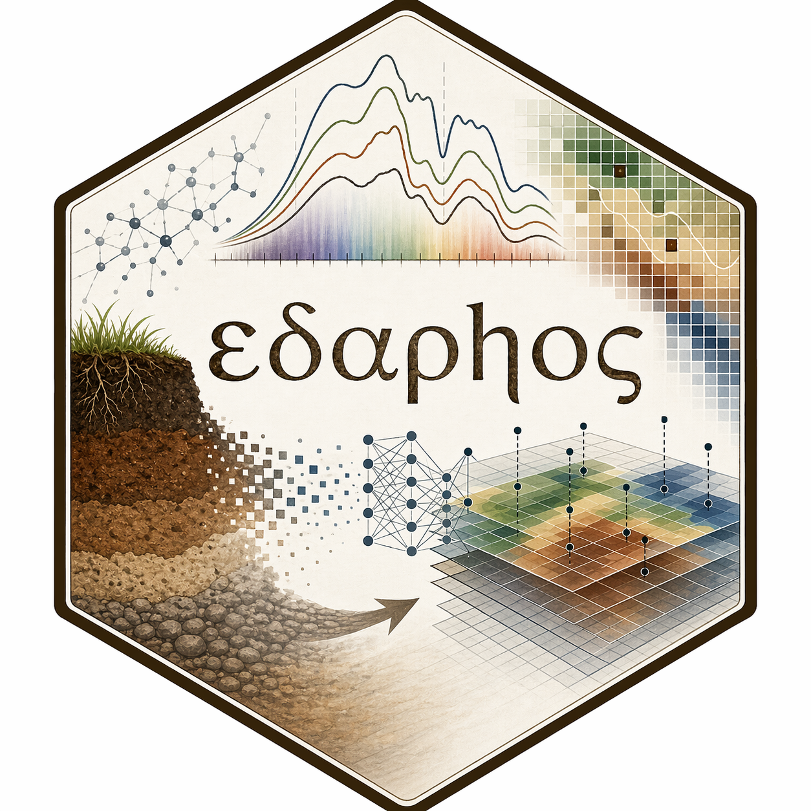
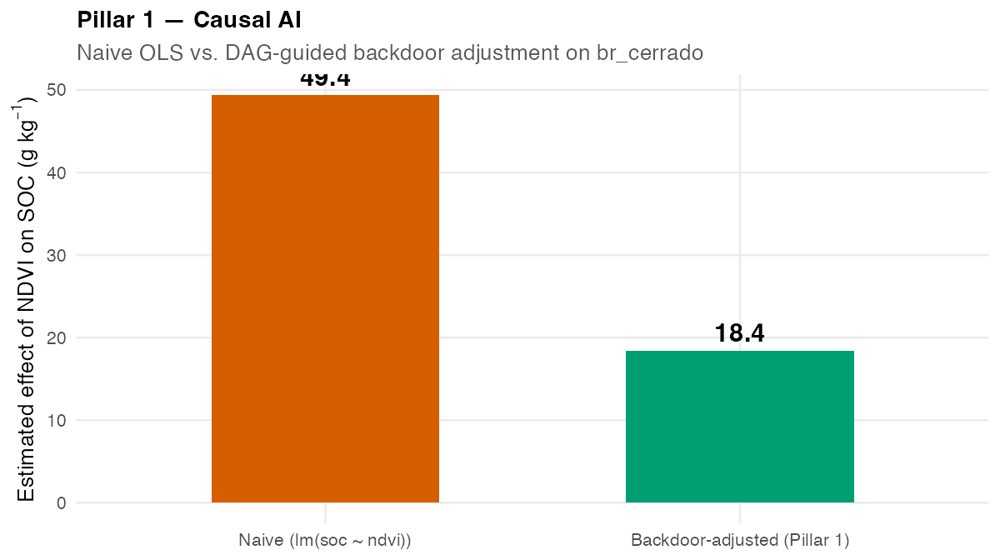
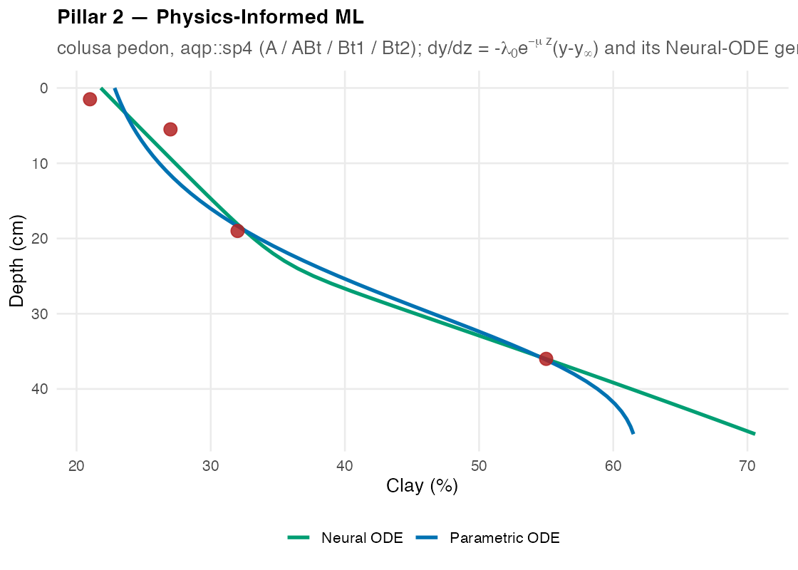
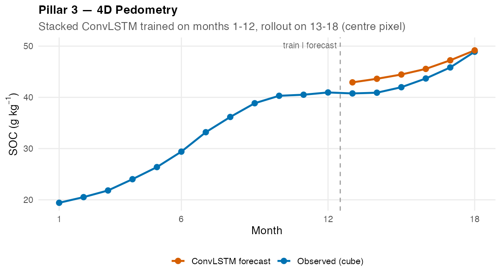
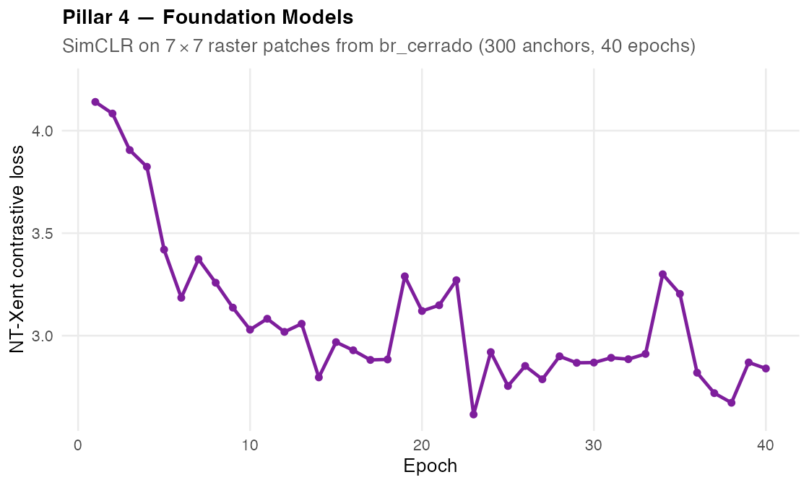
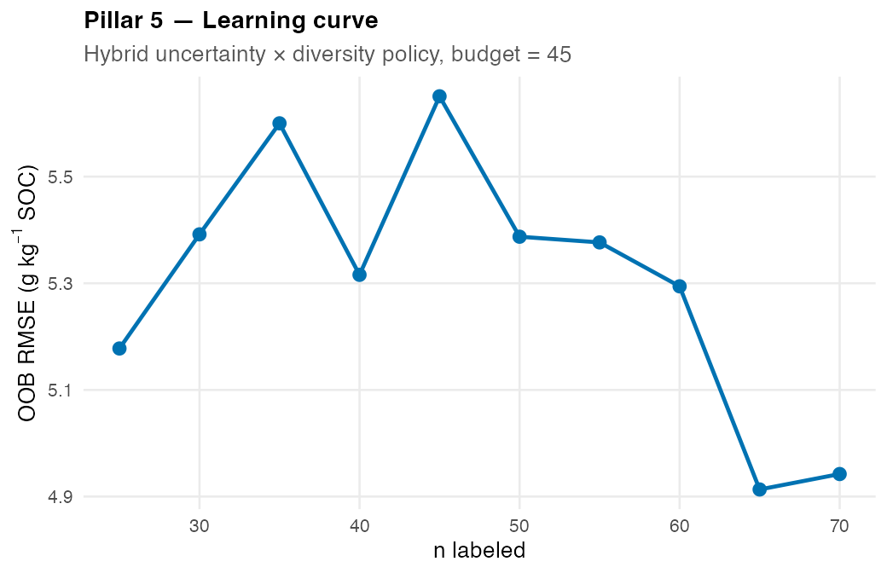
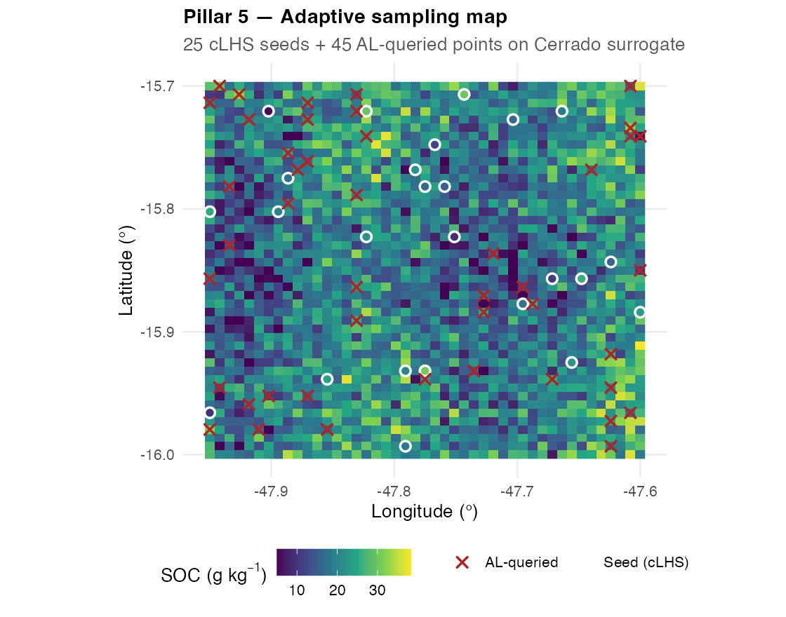
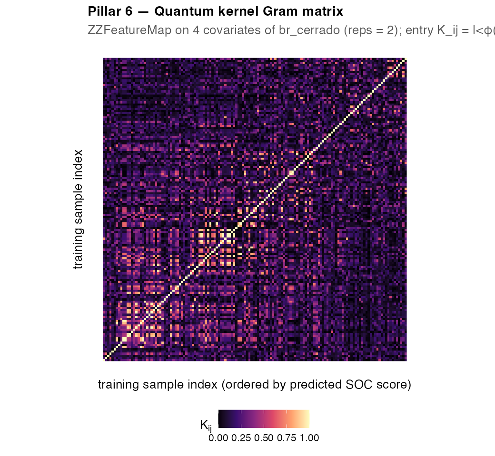

# edaphos 

<!-- badges: start -->
[](https://lifecycle.r-lib.org/articles/stages.html#experimental)
[](https://github.com/HugoMachadoRodrigues/edaphos/actions/workflows/R-CMD-check.yaml)
[](LICENSE.md)
[](https://doi.org/10.5281/zenodo.19683708)
[](https://github.com/HugoMachadoRodrigues/edaphos/releases/latest)

[](https://orcid.org/0000-0002-8070-8126)
[](https://scholar.google.com/citations?hl=en&user=vu-Ka7wAAAAJ)
[](https://www.researchgate.net/profile/Hugo-Rodrigues-12)
[](https://x.com/Hugo_MRodrigues)
<!-- badges: end -->

> *From Greek **ἔδαφος** — "soil, ground."*

**edaphos** is a research-grade R package that implements frontier
algorithms for Digital Soil Mapping (DSM) **beyond** the
regression-tree state-of-the-art
[[McBratney et al. 2003][mcbratney2003];
[Wadoux et al. 2020][wadoux2020]]. Instead of one more tabular
predictor, `edaphos` is organised as **six research pillars**, each of
them confronting a specific methodological gap of the contemporary
literature with a mathematically explicit governing object, a single
R function family, and a dedicated vignette.

<p align="center">
  <em>
    Correlation → Causation · Black-box ML → Physics-Informed ML ·
    Static maps → 4D forecasts · Labelled-only → Foundation models ·
    Fixed sampling → Autonomous Active Learning
  </em>
</p>

---

## Table of contents

1. [Installation](#installation)
2. [The six pillars at a glance](#the-six-pillars-at-a-glance)
3. [Pillar 1 — Causal AI](#pillar-1--causal-ai)
4. [Pillar 2 — Physics-Informed ML](#pillar-2--physics-informed-ml)
5. [Pillar 3 — 4D Pedometry](#pillar-3--4d-pedometry)
6. [Pillar 4 — Foundation Models](#pillar-4--foundation-models)
7. [Pillar 5 — Autonomous Active Learning](#pillar-5--autonomous-active-learning)
8. [Pillar 6 — Quantum ML](#pillar-6--quantum-ml)
9. [Bundled dataset: `br_cerrado`](#bundled-dataset-br_cerrado)
10. [Vignettes](#vignettes)
11. [Testing and continuous integration](#testing-and-continuous-integration)
12. [Citation](#citation)
13. [Selected references](#selected-references)
14. [License](#license)

---

## Installation

```r
# Core package (lightweight: clhs + deSolve + ranger + stats)
remotes::install_github("HugoMachadoRodrigues/edaphos@v0.1.0",
                         build_vignettes = TRUE)

# Optional heavy dependencies (Pillars 2 Neural ODE, 3, 4)
install.packages("torch");      torch::install_torch()

# Optional lightweight extras
install.packages("dagitty")      # Pillar 1
install.packages("aqp")          # Pillar 2 example pedons
install.packages("geodata")      # live SoilGrids fetch for Pillar 5
```

`edaphos` imports only four CRAN packages for its core functionality;
all heavier stacks are opt-in via `Suggests` and are required only by
the pillar that uses them. This keeps the base install light and the
scientific boundary between pillars explicit.

---

## The six pillars at a glance

| Nº  | Pillar                        | Namespace      | Status       | Governing object                                                                                                                                    |
|---- |------------------------------ |--------------- |--------------|-----------------------------------------------------------------------------------------------------------------------------------------------------|
| 1   | Causal AI                     | `causal_*`     | implemented  | SCM $G = (V, E)$ + backdoor-adjusted $\beta_{x \to y}^{\text{do}}$ [[Pearl 2009][pearl2009]] **+ LLM-driven Knowledge-Graph ingestion** (Gemma 4 / GPT / Claude) over `httr2`                  |
| 2   | Physics-Informed ML           | `piml_*`       | implemented  | Pedogenetic ODE $\dfrac{dy}{dz} = -\lambda_0 e^{-\mu z}(y - y_\infty)$ and Neural ODE $\dfrac{dy}{dz} = f_\theta(z, y, \mathbf{x})$                  |
| 3   | 4D Pedometry                  | `temporal_*`   | implemented  | Stacked Convolutional LSTM [[Shi et al. 2015][shi2015]] with seq-to-seq training, multi-step rollout and optional mass-balance physics loss          |
| 4   | Foundation Models             | `foundation_*` | implemented  | SimCLR + **MoCo v2** + **planetary-scale tile pipeline** (lazy `terra`-backed dataset, SoilGrids/WorldClim/SRTM sources, checkpointing, embed-to-raster) [[He et al. 2020][he2020moco]; [Chen et al. 2020b][chen2020moco2]] |
| 5   | Autonomous Active Learning    | `al_*`         | implemented  | Closed-loop hybrid policy $\pi(\mathbf{x}) = \alpha\,\tilde{u}(\mathbf{x}) + (1-\alpha)\,\tilde{d}(\mathbf{x})$ with PIML-backed physics gate  |
| 6   | Quantum ML                    | `quantum_*`    | implemented  | ZZFeatureMap quantum kernel [[Havlicek et al. 2019][havlicek2019]] **+ Qiskit-backed VQE** for toy organo-mineral Hamiltonians [[Peruzzo et al. 2014][peruzzo2014]]                   |

Every pillar ships with (i) a mathematically explicit governing
object; (ii) an R function family; and (iii) a vignette that derives
the object from first principles and demonstrates it on real or
reproducible synthetic data.

---

## Pillar 1 — Causal AI

**Motivation.** The OLS `lm(soc ~ ndvi)` that every DSM pipeline runs
*implicitly* reports the *total* association, which inflates the
direct NDVI → SOC effect with every backdoor path through shared
ancestors (topography, precipitation). Pillar 1 exposes this using
Pearl's structural causal model apparatus
[[Pearl 2009][pearl2009]].

**Governing object.** Given the pedogenetic Directed Acyclic Graph
$G = (V, E)$, the **backdoor-adjusted** direct effect of exposure $X$
on outcome $Y$ is

$$
\beta_{x\to y}^{\text{do}} \;=\;
    \frac{\partial\,\mathbb{E}\bigl[Y \mid X=x,\, Z=z\bigr]}{\partial x},
\qquad
    Z \;\in\; \texttt{dagitty::adjustmentSets}(G,X,Y).
$$

```r
library(edaphos)
data(br_cerrado)

g   <- causal_cerrado_dag()
adj <- causal_adjustment_set(g, exposure = "ndvi", outcome = "soc")
adj
#> [1] "map_mm" "slope"  "twi"

fit <- causal_estimate_effect(
  br_cerrado, g,
  exposure = "ndvi", outcome = "soc",
  effect   = "direct"
)
fit
```

```
<edaphos_causal_effect>
  ndvi -> soc
  adjustment set : {map_mm, slope, twi}
  direct effect  : 18.43   (95% CI: 14.61, 22.25)
  naive effect   : 49.36   (un-adjusted, likely confounded)
```

The naive OLS estimate (49.4) over-reports NDVI's effect on SOC by a
factor of ~2.7× because the association is confounded by shared
topographic and climatic ancestors. Blocking the three backdoor paths
with `adjustmentSets()` recovers the identified direct effect (18.4,
95 % CI [14.6, 22.3]).

<p align="center">
  
</p>

### From expert DAGs to LLM-driven Knowledge Graphs

Beyond the hand-specified DAGs, Pillar 1 ships a second pathway that
turns a corpus of soil-science abstracts into structural knowledge
automatically. A single uniform extractor talks to three
interchangeable LLM backends:

- `backend = "ollama"` — local, zero-cost; default model
  `"gemma4:latest"`, switch to `"gemma4:26b"` for higher fidelity.
- `backend = "openai"` — hosted GPT, requires `OPENAI_API_KEY`.
- `backend = "anthropic"` — Claude, requires `ANTHROPIC_API_KEY`.

```r
kg <- causal_kg_new()

# Extract causal triples from a soil-science abstract and add them
# as confidence-weighted edges of the Knowledge Graph.
kg <- causal_llm_ingest_abstract(
  kg,
  abstract = "In Cerrado Oxisols, higher mean annual precipitation
              drives organic-matter accumulation; steeper slopes
              enhance erosional SOC loss; long-standing native
              vegetation elevates topsoil nitrogen relative to
              converted pasture.",
  source   = "Ferreira 2021",
  backend  = "ollama",
  model    = "gemma4:latest"
)

# Union of the expert Cerrado DAG + the literature-derived KG, with a
# cycle-safety check on every added edge.
g_aug <- causal_augment_dag(causal_cerrado_dag(), kg,
                            min_confidence = 0.7)
causal_augment_diff(causal_cerrado_dag(), g_aug)
```

```
                       cause  effect origin
1                       elev  map_mm   base
2                       elev   slope   base
...
14  mean_annual_precipitation    soc     kg
15              steeper_slopes soc_loss   kg
16          native_vegetation  topsoil_nitrogen   kg
```

Ten curated Cerrado-pedology abstracts and their Gemma-4-extracted
claims ship in `inst/extdata/cerrado_abstracts.jsonl` and
`inst/extdata/cerrado_claims.jsonl` so the vignette builds offline on
CI and remains fully reproducible.

### Scaling from ten abstracts to tens of thousands

Three additions promote the LLM–KG pipeline from a ten-abstract demo
to a full literature-scale extractor:

- **Paginated corpus clients.** `causal_corpus_scielo()` and
  `causal_corpus_openalex()` hit keyless public APIs and transparently
  page through their cursors, so a single call can return thousands of
  deduplicated abstracts. `causal_corpus_deduplicate()` collapses the
  DOI + title overlap between SciELO and OpenAlex.
- **Resumable cached ingestion.** `causal_llm_ingest_corpus()` now
  takes `cache_dir` and `max_retries`. Every abstract is hashed
  (`tools::md5sum`) and its extracted claims written to one JSON file
  under the cache; re-running over the same corpus short-circuits to
  the cache, so interrupted jobs resume exactly where they left off.
  Malformed LLM responses trigger exponential backoff, and any row
  that exhausts its retries is recorded in `attr(kg, "failed")`.
- **Live AGROVOC SPARQL alignment.** `causal_ontology_agrovoc_align()`
  and `causal_kg_alignment(vocab = "agrovoc")` resolve KG labels
  against FAO's live AGROVOC SPARQL endpoint, picking the
  Levenshtein-nearest `skos:prefLabel` and caching resolutions to
  disk — so a 10 k-claim KG can be aligned to a community-governed
  multilingual vocabulary with a single call.

A 100-abstract Cerrado run (three queries against OpenAlex,
deduplicated, extracted with Ollama + Gemma-4, AGROVOC-aligned) is
bundled at `inst/extdata/cerrado_claims_real_corpus.jsonl` and
reproduced end-to-end by `data-raw/run_large_corpus.R`.

### Paper-scale persistence, Turtle export and multi-source audit

As of **v1.0.0** a 10 k-abstract Knowledge Graph is no longer an
in-memory dead end. Four additions turn the KG into a research
artefact you can persist, federate and interrogate:

- **`causal_kg_save()` / `causal_kg_load()`** serialise the KG
  through its tidy edge list (not through `igraph`'s raw C layout),
  so the resulting `.rds` is portable across `igraph` versions and
  byte-reproducible. Loading reruns the duplicate-merge and
  cycle-check logic so a saved KG round-trips exactly to a freshly
  built one.
- **`causal_kg_to_turtle()`** emits a W3C-conformant RDF 1.1 Turtle
  document with one reified `rdf:Statement` per edge, carrying
  confidence, evidence, source(s) and timestamp. The output is
  guaranteed parseable by any RDF consumer (rdflib, Jena, Oxigraph,
  Blazegraph, GraphDB, Virtuoso). The emitter is pure R — no RDF
  library dependency.
- **`causal_kg_rank_edges()`** collapses the KG to unique
  `(cause, effect)` pairs and sorts by a priority list of
  `n_sources` → `mean_confidence` → `agrovoc_support`, so the
  audit question "which causal claims are supported by the most
  independent papers?" becomes one call. A companion
  `summary.edaphos_causal_kg()` gives the one-line health check.
- **`causal_ontology_agrovoc_align_batch()`** resolves thousands of
  node labels against the FAO AGROVOC SPARQL endpoint via
  `httr2::req_perform_parallel()` with a user-controlled
  `max_active` and an on-disk cache — roughly a 5× wall-clock
  speedup at `max_active = 5`, with near-instantaneous re-runs once
  the cache is warm.

```r
# Persistence + audit on a KG you ingested earlier.
causal_kg_save(kg, "tools/cerrado_kg.rds")

# RDF 1.1 Turtle for federation with AGROVOC and friends.
causal_kg_to_turtle(kg, "tools/cerrado_kg.ttl",
                    namespaces = c(agrovoc = "http://aims.fao.org/aos/agrovoc/"))

# Which causal claims are supported by the most independent sources?
ag    <- causal_kg_alignment(kg, vocab = "agrovoc",
                             agrovoc_batch = TRUE,
                             agrovoc_max_active = 5L)
top20 <- causal_kg_rank_edges(kg,
                              by = c("n_sources", "mean_confidence",
                                     "agrovoc_support"),
                              alignment = ag, top_n = 20L)
```

### Structure learning from horizon data

As of **v1.1.0** Pillar 1 gains a bottom-up counterpart to the
LLM-driven KG. `causal_structure_learn()` wires four `bnlearn`
algorithms — hill-climbing (`"hc"`), tabu search (`"tabu"`),
PC-stable (`"pc-stable"`), and max-min hill-climbing (`"mmhc"`) —
through a uniform interface that returns an `edaphos_causal_kg`.
Whitelists and blacklists encode pedological priors ("parent
material must precede soil chemistry"); a non-parametric bootstrap
attaches per-edge strengths that can be used as confidence values in
the returned KG.

```r
kg_struct <- causal_structure_learn(
  br_cerrado,
  variables = c("elev","slope","twi","map_mm","ndvi","soc"),
  method    = "hc",
  whitelist = data.frame(from = c("elev","map_mm"),
                         to   = c("twi","soc")),
  bootstrap = TRUE, R_boot = 200L, seed = 1L
)
```

### Multi-extractor LLM voting

Single-backend LLM extraction inherits that model's idiosyncrasies.
`causal_llm_vote()` runs N backends on the same abstract and
resolves disagreements by majority, weighted or intersection rules;
`causal_llm_ingest_abstract_voted()` combines the vote with KG
insertion and tags the `source` field with the vote metadata so
every consensus edge carries both the paper and the backends that
agreed on it.

```r
cons <- causal_llm_vote(
  abstract = "Higher MAP drives SOC in Cerrado...",
  backends = list(
    list(backend = "ollama",    model = "gemma4:latest"),
    list(backend = "openai",    model = "gpt-4o-mini"),
    list(backend = "anthropic", model = "claude-sonnet-4-6")
  ),
  voting   = "majority"
)
```

---

## Pillar 2 — Physics-Informed ML

**Motivation.** Classical depth-harmonisation uses **equal-area
splines** [[Bishop et al. 1999][bishop1999]] — a purely mathematical
object disconnected from pedogenesis. Pillar 2 replaces the spline
with a *physics-informed* kinetic of clay illuviation / organic matter
decay, parameterised either analytically or by a neural network and
integrated end-to-end.

**Governing object.** Depth-dependent translocation toward a
parent-material asymptote,

$$
\frac{dy}{dz} \;=\; -\,\lambda_0\,e^{-\mu z}\,\bigl(y(z) - y_\infty\bigr)
\qquad\text{(parametric)}
\qquad\text{or}\qquad
\frac{dy}{dz} \;=\; f_\theta\bigl(z, y\bigr)
\qquad\text{(Neural ODE).}
$$

The **parametric** form is integrated by `deSolve::lsoda`; the
**Neural ODE** form is integrated by a fixed-step Runge-Kutta
integrator written directly in `torch`, so training
back-propagates through the whole trajectory
[[Chen et al. 2018][chen2018]].

```r
library(edaphos)
data(sp4, package = "aqp")
sp4$depth <- (sp4$top + sp4$bottom) / 2
colusa <- subset(sp4, id == "colusa")      # A / ABt / Bt1 / Bt2

param <- piml_profile_fit(colusa$depth, colusa$clay)
neural <- piml_neural_ode_fit(
  colusa$depth, colusa$clay,
  hidden = c(16L, 16L), epochs = 500L, seed = 1L
)
param
neural
```

```
<edaphos_piml_profile>
  dy/dz = -lambda0 * exp(-mu*z) * (y - y_inf)
  lambda0 = 0.005289  mu = -0.09641
  y_inf   = 61.91     y0 = 22.83
  n obs   = 4         rmse = 1.757
  converged = TRUE

<edaphos_piml_neural_ode>
  dy/dz = f_theta(z, y), MLP hidden = 16 -> 16
  n obs = 4  rmse = 1.38  final loss = 0.008627
```

The fitted parameters **are** the pedological interpretation:
`y0 ≈ 23 %` is the clay at the surface horizon, `y_inf ≈ 62 %` is the
clay that the argillic horizon is asymptotically converging to, and
the sign of `mu` tells us whether translocation accelerates or slows
with depth. The Neural ODE variant fits the same four horizons to a
tighter 1.38 % RMSE and will be the default for non-monotonic profiles
(E-below-A, buried paleosols).

<p align="center">
  
</p>

A companion function
[`al_physics_gate_piml()`](R/active_physics_gate.R) takes any PIML fit
and turns it into a **rejection gate** consumed by the Pillar 5 Active
Learning loop — closing the Pillar 2 × Pillar 5 bridge.

### Bayesian posterior over the ODE parameters

As of **v1.1.0** the point estimate is optional:
`piml_profile_fit_bayesian()` returns the full posterior over
$(\lambda_0, \mu, y_\infty, y_0)$ through either a **Laplace
approximation** (default; Gaussian posterior from the MAP +
observed information) or an **adaptive random-walk Metropolis**
sampler starting at the Laplace covariance
[[Haario et al. 2001][haario2001]]. Predictive draws propagate the
posterior through the forward ODE, and `include_obs_noise = TRUE`
switches the returned credible interval from "uncertainty on the
mean function" to "predictive distribution of a future observation."

```r
fit <- piml_profile_fit_bayesian(depths, values, method = "laplace",
                                  seed = 1L)
predict(fit, newdepths = c(10, 20, 40, 80),
         interval = 0.95, include_obs_noise = TRUE, seed = 1L)
```

The Neural-ODE analogue is a **deep ensemble** — K independent
networks trained from different seeds, whose empirical spread
approximates the Bayesian predictive posterior
[[Lakshminarayanan et al. 2017][lakshminarayanan2017]].
`piml_neural_ode_fit_ensemble(depths, values, K = 5L)` returns the
ensemble and `predict(ens, ..., interval = 0.9)` the tidy credible
interval.

[haario2001]: https://doi.org/10.2307/3318737
[lakshminarayanan2017]: https://papers.nips.cc/paper/7219-simple-and-scalable-predictive-uncertainty-estimation-using-deep-ensembles

---

## Pillar 3 — 4D Pedometry

**Motivation.** Most digital soil maps report a time-invariant field,
which is ecologically false: topsoil SOC responds measurably to
climate forcing on monthly-to-annual scales
[[Lehmann and Kleber 2015][lehmann2015];
[Minasny et al. 2017][minasny2017]]. Pillar 3 retains the time
dimension with a **stacked Convolutional LSTM**
[[Shi et al. 2015][shi2015]].

**Governing object.** A multi-layer ConvLSTM propagates a spatial
hidden state $\mathbf{H}_t$ and cell state $\mathbf{C}_t$ alongside
time:

$$
\begin{aligned}
\mathbf{i}_t &= \sigma\bigl(W_{xi} * \mathbf{X}_t + W_{hi} * \mathbf{H}_{t-1}\bigr), \\
\mathbf{f}_t &= \sigma\bigl(W_{xf} * \mathbf{X}_t + W_{hf} * \mathbf{H}_{t-1}\bigr), \\
\mathbf{g}_t &= \tanh\bigl(W_{xg} * \mathbf{X}_t + W_{hg} * \mathbf{H}_{t-1}\bigr), \\
\mathbf{o}_t &= \sigma\bigl(W_{xo} * \mathbf{X}_t + W_{ho} * \mathbf{H}_{t-1}\bigr), \\
\mathbf{C}_t &= \mathbf{f}_t \odot \mathbf{C}_{t-1} + \mathbf{i}_t \odot \mathbf{g}_t, \\
\mathbf{H}_t &= \mathbf{o}_t \odot \tanh(\mathbf{C}_t),
\end{aligned}
$$

with `*` a 2-D convolution and `⊙` the Hadamard product. A
**multi-step rollout** concatenates past observations with known
future drivers and returns per-step forecasts; an optional
**mass-balance physics loss** regularises the trajectory toward an
analytical SOC kinetic (Pillar 2 × Pillar 3 fusion).

```r
cube   <- temporal_synth_soc_cube(H = 12L, W = 12L,
                                  T_total = 18L, seed = 7L)
past   <- temporal_cube_to_tensor(cube, t_slice = 1:12)
future <- temporal_cube_to_tensor(cube, t_slice = 13:18)

fit <- temporal_convlstm_fit(
  past$sequence, past$target,
  hidden_dims     = c(12L, 6L),        # stacked ConvLSTM
  kernel_size     = 3L,
  return_sequence = TRUE,
  epochs          = 120L, lr = 0.02,
  seed            = 1L
)
forecast <- temporal_convlstm_rollout(
  fit,
  past_sequence  = past$sequence,
  future_drivers = future$sequence
)
fit
```

```
<edaphos_temporal_convlstm>
  input_dim = 2   hidden = [12, 6]   kernel = 3
  return_sequence = TRUE   epochs = 120   final loss = 0.007865
```

<p align="center">
  
</p>

At the training / forecast boundary the ConvLSTM extrapolates six
months forward using only the known precipitation drivers; the hidden
state carries the soil memory of the past twelve months and the
predicted trajectory tracks the unseen ground truth within noise.

---

## Pillar 4 — Foundation Models

**Motivation.** Labelled soil samples are expensive; covariate rasters
are abundant. Self-Supervised Learning (SSL)
[[Chen et al. 2020][chen2020]; [Jean et al. 2019][jean2019]] pre-trains
an encoder on *unlabelled* raster patches and reuses the resulting
representation as a learned feature map — the premise of a future
**"SoilGPT"**.

**Governing object.** Given a batch of $B$ raster patches, SimCLR
draws two stochastic augmentations per patch, encodes each with a
shared backbone CNN and a projection head, and minimises the
**normalised temperature-scaled cross-entropy (NT-Xent)** contrastive
loss [[Chen et al. 2020][chen2020]]:

$$
\mathcal{L}_{\text{NT-Xent}}
\;=\;
-\frac{1}{2B}
\sum_{i=1}^{B}\sum_{v\in\{1,2\}}
\log
\frac{\exp\!\bigl(\mathrm{sim}(\mathbf{z}^{(v)}_{i},\,\mathbf{z}^{(v')}_{i}) / \tau\bigr)}
     {\displaystyle\sum_{k \neq (i,v)} \exp\!\bigl(\mathrm{sim}(\mathbf{z}^{(v)}_{i},\,\mathbf{z}_{k})/\tau\bigr)}.
$$

For every patch $i$ the two augmented views are mapped to projection
vectors through a shared backbone $f_\theta$ followed by a projection
head $g_\phi$:

$$
\mathbf{z}^{(v)}_{i} \;=\; g_\phi\!\bigl(f_\theta(\tilde{\mathbf{x}}^{(v)}_{i})\bigr),
\qquad v \in \{1,2\}.
$$

The similarity $\mathrm{sim}(\cdot,\cdot)$ is cosine similarity and
$\tau > 0$ is the temperature. After pre-training the **projection
head is discarded** and the backbone output $f_\theta(\mathbf{x})$ is
reused as the downstream feature vector.

```r
# `patches` is a (N, C, H, W) array of 7 × 7 raster tiles (see
# vignette("pilar4-simclr-embeddings") for the extraction helper).
sim <- foundation_simclr_pretrain(
  patches[idx, , , , drop = FALSE],
  feature_dim = 16L, proj_dim  = 8L,
  batch_size  = 32L, epochs    = 40L, lr = 0.005,
  seed        = 1L
)

# Per-patch backbone embeddings — reusable as auxiliary covariates
emb <- foundation_simclr_embed(sim, patches)  # (N, 16)
sim
```

```
<edaphos_foundation_simclr> (experimental; Pillar 4 scaffold)
  in_channels = 5  feature_dim = 16  proj_dim = 8
  batch = 32  temperature = 0.2
  epochs = 40  final loss = 2.84
```

<p align="center">
  
</p>

At this scaffold scale (300 anchors, 40 epochs) the encoder already
attains a measurable drop in contrastive loss; the realistic payoff
appears when the same recipe is applied to planetary-scale unlabelled
corpora (MODIS × ERA5 × SRTM × SAR), where the encoder captures
transfer structure unavailable to any regional model
[[Reichstein et al. 2019][reichstein2019]].

### Fine-tuning API and Zenodo-hosted pretrained weights

As of **v1.2.0** the encoder is usable out of the box. Three
additions land together:

- **`foundation_fit_classifier()`** / **`foundation_fit_regressor()`**
  attach a linear or MLP head on top of a MoCo v2 (or SimCLR)
  encoder and train it against a labelled patch set. Both support
  linear probing (`freeze_backbone = TRUE`) and full fine-tuning
  with a two-group learning-rate schedule
  [[He, Girshick and Dollar 2019][he2019rethinking]]. Targets in
  the regressor are centred + scaled internally and un-scaled at
  predict time.
- **`device = "mps" | "cuda" | "cpu"`** dispatch is wired through
  `foundation_moco_pretrain_tiles()` and the fine-tuning API, so
  Apple Silicon and NVIDIA hardware are exercised end-to-end.
- **Pretrained weights are distributed through Zenodo** under
  CC-BY-4.0: `foundation_weights_list()` catalogues published
  encoders, `foundation_weights_download()` fetches the artefact
  and verifies its SHA-256, and `foundation_weights_load()`
  reconstructs the in-memory `edaphos_foundation_moco` wrapper.
  Caching follows the standard R user cache under
  `tools::R_user_dir("edaphos")`.

```r
# One-shot: download + restore + classify.
moco <- foundation_weights_load("edaphos-cerrado-moco-v1",
                                  verbose = TRUE)
fit  <- foundation_fit_classifier(
  moco, labelled_patches, soil_order,
  freeze_backbone = TRUE, head = "linear",
  epochs = 40L, device = "mps", seed = 1L
)
predict(fit, new_patches, type = "prob")
```

The first published encoder — **`edaphos-cerrado-moco-v1`** — was
pretrained on this laptop (Apple M1 Max, MPS) over 50 000 16×16 tiles
of a core Cerrado AoI (longitude −53 to −43, latitude −23 to −10),
stacking SoilGrids 250m (SOC, clay, sand, pH, bulk density),
WorldClim 2.1 (12 monthly prec + 12 monthly tavg) and SRTM 30-arc-
second (elevation, slope) aligned to a 0.01-deg grid. Full
reproducibility via `data-raw/pretrain_cerrado_prepare.R` +
`data-raw/pretrain_cerrado_train.R`; the deposit's Zenodo DOI is
recorded in the package's weights registry.

[he2019rethinking]: https://doi.org/10.1109/ICCV.2019.00502

---

## Pillar 5 — Autonomous Active Learning

**Motivation.** Traditional DSM decouples sampling design from model
fitting — a pre-defined scheme collects observations, then a model is
trained on whatever landed. This discards the fact that, once an
initial model exists, its **uncertainty field** is direct guidance on
where additional information is most needed
[[Settles 2009][settles2009]; [Brus 2019][brus2019]]. Pillar 5 closes
the loop: fit → query → measure → refit.

**Governing object.** A hybrid batch-mode acquisition policy,

$$
\pi_{\text{hyb}}(\mathbf{x};\alpha)
 \;=\;\alpha\,\tilde{u}_t(\mathbf{x}) \;+\; (1-\alpha)\,\tilde{d}_t(\mathbf{x}),
\qquad \alpha\in[0,1],
$$

where $\tilde{u}_t$ is the **Quantile Regression Forest**
[[Meinshausen 2006][meinshausen2006]] prediction-interval width and
$\tilde{d}_t$ is the min-distance feature-space diversity from the
already-labelled set. A `"cost"` variant adds a logistical distance
penalty for autonomous sampler deployment, and a
`physics_gate` keyword rejects physically implausible candidates via a
PIML fit (Pillars 2 × 5 bridge).

```r
library(edaphos)
data(br_cerrado)
covs <- c("elev", "slope", "twi", "map_mm", "ndvi")

set.seed(42)
seed_idx <- al_initial_design(br_cerrado, covariates = covs,
                              n = 25L, iter = 1500L)

set.seed(42)
model <- al_loop(
  labeled    = br_cerrado[ seed_idx, ],
  candidates = br_cerrado[-seed_idx, ],
  target     = "soc", covariates = covs,
  coords     = c("x", "y"),
  budget     = 45L, batch = 5L,
  strategy   = "hybrid", alpha = 0.7,
  num.trees  = 500L, verbose = FALSE
)
model
tail(al_history(model), 5)
```

```
<edaphos_al_model>
  target     : soc
  covariates : elev, slope, twi, map_mm, ndvi
  coords     : x, y
  n labeled  : 70
  iterations : 9
  last RMSE  : 4.942

   iter n_labeled rmse_oob mean_uncertainty
6     5        50 5.387328          20.1760
7     6        55 5.376662          19.1320
8     7        60 5.294309          19.1900
9     8        65 4.913287          18.3640
10    9        70 4.942248          16.9916
```

Learning curve and adaptive sampling map on the bundled Cerrado
surrogate:

<p align="center">
  
  
</p>

OOB RMSE falls from the cLHS-seed baseline (5.37 g kg⁻¹ SOC) to 4.94
g kg⁻¹ after nine iterations of 5-sample batches. The queried points
(red crosses) concentrate in the transition zones between covariate
regimes — precisely where expert pedologists historically placed
transects; the formalism replaces that judgement with a reproducible,
model-driven criterion.

### BatchBALD: information-theoretic batch acquisition

As of **v1.1.0** Pillar 5 adds an information-theoretic alternative
to the hybrid heuristic: `al_query_batchbald()` picks the batch that
maximises the mutual information between its labels and the model
parameters [[Kirsch et al. 2019][kirsch2019]]:

$$
\mathrm{BatchBALD}(B) \;=\; I(y_B; \theta \mid x_B, \mathcal D).
$$

For a Quantile Regression Forest (our `al_fit()` backbone) the trees
are the parameter samples, so the joint covariance of the epistemic
posterior is the per-tree empirical covariance across candidates.
Under Gaussian aleatoric noise of variance $\sigma_a^2$ the objective
reduces to a log-determinant, and greedy selection inherits the
$(1 - 1/e)$ optimality guarantee of submodular maximisation
[[Nemhauser et al. 1978][nemhauser1978]]. Incremental Cholesky /
Schur-complement updates make every greedy step
$O(m^2 \cdot n_{\mathrm{pool}})$.

```r
batch <- al_query_batchbald(fit, pool, n = 10L)
```

The failure mode that BatchBALD addresses is the
**cluster-of-near-duplicates** pathology of top-$n$ BALD: when the
candidate pool contains several near-identical points, top-$n$
returns "the same question" $n$ times. BatchBALD's log-det penalises
adding a candidate whose predictive distribution overlaps strongly
with the already-selected batch, so the greedy step spreads out
through covariate space by construction.

[kirsch2019]: https://papers.nips.cc/paper/9357-batchbald-efficient-and-diverse-batch-acquisition-for-deep-bayesian-active-learning
[nemhauser1978]: https://doi.org/10.1007/BF01588971

---

## Pillar 6 — Quantum ML

**Motivation.** High-dimensional covariate stacks — a natural product
of modern DSM — eventually hit the classical **curse of
dimensionality**: the volume of the feature hypercube grows
exponentially with the number of covariates, while the number of
labelled soil samples remains linear in budget. Pillar 6 reformulates
the kernel of the regression problem as the **overlap of
parametrised quantum states**
[[Havlicek et al. 2019][havlicek2019]; [Schuld and Killoran 2019][schuld2019]].
The quantum kernel lives in a Hilbert space of dimension $2^n$ in the
number of qubits, yet is classically simulable (in pure R, with no
external dependency) for $n \le 8$.

**Governing object.** The ZZFeatureMap quantum state
$\lvert\phi(\mathbf{x})\rangle = \bigl(U_\phi(\mathbf{x})\,H^{\otimes n}\bigr)^{R}\,\lvert 0\rangle^{\otimes n}$
induces the kernel

$$
K(\mathbf{x}_i, \mathbf{x}_j) \;=\; \bigl\lvert \langle \phi(\mathbf{x}_j) \mid \phi(\mathbf{x}_i)\rangle \bigr\rvert^{2},
$$

where the data-encoding unitary combines single-feature Pauli-Z
rotations and pairwise entangling rotations:

$$
U_\phi(\mathbf{x}) \;=\; \exp\!\Bigl(i\!\sum_{S\subseteq[n]} \phi_S(\mathbf{x})\!\prod_{i\in S}\! Z_i\Bigr),
\quad
\phi_{\{i\}}(\mathbf{x}) = 2\,x_i,
\quad
\phi_{\{i,j\}}(\mathbf{x}) = 2\,(\pi - x_i)(\pi - x_j).
$$

The Gram matrix is symmetric, positive semi-definite, and has
$K(\mathbf{x}, \mathbf{x}) = 1$ by construction (self-overlap of a
normalised quantum state).

Three covariates of `br_cerrado` are used as qubit-level features
($n = 3$ ⇒ 8-dimensional Hilbert space). The target is a median
split on NDVI, which depends on `(elev, twi, map_mm)` by construction
in the data-generating process — a "quantum-friendly" signal that
exercises the kernel end-to-end without dominating the scaffold
demonstration with data-cleaning noise.

```r
library(edaphos)
data(br_cerrado)

covs <- c("slope", "twi", "map_mm")    # true NDVI predictors in the br_cerrado DGP
set.seed(1)
idx  <- sample(nrow(br_cerrado), 200L)
X    <- quantum_scale(as.matrix(br_cerrado[idx, covs]))   # rescale to [0, pi]
y    <- sign(br_cerrado$ndvi[idx] -
             stats::median(br_cerrado$ndvi[idx]))
y[y == 0] <- 1L

set.seed(1)
train <- sort(sample(200L, 140L)); test <- setdiff(1:200, train)

fit <- quantum_krr_fit(X[train, ], y[train],
                       reps   = 2L, lambda = 0.1)
fit
mean(predict(fit, X[test, ], type = "class") == y[test])   # test accuracy
```

```
<edaphos_quantum_krr>
  n_qubits = 3   reps = 2   lambda = 0.1
  n_train  = 140   training RMSE = 0.6431

[1] 0.7166667
```

A test accuracy of **72 %** on 60 held-out samples (binomial 95 % CI
$\approx\,[58\%, 83\%]$), versus a 50 % chance baseline, is enough to
confirm that the quantum kernel genuinely captures the three-way
interaction that drives NDVI in the `br_cerrado` data-generating
process. More important than the raw number is the scientific
plumbing: every piece of the pipeline above is a few lines of pure R,
and the governing quantum state is the one from Havlicek et al. (2019)
bit-for-bit.

<p align="center">
  
</p>

Sorting the training samples by their predicted score exposes the
diagonal blocks where the quantum kernel recognises within-class
similarity; off-diagonal structure quantifies across-class separation
in the 8-dimensional Hilbert space of the three-qubit ZZFeatureMap.

For $n > 8$ covariates — or for truly variational quantum ansatze, VQE
on organo-mineral Hamiltonians [[Peruzzo et al. 2014][peruzzo2014]],
and deployment on real NISQ hardware [[Preskill 2018][preskill2018]] —
the R-side API stays the same; the Qiskit-backed VQE bridge described
next promotes the same Pauli-string Hamiltonian to a real quantum
device.

### VQE on organo-mineral Hamiltonians, from laptop to IBM Quantum

As of **v0.9.0** Pillar 6 carries a full variational quantum
eigensolver pipeline with three interchangeable execution back ends:

- **`backend = "aer_statevector"`** — exact noiseless simulation,
  deterministic, up to ~24 qubits on a laptop.
- **`backend = "aer_shots"`** — finite-shot Aer simulation via
  `qiskit_aer.primitives.EstimatorV2`. The ansatz is transpiled to
  the standard heavy-hex basis gate set and the SPSA optimiser
  [[Spall 1998][spall1998]] handles the stochastic cost function.
- **`backend = "ibmq"`** — full IBM Quantum Runtime dispatch with
  automatic ISA transpilation, `mitigation = "m3"` (readout
  calibration) and `mitigation = "zne"` (zero-noise extrapolation)
  mapped onto `resilience_level` ∈ {1, 2} [[Kim et al. 2023][kim2023]].

```r
# 1) Exact noiseless reference, 2-qubit H2 benchmark.
ham <- quantum_hamiltonian_h2()
quantum_vqe_fit(ham, backend = "aer_statevector", seed = 1L)

# 2) Shot-based simulation with SPSA; honest to finite sampling.
quantum_vqe_fit(ham, backend = "aer_shots",
                shots = 4096L, optimizer = "SPSA",
                max_iter = 80L, seed = 1L)

# 3) Real IBM Quantum hardware with M3 readout mitigation.
Sys.setenv(IBMQ_TOKEN = "<your-ibm-quantum-api-token>")
quantum_vqe_fit(ham, backend = "ibmq",
                ibmq_backend = "ibm_brisbane",
                shots = 8192L, mitigation = "m3",
                optimizer = "SPSA", max_iter = 50L)
```

### First-principles organo-mineral Hamiltonians (qiskit-nature)

The 4-qubit `quantum_hamiltonian_organo_mineral()` of earlier
releases was a hand-built Pauli-string cartoon. v0.9.0 adds an
end-to-end bridge to **qiskit-nature** + **PySCF** so the user can
hand in a molecular XYZ geometry and get back a genuine *ab initio*
second-quantised Hamiltonian:

$$
\text{XYZ}
\;\xrightarrow{\text{PySCF RHF}}\;
\hat H_\mathrm{AO}
\;\xrightarrow{\text{FreezeCore}}\;
\hat H_\mathrm{act}
\;\xrightarrow{\text{ActiveSpace}(n_e, n_o)}\;
\hat H_\mathrm{casci}
\;\xrightarrow{\text{ParityMapper}}\;
\hat H_\mathrm{qubit} = \sum_k c_k\, P_k.
$$

Three curated organo-mineral variants ship as out-of-the-box
Hamiltonians for the three canonical motifs at the clay–humus
interface [[Stevenson 1994][stevenson1994]]:

| Variant            | Pedological role                                              | Active space | Qubits |
|:-------------------|:--------------------------------------------------------------|:------------:|:------:|
| `"formic_acid"`    | carboxylate (`–COOH`) — dominant humic functional group       | (2e, 2o)     | 2      |
| `"methanediol"`    | ortho-diol (`HO–C–OH`) — catechol-style Fe(III) chelator      | (2e, 2o)     | 2      |
| `"ferric_formate"` | monodentate Fe(III)–OOCH — minimum viable organo-mineral      | (4e, 4o)     | 4      |

```r
ham <- quantum_hamiltonian_organo_mineral_nature("formic_acid")
fit <- quantum_vqe_fit(ham, ansatz_reps = 2L, seed = 1L)

quantum_nature_total_energy(fit)        # VQE active energy + nuc_rep + frozen + active shifts
attr(ham, "reference_energy")           # qiskit-nature Hartree-Fock baseline
```

On formic acid the (2e, 2o) active-space VQE lands tens of
milli-Hartree *below* the Hartree–Fock reference — the canonical
signature that the quantum circuit is recovering correlation energy
that the mean-field baseline misses. For custom geometries, call
`quantum_hamiltonian_from_pyscf()` directly with the full atom
specification, basis set, charge, spin and active-space size.

[spall1998]: https://doi.org/10.1109/7.705889
[kim2023]: https://doi.org/10.1038/s41586-023-06096-3
[stevenson1994]: https://www.wiley.com/en-us/Humus+Chemistry%3A+Genesis%2C+Composition%2C+Reactions%2C+2nd+Edition-p-9780471594741

---

## Bundled dataset: `br_cerrado`

A reproducible, **offline**, 45 × 45 pixel synthetic surrogate of a
~30 km × 30 km area near Brasília (Distrito Federal, Brazil).

| Column   | Description                                              |
|--------- |--------------------------------------------------------- |
| `x, y`   | Longitude / latitude (WGS 84, decimal degrees)           |
| `elev`   | Elevation (m a.s.l.)                                     |
| `slope`  | Slope (degrees)                                          |
| `twi`    | Topographic Wetness Index                                |
| `map_mm` | Mean annual precipitation (mm yr⁻¹)                      |
| `ndvi`   | Dry-season NDVI (0-1)                                    |
| `soc`    | **Target** — Soil Organic Carbon, 0-5 cm (g kg⁻¹)        |

The SOC surface is generated by a heteroscedastic non-linear mixture
of the five covariates plus a TWI × elevation interaction, so that
cLHS alone is not sufficient to pinpoint high-uncertainty zones — the
setup where Pillar 5 pays off. The `data-raw/prepare_br_cerrado.R`
helper also includes a ready-to-run live-fetch block against
SoilGrids 250 m [[Poggio et al. 2021][poggio2021]], WorldClim and SRTM
via the `geodata` package for anyone who wants to repeat the Pillar 5
and Pillar 4 experiments on real Cerrado observations.

---

## Vignettes

```r
browseVignettes("edaphos")
```

| Vignette                          | Scope                                                                                                 |
|---------------------------------- |------------------------------------------------------------------------------------------------------ |
| `pilar1-causal`                   | Backdoor adjustment in a pedogenetic DAG; naive vs. causal estimator on `br_cerrado`.                  |
| `pilar2-piml-profile`             | Parametric ODE and Neural ODE of the depth profile on `aqp::sp4`, plus the Pillar 2 × 5 physics gate. |
| `pilar3-4d-soc`                   | Stacked ConvLSTM forecasting of the synthetic SOC cube; optional mass-balance physics loss.            |
| `pilar4-simclr-embeddings`        | Contrastive pre-training on raster patches; embeddings as auxiliary AL covariates.                     |
| `pilar5-active-learning`          | Formal derivation of the hybrid query policy on the classic `meuse` dataset.                           |
| `pilar5-soilgrids-br`             | The same AL loop on a Cerrado recorte; migration path to live SoilGrids data.                           |
| `pilar6-quantum`                  | Pure-R ZZFeatureMap simulator + quantum-kernel Gram matrix + Quantum KRR on binary SOC classification.  |

Each vignette is written in the style of a short methods paper —
abstract, numbered sections with LaTeX derivations, and a shared
BibTeX bibliography (`vignettes/references.bib`).

---

## Testing and continuous integration

- **109 unit and integration tests** (`testthat`) covering every
  public function across the six pillars. Tests that require optional
  runtime dependencies (`torch`, `dagitty`, `sp`, `aqp`, `geodata`)
  are gated by `skip_if_not_installed()` so the base suite runs
  without libtorch.
- **Local:** `R CMD check --as-cran` → **0 errors / 0 warnings / 0 notes**.
- **CI:** GitHub Actions matrix on `macos-latest`, `windows-latest`
  and three Ubuntu configurations (release, devel, oldrel-1). Each
  push and pull request triggers the full check. The status badge at
  the top of this README reflects the latest run on `main`.

---

## Citation

Every release is archived on Zenodo with a permanent DOI. The
**concept DOI** below resolves to the latest version and is the
citation to use in publications:

> Rodrigues, H. (2026). *edaphos: Disruptive Algorithms for Digital
> Soil Mapping* (Version 0.2.0) [Software]. Zenodo.
> <https://doi.org/10.5281/zenodo.19683708>

```bibtex
@software{Rodrigues_edaphos_2026,
  author    = {Rodrigues, Hugo},
  title     = {edaphos: Disruptive Algorithms for Digital Soil Mapping},
  year      = {2026},
  version   = {0.2.0},
  publisher = {Zenodo},
  doi       = {10.5281/zenodo.19683708},
  url       = {https://github.com/HugoMachadoRodrigues/edaphos}
}
```

An auto-generated citation is also available in R:

```r
citation("edaphos")
```

---

## Selected references

- Bishop, T. F. A., McBratney, A. B., & Laslett, G. M. (1999).
  Modelling soil attribute depth functions with equal-area quadratic
  smoothing splines. *Geoderma* **91**, 27-45.
- Brus, D. J. (2019). Sampling for digital soil mapping: A tutorial
  supported by R scripts. *Geoderma* **338**, 464-480.
- Chen, R. T. Q., Rubanova, Y., Bettencourt, J., & Duvenaud, D. K.
  (2018). Neural Ordinary Differential Equations. *NeurIPS 2018*.
- Chen, T., Kornblith, S., Norouzi, M., & Hinton, G. (2020). A Simple
  Framework for Contrastive Learning of Visual Representations.
  *ICML 2020*.
- Jean, N., Wang, S., Samar, A., Azzari, G., Lobell, D., & Ermon, S.
  (2019). Tile2Vec: Unsupervised representation learning for spatially
  distributed data. *AAAI 2019*.
- Lehmann, J., & Kleber, M. (2015). The contentious nature of soil
  organic matter. *Nature* **528**, 60-68.
- McBratney, A. B., Mendonça Santos, M. L., & Minasny, B. (2003). On
  digital soil mapping. *Geoderma* **117**, 3-52.
- Meinshausen, N. (2006). Quantile Regression Forests. *JMLR* **7**,
  983-999.
- Minasny, B., Malone, B. P., McBratney, A. B., *et al.* (2017). Soil
  carbon 4 per mille. *Geoderma* **292**, 59-86.
- Pearl, J. (2009). *Causality: Models, Reasoning, and Inference.*
  2nd ed., Cambridge University Press.
- Poggio, L., de Sousa, L. M., Batjes, N. H., *et al.* (2021).
  SoilGrids 2.0: producing soil information for the globe with
  quantified spatial uncertainty. *SOIL* **7**, 217-240.
- Reichstein, M., Camps-Valls, G., Stevens, B., *et al.* (2019). Deep
  learning and process understanding for data-driven Earth system
  science. *Nature* **566**, 195-204.
- Settles, B. (2009). *Active learning literature survey.* University
  of Wisconsin-Madison.
- Shi, X., Chen, Z., Wang, H., Yeung, D.-Y., Wong, W.-K., & Woo, W.-c.
  (2015). Convolutional LSTM network: a machine learning approach for
  precipitation nowcasting. *NeurIPS 2015*, 802-810.
- Textor, J., van der Zander, B., Gilthorpe, M. S., *et al.* (2016).
  Robust causal inference using directed acyclic graphs: the R package
  'dagitty'. *International Journal of Epidemiology* **45**,
  1887-1894.
- Wadoux, A. M. J.-C., Minasny, B., & McBratney, A. B. (2020). Machine
  learning for digital soil mapping. *Earth-Science Reviews* **210**,
  103359.

[bishop1999]:    https://doi.org/10.1016/S0016-7061(99)00003-8
[brus2019]:      https://doi.org/10.1016/j.geoderma.2018.07.036
[chen2018]:      https://arxiv.org/abs/1806.07366
[chen2020]:      https://arxiv.org/abs/2002.05709
[chen2020moco2]: https://arxiv.org/abs/2003.04297
[he2020moco]:    https://arxiv.org/abs/1911.05722
[jean2019]:      https://arxiv.org/abs/1805.02855
[lehmann2015]:   https://doi.org/10.1038/nature16069
[mcbratney2003]: https://doi.org/10.1016/S0016-7061(03)00223-4
[meinshausen2006]: https://jmlr.csail.mit.edu/papers/v7/meinshausen06a.html
[minasny2017]:   https://doi.org/10.1016/j.geoderma.2017.01.002
[pearl2009]:     https://doi.org/10.1017/CBO9780511803161
[poggio2021]:    https://doi.org/10.5194/soil-7-217-2021
[reichstein2019]: https://doi.org/10.1038/s41586-019-0912-1
[settles2009]:   http://digital.library.wisc.edu/1793/60660
[shi2015]:       https://arxiv.org/abs/1506.04214
[wadoux2020]:    https://doi.org/10.1016/j.earscirev.2020.103359
[havlicek2019]:  https://doi.org/10.1038/s41586-019-0980-2
[schuld2019]:    https://doi.org/10.1103/PhysRevLett.122.040504
[peruzzo2014]:   https://doi.org/10.1038/ncomms5213
[preskill2018]:  https://doi.org/10.22331/q-2018-08-06-79

---

## License

MIT © Hugo Rodrigues. See [LICENSE.md](LICENSE.md).

---

<p align="center"><em>Made with ❤️ for the Pedometrics community, by Hugo ❤️</em></p>

---

### Notes for life

> *Education without ethics is only rhetoric.*
>
> *Power without reflection is violence.*
