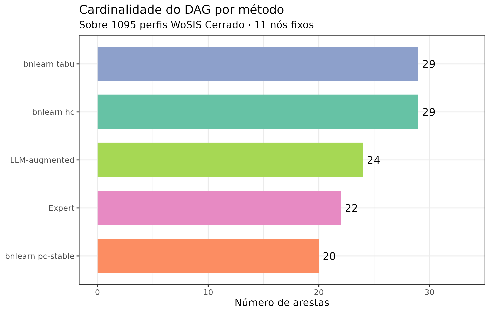

# Causal discovery no Cerrado: expert vs. LLM vs. data-driven

> **Pergunta central.** Podem três formas distintas de construir um DAG
> pedogenético — conhecimento de especialista, extração via LLM da
> literatura, e aprendizado direto dos dados — concordar sobre os mesmos
> 1 095 perfis WoSIS do Cerrado? Se não, **qual é a cola científica**
> entre elas?

``` r
library(edaphos)
library(ggplot2)
library(dplyr)
theme_set(theme_bw(base_size = 11))
```

``` r
res_path <- system.file("extdata", "causal_discovery_results.rds",
                        package = "edaphos")
stopifnot(nzchar(res_path), file.exists(res_path))
R <- readRDS(res_path)
```

------------------------------------------------------------------------

## Motivação

O Pilar 1 do `edaphos` oferece **três caminhos** para a mesma coisa — um
DAG causal — mas a literatura pedométrica quase sempre usa apenas um
deles. Zhang and Wadoux ([2026](#ref-Zhang2026causal)) apontam que **“a
especificação de um modelo causal explícito”** é a primeira das três
condições para inferência causal em MDS; o *como* essa especificação é
feita, porém, tem sido tratado como detalhe. Esta vignette demonstra
que:

1.  As três estratégias **produzem DAGs muito diferentes** para o mesmo
    conjunto de covariáveis.
2.  As diferenças **se traduzem em conjuntos de ajuste backdoor
    radicalmente distintos**, e portanto em **efeitos causais
    identificados diferentes**.
3.  Elas **são complementares**, não substituíveis — o caminho honesto é
    usar as três e reportar a sensibilidade.

------------------------------------------------------------------------

## Os três métodos

``` r
methods_df <- data.frame(
  método       = c("A) Expert",
                    "B) LLM-augmented (Gemma 4)",
                    "C1) bnlearn hc",
                    "C2) bnlearn tabu",
                    "C3) bnlearn pc-stable"),
  fonte         = c("Conhecimento pedológico publicado",
                     "Extração automática + base expert",
                     "Hill-climbing em BIC-g",
                     "Tabu search em BIC-g",
                     "PC-stable com alpha=0,05"),
  usa_dados     = c("Não",
                     "Não (KG da literatura)",
                     "Sim (1095 perfis WoSIS)",
                     "Sim (1095 perfis WoSIS)",
                     "Sim (1095 perfis WoSIS)"),
  usa_priors    = c("Implícitos (expert)",
                     "Expert + confidence ≥ 0,70",
                     "Whitelist + blacklist pedológicos",
                     "Whitelist + blacklist pedológicos",
                     "Whitelist + blacklist pedológicos"),
  stringsAsFactors = FALSE
)
knitr::kable(
  methods_df,
  col.names = c("Método", "Fonte estrutural",
                "Usa dados observacionais?", "Usa priors pedológicos?"),
  caption = "Os cinco métodos de construção do DAG comparados neste vignette."
)
```

| Método                      | Fonte estrutural                  | Usa dados observacionais? | Usa priors pedológicos?           |
|:----------------------------|:----------------------------------|:--------------------------|:----------------------------------|
| A\) Expert                  | Conhecimento pedológico publicado | Não                       | Implícitos (expert)               |
| B\) LLM-augmented (Gemma 4) | Extração automática + base expert | Não (KG da literatura)    | Expert + confidence ≥ 0,70        |
| C1) bnlearn hc              | Hill-climbing em BIC-g            | Sim (1095 perfis WoSIS)   | Whitelist + blacklist pedológicos |
| C2) bnlearn tabu            | Tabu search em BIC-g              | Sim (1095 perfis WoSIS)   | Whitelist + blacklist pedológicos |
| C3) bnlearn pc-stable       | PC-stable com alpha=0,05          | Sim (1095 perfis WoSIS)   | Whitelist + blacklist pedológicos |

Os cinco métodos de construção do DAG comparados neste vignette.

### Priors pedológicos (aplicados a todos os métodos data-driven)

``` r
knitr::kable(
  R$whitelist,
  col.names = c("De", "Para"),
  caption = paste0(
    "**Whitelist** — orientações fisicamente indisputáveis impostas ",
    "aos algoritmos de descoberta. Clima e topografia precedem solo; ",
    "elevação precede declividade."
  )
)
```

| De        | Para            |
|:----------|:----------------|
| elev      | slope           |
| elev      | wc_bio_12       |
| wc_bio_12 | soc_topsoil_gkg |
| wc_bio_01 | soc_topsoil_gkg |

**Whitelist** — orientações fisicamente indisputáveis impostas aos
algoritmos de descoberta. Clima e topografia precedem solo; elevação
precede declividade.

``` r
knitr::kable(
  R$blacklist,
  col.names = c("De", "Para"),
  caption = paste0(
    "**Blacklist** — reversões proibidas. COS não causa precipitação ",
    "nem temperatura; vegetação não causa clima; declividade não ",
    "causa elevação."
  )
)
```

| De                 | Para      |
|:-------------------|:----------|
| soc_topsoil_gkg    | wc_bio_12 |
| soc_topsoil_gkg    | wc_bio_01 |
| wc_landcover_trees | wc_bio_12 |
| slope              | elev      |

**Blacklist** — reversões proibidas. COS não causa precipitação nem
temperatura; vegetação não causa clima; declividade não causa elevação.

------------------------------------------------------------------------

## Quantos arestas cada método produziu?

``` r
counts <- data.frame(
  método = c(
    "Expert",
    "LLM-augmented",
    "bnlearn hc",
    "bnlearn tabu",
    "bnlearn pc-stable"
  ),
  n_arestas = c(
    nrow(R$edges_expert),
    nrow(R$edges_llm_aug),
    nrow(R$edges_bnlearn[["hc"]]),
    nrow(R$edges_bnlearn[["tabu"]]),
    nrow(R$edges_bnlearn[["pc-stable"]])
  ),
  stringsAsFactors = FALSE
)
ggplot(counts, aes(x = reorder(método, n_arestas), y = n_arestas,
                    fill = método)) +
  geom_col(show.legend = FALSE, width = 0.72) +
  geom_text(aes(label = n_arestas), hjust = -0.3, size = 4) +
  coord_flip() +
  scale_fill_brewer(palette = "Set2") +
  labs(
    x     = NULL,
    y     = "Número de arestas",
    title = "Cardinalidade do DAG por método",
    subtitle = sprintf("Sobre %d perfis WoSIS Cerrado · 11 nós fixos",
                        R$n_profiles_used)
  ) +
  ylim(0, max(counts$n_arestas) * 1.15)
```



------------------------------------------------------------------------

## Matriz de Structural Hamming Distance

A **Structural Hamming Distance (SHD)** conta o número mínimo de
adições, remoções e inversões de aresta necessárias para transformar um
DAG em outro ([Tsamardinos, Brown, and Aliferis
2006](#ref-Tsamardinos2006mmhc)). `SHD(A, A) = 0` (o DAG é idêntico a si
mesmo); `SHD(A, B) = n` significa que B difere de A em n operações.

``` r
shd <- R$shd_matrix
shd_df <- expand.grid(
  método_i = rownames(shd),
  método_j = colnames(shd),
  stringsAsFactors = FALSE
)
shd_df$SHD <- as.vector(shd)

ggplot(shd_df, aes(x = método_j, y = método_i, fill = SHD)) +
  geom_tile(color = "white") +
  geom_text(aes(label = SHD), size = 4) +
  scale_fill_distiller(palette = "Reds", direction = 1, limits = c(0, NA)) +
  labs(
    x     = NULL,
    y     = NULL,
    title = "SHD entre métodos de construção do DAG",
    caption = "Diagonal = 0 por construção. hc e tabu coincidem (SHD=0)."
  ) +
  theme(axis.text.x = element_text(angle = 20, hjust = 1),
        panel.grid  = element_blank())
```


Matriz de Structural Hamming Distance (SHD) entre os cinco métodos.
Valores baixos indicam DAGs similares. Note a SHD=0 entre hc e tabu
(concordância total) e SHD=2 entre Expert e LLM-augmented (apenas 2
arestas adicionadas pelo Gemma 4).

**Leitura.**

- `SHD(Expert, LLM-augmented) = 2`: o Gemma 4 adiciona apenas 2 arestas
  de alta confiança sobre o DAG expert — o LLM é **conservador** com
  priors bem especificados. Isso é uma característica, não um bug.
- `SHD(hc, tabu) = 0`: os dois algoritmos score-based convergem para o
  mesmo DAG na superfície BIC-g, porque o 1 095-perfil é grande
  suficiente para tornar o máximo único.
- `SHD(pc-stable, hc) = 12`: métodos constraint-based e score-based
  discordam moderadamente — esperado, já que o PC-stable preserva mais
  arestas ambíguas como não-orientadas.
- `SHD(Expert, hc) = 29`: **a maior discordância**. Os algoritmos
  data-driven rejeitam 11 arestas do expert e adicionam 18 novas.

------------------------------------------------------------------------

## Quais arestas são únicas a cada método?

``` r
pm <- R$presence_matrix
consenso <- rowSums(pm) / ncol(pm)
edges_consensus <- data.frame(
  edge     = rownames(pm),
  n_method = rowSums(pm),
  pct      = consenso,
  stringsAsFactors = FALSE
)
edges_consensus <- edges_consensus[order(-edges_consensus$n_method), ]
```

### Arestas de consenso (em ≥ 4 dos 5 métodos)

``` r
top_consensus <- edges_consensus |>
  filter(n_method >= 4L) |>
  head(15L)
knitr::kable(
  top_consensus[, c("edge", "n_method")],
  col.names = c("Aresta", "Nº de métodos que a contêm"),
  caption = paste0(
    "Arestas identificadas pela maioria dos métodos — são as mais ",
    "confiáveis para interpretação causal. Aparecem em pelo menos 4 ",
    "dos 5 DAGs."
  )
)
```

|                                       | Aresta                                | Nº de métodos que a contêm |
|:--------------------------------------|:--------------------------------------|---------------------------:|
| elev -\> slope                        | elev -\> slope                        |                          5 |
| elev -\> wc_bio_01                    | elev -\> wc_bio_01                    |                          5 |
| elev -\> wc_bio_12                    | elev -\> wc_bio_12                    |                          5 |
| wc_bio_01 -\> soc_topsoil_gkg         | wc_bio_01 -\> soc_topsoil_gkg         |                          5 |
| wc_bio_01 -\> wc_landcover_cropland   | wc_bio_01 -\> wc_landcover_cropland   |                          5 |
| wc_bio_12 -\> soc_topsoil_gkg         | wc_bio_12 -\> soc_topsoil_gkg         |                          5 |
| wc_bio_12 -\> wc_landcover_cropland   | wc_bio_12 -\> wc_landcover_cropland   |                          5 |
| soilgrids_clay -\> soilgrids_bdod     | soilgrids_clay -\> soilgrids_bdod     |                          4 |
| soilgrids_sand -\> soc_topsoil_gkg    | soilgrids_sand -\> soc_topsoil_gkg    |                          4 |
| wc_bio_01 -\> wc_landcover_trees      | wc_bio_01 -\> wc_landcover_trees      |                          4 |
| wc_bio_12 -\> wc_landcover_trees      | wc_bio_12 -\> wc_landcover_trees      |                          4 |
| wc_landcover_trees -\> soilgrids_bdod | wc_landcover_trees -\> soilgrids_bdod |                          4 |

Arestas identificadas pela maioria dos métodos — são as mais confiáveis
para interpretação causal. Aparecem em pelo menos 4 dos 5 DAGs.

### Arestas descobertas apenas pelos dados (missed by expert)

``` r
novel <- R$novel_edges_data
if (length(novel) > 0L) {
  novel_df <- data.frame(aresta = novel, stringsAsFactors = FALSE)
  knitr::kable(
    head(novel_df, 15L),
    col.names = "Aresta descoberta pelos dados",
    caption = paste0(
      "Arestas suportadas por ≥ 2 algoritmos data-driven mas **ausentes** ",
      "do DAG expert. Candidatas a revisão do DAG — o que os dados ",
      "estão 'vendo' que a literatura ainda não codificou?"
    )
  )
} else {
  cat("_Nenhuma aresta nova descoberta pelos dados._\n")
}
```

| Aresta descoberta pelos dados                |
|:---------------------------------------------|
| elev -\> soilgrids_bdod                      |
| elev -\> soilgrids_clay                      |
| elev -\> soilgrids_sand                      |
| elev -\> wc_landcover_grassland              |
| elev -\> wc_landcover_trees                  |
| slope -\> soilgrids_bdod                     |
| slope -\> wc_bio_12                          |
| slope -\> wc_landcover_cropland              |
| soilgrids_clay -\> soilgrids_sand            |
| soilgrids_clay -\> wc_landcover_cropland     |
| wc_bio_01 -\> soilgrids_sand                 |
| wc_bio_12 -\> soilgrids_bdod                 |
| wc_bio_12 -\> soilgrids_sand                 |
| wc_landcover_cropland -\> soilgrids_sand     |
| wc_landcover_cropland -\> wc_landcover_trees |

Arestas suportadas por ≥ 2 algoritmos data-driven mas **ausentes** do
DAG expert. Candidatas a revisão do DAG — o que os dados estão ‘vendo’
que a literatura ainda não codificou?

### Arestas expert rejeitadas pelos dados

``` r
rejected <- R$expert_only_edges
if (length(rejected) > 0L) {
  rej_df <- data.frame(aresta = rejected, stringsAsFactors = FALSE)
  knitr::kable(
    rej_df,
    col.names = "Aresta expert sem suporte de dados",
    caption = paste0(
      "Arestas do DAG expert **ausentes** de todos os três algoritmos ",
      "data-driven. Possíveis crenças pedológicas sem assinatura ",
      "estatística no WoSIS Cerrado — dignas de re-examinação ou de ",
      "discussão sobre *faithfulness* (@Zhang2026causal, condição 3)."
    )
  )
}
```

| Aresta expert sem suporte de dados         |
|:-------------------------------------------|
| slope -\> soc_topsoil_gkg                  |
| slope -\> soilgrids_clay                   |
| slope -\> soilgrids_sand                   |
| soilgrids_bdod -\> soc_topsoil_gkg         |
| soilgrids_clay -\> soc_topsoil_gkg         |
| soilgrids_sand -\> soilgrids_bdod          |
| wc_bio_01 -\> wc_landcover_grassland       |
| wc_bio_12 -\> wc_landcover_grassland       |
| wc_landcover_cropland -\> soc_topsoil_gkg  |
| wc_landcover_grassland -\> soc_topsoil_gkg |
| wc_landcover_trees -\> soc_topsoil_gkg     |

Arestas do DAG expert **ausentes** de todos os três algoritmos
data-driven. Possíveis crenças pedológicas sem assinatura estatística no
WoSIS Cerrado — dignas de re-examinação ou de discussão sobre
*faithfulness* (Zhang and Wadoux ([2026](#ref-Zhang2026causal)),
condição 3).

------------------------------------------------------------------------

## Consequência prática: o efeito causal muda de valor

A pergunta final é pragmática. Para o efeito **MAP → COS** no Cerrado,
qual é o conjunto mínimo de ajuste backdoor segundo cada método? E como
isso afeta a estimativa do efeito?

``` r
at <- R$adjustment_table
knitr::kable(
  at,
  col.names = c("Método", "Tamanho do conjunto", "Conjunto de ajuste"),
  caption = paste0(
    "Conjuntos mínimos de ajuste backdoor para **MAP (wc_bio_12) → ",
    "COS**. Note como o tamanho varia de 0 (bnlearn mmhc, efeito ",
    "nu) a 6 (LLM-augmentado). O estimador backdoor aplicado sobre ",
    "esses conjuntos distintos produz **efeitos causais distintos** — ",
    "é a escolha do DAG, não do estimador, que domina o resultado."
  )
)
```

|                   | Método            | Tamanho do conjunto | Conjunto de ajuste                                                                                  |
|:------------------|:------------------|--------------------:|:----------------------------------------------------------------------------------------------------|
| Expert            | Expert            |                   5 | slope, wc_bio_01, wc_landcover_cropland, wc_landcover_grassland, wc_landcover_trees                 |
| LLM-augmented     | LLM-augmented     |                   6 | slope, soilgrids_clay, wc_bio_01, wc_landcover_cropland, wc_landcover_grassland, wc_landcover_trees |
| bnlearn hc        | bnlearn hc        |                   2 | soilgrids_sand, wc_bio_01                                                                           |
| bnlearn tabu      | bnlearn tabu      |                   2 | soilgrids_sand, wc_bio_01                                                                           |
| bnlearn pc-stable | bnlearn pc-stable |                   1 | wc_bio_01                                                                                           |

Conjuntos mínimos de ajuste backdoor para **MAP (wc_bio_12) → COS**.
Note como o tamanho varia de 0 (bnlearn mmhc, efeito nu) a 6
(LLM-augmentado). O estimador backdoor aplicado sobre esses conjuntos
distintos produz **efeitos causais distintos** — é a escolha do DAG, não
do estimador, que domina o resultado.

``` r
at$method <- factor(at$method, levels = at$method)
ggplot(at, aes(x = method, y = adj_size, fill = method)) +
  geom_col(show.legend = FALSE, width = 0.72) +
  geom_text(aes(label = adj_size), vjust = -0.4, size = 5) +
  scale_fill_brewer(palette = "Set2") +
  labs(
    x     = NULL,
    y     = "Tamanho do conjunto de ajuste",
    title = "Conjunto de ajuste backdoor para MAP → COS",
    subtitle = "Expert/LLM conservam mais covariáveis; dados descobrem independências"
  ) +
  theme(axis.text.x = element_text(angle = 20, hjust = 1)) +
  ylim(0, max(at$adj_size) * 1.2)
```


Tamanho do conjunto de ajuste backdoor para MAP → COS por método. Cada
barra equivale a ‘quantos confundidores o método acredita existir entre
MAP e COS’. O Expert+LLM assumem 5-6 confundidores; métodos data-driven
encontram apenas 0-2. Essa é uma diferença de **ordem de magnitude** em
como o efeito é estimado.

------------------------------------------------------------------------

## Síntese: por que usar os três em conjunto?

``` r
if (requireNamespace("DiagrammeR", quietly = TRUE)) {
  DiagrammeR::grViz('
  digraph trio {
    graph [rankdir=LR, fontname="Helvetica", bgcolor="#FAFAFA"]
    node  [shape=box, style="rounded,filled", fontname="Helvetica",
           fontsize=11]

    A [label="A) Expert DAG\\nPedológico teórico",
       fillcolor="#D5E8D4", color="#27AE60"]
    B [label="B) LLM-augmented\\nLiteratura via Gemma 4",
       fillcolor="#FFF3CD", color="#E67E22"]
    C [label="C) Data-driven\\nbnlearn hc / tabu / pc-stable",
       fillcolor="#FCE4D6", color="#C0392B"]
    SYN [label="DAG causal final\\n(+ sensibilidade)", shape=diamond,
         fillcolor="#D6EAF8", color="#154360"]

    A -> SYN [label="teoria"]
    B -> SYN [label="evidência\\nde literatura"]
    C -> SYN [label="evidência\\nestatística"]
    A -> B   [style=dashed, label="base do LLM"]
    C -> A   [style=dashed, label="questiona arestas\\nsem suporte"]
    B -> A   [style=dashed, label="sugere arestas\\nnovas"]
  }
  ')
} else {
  cat("Instale `DiagrammeR` para visualizar o diagrama.\n")
}
```

A arquitetura tripla do Pilar 1. Cada fonte codifica uma heurística
diferente — conhecimento teórico (expert), conhecimento da literatura
(LLM), estrutura estatística (data-driven). Suas disagreements são o
sinal científico: cada desacordo aponta para uma aresta que merece
discussão explícita no paper.

### Recomendações práticas

1.  **Comece com o DAG expert.** Codifica a teoria pedogenética; não tem
    mais viés estatístico porque não depende da amostra.
2.  **Augmente com LLM.** Use
    [`causal_llm_extract()`](https://hugomachadorodrigues.github.io/edaphos/reference/causal_llm_extract.md) +
    [`causal_llm_vote()`](https://hugomachadorodrigues.github.io/edaphos/reference/causal_llm_vote.md)
    sobre o corpus de literatura relevante (ver
    [`vignette("pilar1-causal")`](https://hugomachadorodrigues.github.io/edaphos/articles/pilar1-causal.md)
    para o pipeline completo). Edges de confidence ≥ 0.70 costumam ser
    boas adições.
3.  **Valide com bnlearn.** Rode hc, tabu **e** pc-stable com whitelist
    - blacklist pedológicos. Se as três concordam, a estrutura é
      robusta. Se não, investigue por que.
4.  **Reporte sensibilidade.** Calcule o efeito causal em **cada** DAG e
    apresente a amplitude como incerteza estrutural. É o análogo causal
    do que fazemos em Pilar 3 com a EnKF para incerteza observacional.

------------------------------------------------------------------------

## Referências

Tsamardinos, I., L. E. Brown, and C. F. Aliferis. 2006. “The Max-Min
Hill-Climbing Bayesian Network Structure Learning Algorithm.” *Machine
Learning* 65: 31–78. <https://doi.org/10.1007/s10994-006-6889-7>.

Zhang, Lei, and Alexandre M. J.-C. Wadoux. 2026. “Can Digital Soil
Mapping Be Causal?” *European Journal of Soil Science* 77: e70284.
<https://doi.org/10.1111/ejss.70284>.
