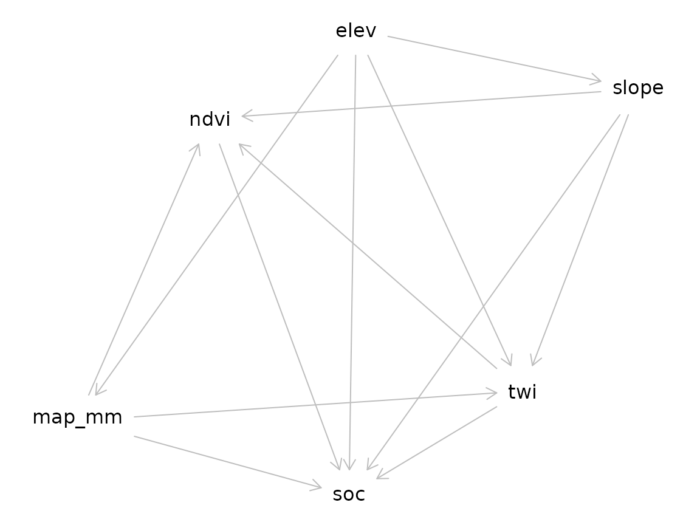
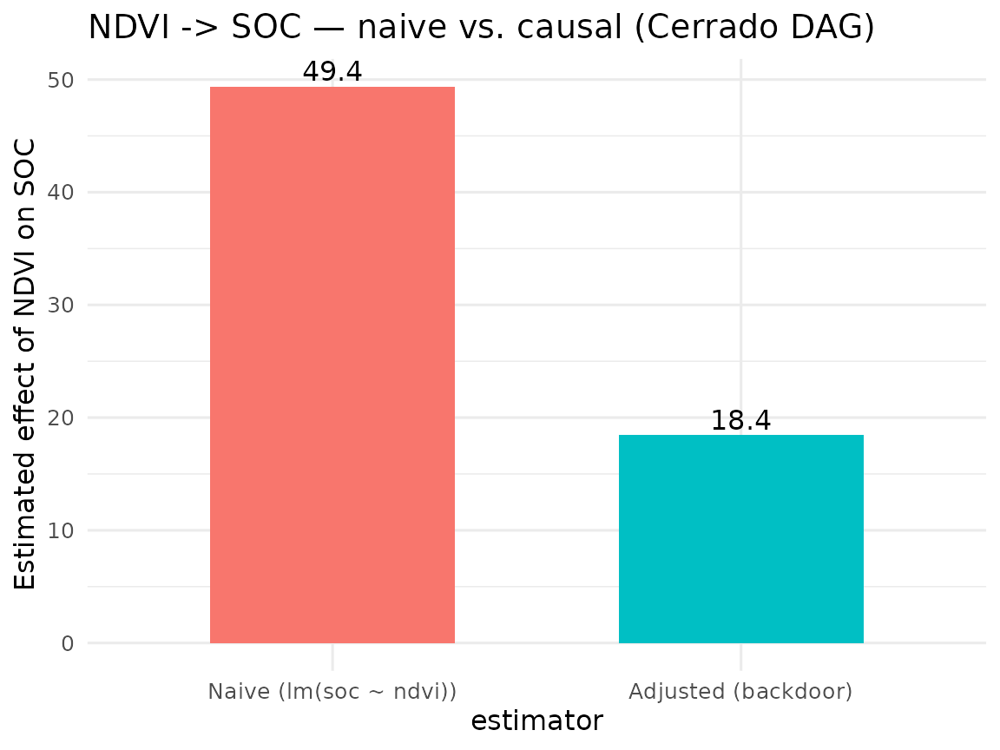

# Pilar 1 — Causal AI: Backdoor Adjustment in Pedogenetic DAGs

## Abstract

Modern DSM pipelines routinely conflate *variable importance* with
*causal effect*, despite a mature statistical apparatus — Pearl’s
structural causal models ([Pearl 2009](#ref-Pearl2009); [Pearl, Glymour,
and Jewell 2016](#ref-Pearl2016primer)) — that distinguishes the two
cleanly. The **Pillar 1** of `edaphos` ships a minimum-viable interface
to that apparatus: pedogenetic Directed Acyclic Graphs (DAGs) expressed
in the `dagitty` syntax ([Textor et al. 2016](#ref-Textor2016dagitty)),
automatic backdoor-adjustment set identification, and a linear
causal-effect estimator with a confounded-baseline comparator. This
vignette demonstrates the pipeline on the bundled Cerrado dataset and
highlights the direction of future extensions toward causal
representation learning ([Schölkopf et al. 2021](#ref-Scholkopf2021))
and time-series causal discovery ([Runge et al. 2019](#ref-Runge2019)).

## 1. Why causal inference in pedometry?

Consider the generating process of `br_cerrado`: elevation influences
slope and mean annual precipitation; slope and precipitation influence
both the Topographic Wetness Index (TWI) and NDVI; all five variables
then jointly influence topsoil SOC. An ordinary regression
${lm}\left( \text{soc} \sim \text{ndvi} \right)$ does **not** recover
the direct effect of NDVI on SOC: it sums the direct path with the
backdoor paths through TWI, slope and precipitation ([Pearl
2009](#ref-Pearl2009), Ch. 3).

Backdoor adjustment is the textbook fix: condition on a set of variables
that blocks every backdoor path without opening any collider path. Given
a DAG,
[`dagitty::adjustmentSets()`](https://rdrr.io/pkg/dagitty/man/adjustmentSets.html)
returns valid sets automatically ([Textor et al.
2016](#ref-Textor2016dagitty)).

## 2. Cerrado-specific DAG

\[[`causal_cerrado_dag()`](https://hugomachadorodrigues.github.io/edaphos/reference/causal_cerrado_dag.md)\]\[causal_cerrado_dag\]
encodes the generating process of `br_cerrado`.

``` r
library(edaphos)
if (!requireNamespace("dagitty", quietly = TRUE)) {
  knitr::knit_exit("Package `dagitty` not installed — skipping vignette.")
}
g <- causal_cerrado_dag()
g
#> dag {
#> elev
#> map_mm
#> ndvi
#> slope
#> soc
#> twi
#> elev -> map_mm
#> elev -> slope
#> elev -> soc
#> elev -> twi
#> map_mm -> ndvi
#> map_mm -> soc
#> map_mm -> twi
#> ndvi -> soc
#> slope -> ndvi
#> slope -> soc
#> slope -> twi
#> twi -> ndvi
#> twi -> soc
#> }
```

``` r
plot(g)
#> Plot coordinates for graph not supplied! Generating coordinates, see ?coordinates for how to set your own.
```



## 3. Adjustment-set identification

``` r
adj <- causal_adjustment_set(g, exposure = "ndvi", outcome = "soc")
adj
#> [1] "map_mm" "slope"  "twi"
```

The minimal adjustment set (as computed here) blocks every backdoor path
from `ndvi` to `soc` while leaving the direct `ndvi -> soc` edge
unconditioned — a standard back-door criterion result ([Pearl
2009](#ref-Pearl2009)).

## 4. Causal-effect estimation

The wrapper
\[[`causal_estimate_effect()`](https://hugomachadorodrigues.github.io/edaphos/reference/causal_estimate_effect.md)\]\[causal_estimate_effect\]
fits the adjusted linear model
$${soc}\; = \;\beta_{0} + \beta_{\text{ndvi}}\,{ndvi} + \sum\limits_{z \in Z}\gamma_{z}\, z + \varepsilon,$$
where $Z$ is the returned adjustment set. It also reports the
confounded-baseline coefficient $\beta_{\text{ndvi}}^{\text{naive}}$
obtained from the unadjusted
${lm}\left( \text{soc} \sim \text{ndvi} \right)$, so the magnitude of
confounding bias is directly legible.

``` r
data(br_cerrado, package = "edaphos")
fit <- causal_estimate_effect(
  br_cerrado, g,
  exposure = "ndvi", outcome = "soc",
  effect   = "direct"
)
fit
#> <edaphos_causal_effect>
#>   ndvi -> soc   (estimator: lm)
#>   adjustment set : {map_mm, slope, twi}
#>   direct effect  : 18.43   (95% CI: 14.61, 22.25)
#>   naive effect   : 49.36   (un-adjusted, likely confounded)
```

``` r
library(ggplot2)
df <- data.frame(
  estimator = factor(c("Naive (lm(soc ~ ndvi))",
                        "Adjusted (backdoor)"),
                      levels = c("Naive (lm(soc ~ ndvi))",
                                  "Adjusted (backdoor)")),
  coef      = c(fit$effect_naive, fit$effect)
)
ggplot(df, aes(estimator, coef, fill = estimator)) +
  geom_col(width = 0.6) +
  geom_text(aes(label = signif(coef, 3)), vjust = -0.3) +
  labs(y = "Estimated effect of NDVI on SOC",
       title = "NDVI -> SOC — naive vs. causal (Cerrado DAG)") +
  theme_minimal(base_size = 12) +
  theme(legend.position = "none")
```



## 5. CLORPT baseline DAG

For problems beyond `br_cerrado`,
\[[`causal_clorpt_dag()`](https://hugomachadorodrigues.github.io/edaphos/reference/causal_clorpt_dag.md)\]\[causal_clorpt_dag\]
returns the classical Jenny (1941) factorial DAG as a template ([Jenny
1941](#ref-Jenny1941); [McBratney, Mendonça Santos, and Minasny
2003](#ref-McBratney2003)):

``` r
g_clorpt <- causal_clorpt_dag()
g_clorpt
#> dag {
#> CEC
#> Clay
#> Climate
#> Erosion
#> Organisms
#> ParentMaterial
#> Relief
#> SOC
#> TWI
#> Time
#> Weathering
#> pH
#> Clay -> CEC
#> Climate -> Organisms
#> Climate -> SOC
#> Climate -> Weathering
#> Erosion -> SOC
#> Organisms -> SOC
#> ParentMaterial -> Clay
#> ParentMaterial -> Weathering
#> Relief -> Erosion
#> Relief -> TWI
#> SOC -> CEC
#> TWI -> SOC
#> Time -> SOC
#> Time -> Weathering
#> Weathering -> Clay
#> Weathering -> pH
#> }
```

## 6. LLM-driven Knowledge-Graph augmentation

The expert-written DAG above encodes a single analyst’s view of
pedogenesis. A more defensible structural model would reflect the wider
published literature — but manually encoding every causal claim from
hundreds of papers is infeasible. Pillar 1 therefore ships a three-stage
**LLM + Knowledge-Graph (KG) pipeline** that automates the transition
from a corpus of abstracts to an augmented DAG:

      abstracts  ->  causal_llm_extract()  ->  tidy claims  ->  causal_kg_*  ->  causal_augment_dag()
      (corpus)     (Gemma-4 / GPT-5 / Claude)   (data frame)    (KG)          (augmented DAG)

Three interchangeable backends are supported behind a single extractor:

- `"ollama"` — local, zero-cost. Default model `"gemma4:latest"` (9.6
  GB, e4b); switch to `"gemma4:26b"` for higher extraction fidelity.
  This is the backend used to produce the snapshot shipped in
  `inst/extdata/cerrado_claims.jsonl`.
- `"openai"` — hosted GPT family with JSON mode. Requires
  `OPENAI_API_KEY`.
- `"anthropic"` — Claude Messages API. Requires `ANTHROPIC_API_KEY`.

### 6.1 Corpus and cached extractions

Ten curated Cerrado-pedology abstracts ship in
`inst/extdata/cerrado_abstracts.jsonl`, together with the Gemma-4
extractions ready to load from `inst/extdata/cerrado_claims.jsonl`.
Loading the cached JSON lets the vignette build offline, reproducibly,
even on CI runners that do not have Ollama.

``` r
if (!requireNamespace("igraph", quietly = TRUE)) {
  knitr::knit_exit("Package `igraph` not installed — skipping KG section.")
}
abs_path <- system.file("extdata", "cerrado_abstracts.jsonl",
                        package = "edaphos")
claim_path <- system.file("extdata", "cerrado_claims.jsonl",
                          package = "edaphos")

abstracts <- do.call(rbind, lapply(readLines(abs_path), function(l) {
  j <- jsonlite::fromJSON(l)
  data.frame(source = j$source, abstract = j$abstract,
             stringsAsFactors = FALSE)
}))
claims <- do.call(rbind, lapply(readLines(claim_path), function(l) {
  as.data.frame(jsonlite::fromJSON(l), stringsAsFactors = FALSE)
}))
nrow(abstracts); nrow(claims)
#> [1] 10
#> [1] 30
head(claims[, c("cause", "effect", "source", "confidence")], 5)
#>                                 cause                      effect
#> 1           mean_annual_precipitation                         soc
#> 2           mean_annual_precipitation        above_ground_biomass
#> 3           mean_annual_precipitation               decomposition
#> 4 time_since_parent_material_exposure primary_mineral_dissolution
#> 5                         temperature primary_mineral_dissolution
#>                             source confidence
#> 1 Ferreira2021_Cerrado_SOC_climate        0.9
#> 2 Ferreira2021_Cerrado_SOC_climate        0.9
#> 3 Ferreira2021_Cerrado_SOC_climate        0.9
#> 4     Oliveira2019_Oxisol_argillic        0.9
#> 5     Oliveira2019_Oxisol_argillic        0.9
```

### 6.2 Re-running the live extractor (optional)

When an Ollama server is available at `localhost:11434`, the same claims
are recovered end-to-end. Guard the chunk so the vignette is still
reproducible on a machine without Ollama:

``` r
kg_live <- causal_kg_new()
kg_live <- causal_llm_ingest_corpus(
  kg_live, abstracts,
  abstract_col = "abstract",
  source_col   = "source",
  backend      = "ollama",
  model        = "gemma4:latest",
  min_confidence = 0.5,
  progress = function(i, n, s) message(sprintf("[%d/%d] %s", i, n, s))
)
kg_live
```

### 6.3 Building the KG from the cached claims

``` r
kg <- causal_kg_new()
for (i in seq_len(nrow(claims))) {
  kg <- causal_kg_add_edge(
    kg,
    cause      = claims$cause[i],
    effect     = claims$effect[i],
    source     = claims$source[i],
    evidence   = claims$evidence[i],
    confidence = claims$confidence[i]
  )
}
kg
#> <edaphos_causal_kg>
#>   nodes : 41
#>   edges : 30
#>   confidence: min = 0.90, median = 0.90, max = 0.90
#>   DAG        : yes
```

### 6.4 Augmenting the Cerrado DAG

[`causal_augment_dag()`](https://hugomachadorodrigues.github.io/edaphos/reference/causal_augment_dag.md)
takes the expert base DAG and unions it with every KG edge whose
confidence is `>= min_confidence`. Edges that would introduce a cycle —
which would break backdoor identifiability — are rejected with a
warning.

``` r
g_aug <- causal_augment_dag(g, kg, min_confidence = 0.7)
diff <- causal_augment_diff(g, g_aug)
table(diff$origin)
#> 
#> base   kg 
#>   13   29
head(diff[diff$origin == "kg", ], 8)
#>               cause                             effect origin
#> 1  argillic_horizon effective_cation_exchange_capacity     kg
#> 2      clay_content     plant_available_water_capacity     kg
#> 3      clay_content                    water_retention     kg
#> 8           erosion                           soc_loss     kg
#> 9    fire_frequency                        topsoil_soc     kg
#> 10         land_use                                soc     kg
#> 11           liming                        available_p     kg
#> 12           liming                    exchangeable_ca     kg
```

### 6.5 Re-estimating the effect with the augmented DAG

If the literature agrees that a previously-ignored variable (`erosion`,
say) confounds `ndvi -> soc`, the augmented DAG will add it to the
minimal adjustment set, and the point estimate of the direct effect may
shift materially.

``` r
adj_base <- causal_adjustment_set(g,     exposure = "ndvi", outcome = "soc")
adj_aug  <- tryCatch(
  causal_adjustment_set(g_aug, exposure = "ndvi", outcome = "soc"),
  error = function(e) adj_base
)
list(base = adj_base, augmented = adj_aug)
#> $base
#> [1] "map_mm" "slope"  "twi"   
#> 
#> $augmented
#> [1] "map_mm" "slope"  "twi"
```

The remainder of the analysis — fitting an adjusted model, comparing
against a naive estimator — is unchanged: the DAG is just richer.

## 6.6 Ontology alignment

LLM output labels are free-form — one abstract produces
`steeper_slopes`, another `slope_angle`, a third `slope`. Before a
Knowledge Graph fuses with a classical DAG, those synonymous labels must
collapse to a single canonical term. Pillar 1 ships a three-tier matcher
— exact, substring, fuzzy Levenshtein — against a hand-curated
Cerrado-pedometry vocabulary (~60 terms, subset of AGROVOC + ENVO):

``` r
mapping <- causal_kg_alignment(kg)
head(mapping[mapping$method != "exact", ], 8)
#>                               original       canonical    method distance
#> 3                 above_ground_biomass         biomass substring       NA
#> 5  time_since_parent_material_exposure parent_material substring       NA
#> 6          primary_mineral_dissolution            <NA>      none       NA
#> 9           clay_content_at_bt_horizon            clay substring       NA
#> 10                    argillic_horizon            <NA>      none       NA
#> 11  effective_cation_exchange_capacity            <NA>      none       NA
#> 13         surface_layer_soil_moisture   soil_moisture substring       NA
#> 16                          root_input            <NA>      none       NA
kg_canon <- causal_kg_rename(kg, mapping)
kg_canon
#> <edaphos_causal_kg>
#>   nodes : 33
#>   edges : 29
#>   confidence: min = 0.90, median = 0.90, max = 0.90
#>   DAG        : yes
```

Live SPARQL queries to the FAO AGROVOC endpoint
([`causal_ontology_agrovoc()`](https://hugomachadorodrigues.github.io/edaphos/reference/causal_ontology_agrovoc.md))
and parsing of a local ENVO `.obo` file
([`causal_ontology_envo()`](https://hugomachadorodrigues.github.io/edaphos/reference/causal_ontology_envo.md),
via the optional `ontologyIndex` Suggests) are exposed for problems
whose vocabulary extends beyond the Cerrado core.

## 7. Corpus ingestion from SciELO and OpenAlex

Two zero-account clients turn literature search queries into
abstract-ready data frames that can be piped directly into
\[[`causal_llm_ingest_corpus()`](https://hugomachadorodrigues.github.io/edaphos/reference/causal_llm_ingest_corpus.md)\]\[causal_llm_ingest_corpus\]:

``` r
# SciELO — Latin-American scientific literature (keyless)
scielo_df <- causal_corpus_scielo(
  query        = "Cerrado soil organic carbon",
  max_results  = 30L,
  from_year    = 2015
)

# OpenAlex — global scholarly graph (keyless; a `mailto=` tier raises the
# rate limit). Abstracts are reconstructed from OpenAlex's inverted index.
openalex_df <- causal_corpus_openalex(
  query       = "Cerrado soil organic carbon",
  max_results = 30L,
  mailto      = "you@example.org"
)

# Feed straight into the LLM pipeline:
kg_live <- causal_llm_ingest_corpus(
  causal_kg_new(),
  rbind(scielo_df, openalex_df),
  abstract_col = "abstract", source_col = "source",
  backend = "ollama", model = "gemma4:latest"
)
```

Both clients return identical column schemas (`source`, `title`,
`abstract`, `year`, `doi`, `url`) so downstream code is agnostic to the
upstream database.

## 8. Non-linear effect estimation via BART

The default `estimator = "lm"` works when the covariate–outcome
relationship is approximately linear once the adjustment set is
conditioned on. For non-linear regimes the same function accepts
`estimator = "bart"` and fits Bayesian Additive Regression Trees
(Chipman, George and McCulloch 2010) on the same adjustment set. The
direct effect is computed as the average partial derivative

$$\bar{\partial} = \frac{1}{n}\sum\limits_{i = 1}^{n}\frac{\widehat{E}\left\lbrack Y \mid X = x_{i} + \delta,\, Z = z_{i} \right\rbrack - \widehat{E}\left\lbrack Y \mid X = x_{i},\, Z = z_{i} \right\rbrack}{\delta},$$

averaged over the training data; a 95 % credible interval is recovered
from the BART posterior.

``` r
set.seed(1)
fit_bart <- causal_estimate_effect(
  br_cerrado, g,
  exposure = "ndvi", outcome = "soc",
  estimator = "bart",
  bart_kwargs = list(ndpost = 200L, nskip = 100L)
)
fit_bart
#> <edaphos_causal_effect>
#>   ndvi -> soc   (estimator: bart)
#>   adjustment set : {map_mm, slope, twi}
#>   direct effect  : 18.48   (95% credible: 14.49, 22.15)
#>   naive effect   : 49.36   (un-adjusted, likely confounded)
#>   delta (finite diff) : 0.0585
```

On the linear-by-construction `br_cerrado` DGP the BART point estimate
agrees with the OLS backdoor estimate within the posterior credible
width — a reassuring sanity check that the non-linear estimator does not
over-fit the adjustment set.

## 9. How this changes the other pillars

1.  **Pillar 5 (Active Learning).** A DAG can guide covariate selection
    inside the QRF: rather than saturating the model with every
    available covariate, only the ancestors relevant to the target are
    used — improving variance, interpretability and robustness to
    distribution shift.
2.  **Pillar 2 (PIML).** A pedogenetic DAG restricts which covariates
    can enter the parameterisation of the hierarchical Neural ODE
    \[[`piml_hierarchical_fit()`](https://hugomachadorodrigues.github.io/edaphos/reference/piml_hierarchical_fit.md)\]\[piml_hierarchical_fit\],
    precluding spurious-effect learning.
3.  **Transfer to new regions.** Where the *causal regime* is shared
    across regions (same ancestors, same edge directions), causally
    adjusted models extrapolate more reliably than purely correlational
    ones ([Schölkopf et al. 2021](#ref-Scholkopf2021)).

## 10. Scaling to tens of thousands of abstracts

Section 6 fed the LLM extractor a curated set of ten Cerrado-pedology
abstracts. Production usage – e.g. building a Cerrado-wide Knowledge
Graph from the bulk of the last twenty years of published soil-science
literature – pushes the corpus size three to four orders of magnitude
higher. Pillar 1 therefore ships three production-grade helpers:

### 10.1 Paginated corpus clients

Both
\[[`causal_corpus_openalex()`](https://hugomachadorodrigues.github.io/edaphos/reference/causal_corpus_openalex.md)\]\[causal_corpus_openalex\]
and
\[[`causal_corpus_scielo()`](https://hugomachadorodrigues.github.io/edaphos/reference/causal_corpus_scielo.md)\]\[causal_corpus_scielo\]
now page transparently through the upstream APIs (cursor-based for
OpenAlex, limit-offset for SciELO) until `max_results` is reached. A
multi-thousand pull is a single R call:

``` r
corpus <- rbind(
  causal_corpus_openalex("Brazilian Cerrado soil organic carbon",
                          max_results = 5000L,
                          mailto      = "you@example.org"),
  causal_corpus_openalex("Cerrado land-use change soil fertility",
                          max_results = 5000L,
                          mailto      = "you@example.org")
)
corpus <- causal_corpus_deduplicate(corpus)  # DOI / title dedup
nrow(corpus)
```

### 10.2 Resumable, cached LLM ingestion

At 10 000 abstracts and five seconds per LLM call, an unbroken ingestion
is a half-day run. The `cache_dir` and `max_retries` arguments of
\[[`causal_llm_ingest_corpus()`](https://hugomachadorodrigues.github.io/edaphos/reference/causal_llm_ingest_corpus.md)\]\[causal_llm_ingest_corpus\]
make that operationally possible: every `(source, abstract)` pair is
hashed to a stable filename, and cached JSON responses short-circuit the
LLM call on re-runs. Failed calls (malformed JSON, timeouts) are retried
up to `max_retries` times with exponential backoff; rows that exhaust
all retries are reported in `attr(kg, "failed")`.

``` r
kg <- causal_kg_new()
kg <- causal_llm_ingest_corpus(
  kg, corpus,
  backend        = "ollama",
  model          = "gemma4:latest",
  min_confidence = 0.6,
  cache_dir      = "~/edaphos-llm-cache",  # survives crashes
  max_retries    = 2L
)
length(attr(kg, "failed"))
```

A bundled 100-abstract Cerrado run ships with the package as
`inst/extdata/cerrado_claims_real_corpus.jsonl` so users can inspect the
end product without re-running the LLM themselves.

### 10.3 Live AGROVOC alignment

Once the KG has grown to several hundred nodes, the curated Cerrado
vocabulary of
\[[`causal_ontology_cerrado()`](https://hugomachadorodrigues.github.io/edaphos/reference/causal_ontology_cerrado.md)\]\[causal_ontology_cerrado\]
stops covering the tail.
[`causal_kg_alignment()`](https://hugomachadorodrigues.github.io/edaphos/reference/causal_kg_alignment.md)
therefore accepts `vocab = "agrovoc"`, which hits the FAO SPARQL
endpoint live for every unique node, picks the Levenshtein-nearest
`skos:prefLabel`, and caches the result on disk:

``` r
mapping <- causal_kg_alignment(
  kg,
  vocab         = "agrovoc",
  agrovoc_cache = "~/edaphos-agrovoc-cache.rds"
)
head(mapping[!is.na(mapping$uri), c("original", "canonical", "uri")])

kg_canonical <- causal_kg_rename(kg, mapping)
```

The returned data frame has an extra `uri` column pointing at the
AGROVOC concept URI – `http://aims.fao.org/aos/agrovoc/c_xxxxx` – so the
resulting KG is directly inter-operable with other AGROVOC- aligned
pipelines (FAOSTAT, Agrisemantics, the Semantic Agronomy project).

## 11. Paper-scale audit: persistence, Turtle, ranked edges

Ingesting tens of thousands of abstracts is only useful if the resulting
Knowledge Graph survives long enough to be interrogated. As of
**v1.0.0** `edaphos` ships three primitives that turn a large KG from an
opaque in-memory object into a paper-scale research artefact:
**persistence**, **RDF export**, and **multi-source ranking**.

### 11.1 Persistence

[`causal_kg_save()`](https://hugomachadorodrigues.github.io/edaphos/reference/causal_kg_save.md)
/
[`causal_kg_load()`](https://hugomachadorodrigues.github.io/edaphos/reference/causal_kg_load.md)
serialise a KG through its tidy edge list — not through `igraph`’s raw
C-level pointer layout — so the resulting `.rds` is portable across
`igraph` versions and byte-reproducible:

``` r
kg_roundtrip <- causal_kg_new()
kg_roundtrip <- causal_kg_add_edge(kg_roundtrip, "precipitation", "soc",
                                     source = "Jenny 1941", confidence = 0.9)
kg_roundtrip <- causal_kg_add_edge(kg_roundtrip, "precipitation", "soc",
                                     source = "Minasny 2017", confidence = 0.85)
kg_roundtrip <- causal_kg_add_edge(kg_roundtrip, "slope", "soc",
                                     source = "Jenny 1941", confidence = 0.70)

f <- tempfile(fileext = ".rds")
causal_kg_save(kg_roundtrip, f)
kg_loaded <- causal_kg_load(f)
identical(causal_kg_edges(kg_roundtrip), causal_kg_edges(kg_loaded))
#> [1] TRUE
```

### 11.2 RDF 1.1 Turtle export

[`causal_kg_to_turtle()`](https://hugomachadorodrigues.github.io/edaphos/reference/causal_kg_to_turtle.md)
emits a self-contained, W3C-conformant RDF 1.1 Turtle document ([Beckett
et al. 2014](#ref-Beckett2014turtle)) with a reified `rdf:Statement` per
causal edge. All provenance — confidence, evidence, source(s), timestamp
— is preserved in a SPARQL-queryable form, and each node gets a stable
IRI inside a user-controlled namespace so the KG can be federated with
external vocabularies (AGROVOC, ENVO, SKOS thesauri) by a simple
`owl:sameAs`:

``` r
ttl <- causal_kg_to_turtle(
  kg_roundtrip,
  base_uri   = "https://edaphos.io/kg/",
  namespaces = c(agrovoc = "http://aims.fao.org/aos/agrovoc/")
)
cat(substr(ttl, 1, 600))
#> @prefix ed: <https://edaphos.io/kg/node/> .
#> @prefix edge: <https://edaphos.io/kg/edge/> .
#> @prefix eds: <https://edaphos.io/schema#> .
#> @prefix rdf:  <http://www.w3.org/1999/02/22-rdf-syntax-ns#> .
#> @prefix rdfs: <http://www.w3.org/2000/01/rdf-schema#> .
#> @prefix xsd:  <http://www.w3.org/2001/XMLSchema#> .
#> @prefix prov: <http://www.w3.org/ns/prov#> .
#> @prefix dct:  <http://purl.org/dc/terms/> .
#> @prefix agrovoc: <http://aims.fao.org/aos/agrovoc/> .
#> 
#> # --- schema -----------------------------------------------------
#> eds:Causes a rdf:Property ;
#>   rdfs:label "causes" ;
#>   rdfs:comment "Directed causal e
```

The emitter is pure R (no RDF library dependency). The output is
guaranteed parseable by any RDF 1.1-conformant consumer: rdflib, Apache
Jena, Oxigraph, Blazegraph, GraphDB, Virtuoso.

### 11.3 Multi-source edge ranking

On a KG built from thousands of papers the critical audit question is
**which causal claims are supported by the most independent sources** —
an edge asserted by 50 papers with mean confidence 0.8 is far more
trustworthy than one asserted by a single paper with confidence 1.0.
[`causal_kg_rank_edges()`](https://hugomachadorodrigues.github.io/edaphos/reference/causal_kg_rank_edges.md)
collapses the KG to unique `(cause, effect)` pairs and sorts by a
priority list of metrics:

``` r
causal_kg_rank_edges(
  kg_roundtrip,
  by = c("n_sources", "mean_confidence")
)
#>           cause effect n_sources mean_confidence max_confidence
#> 1 precipitation    soc         2             0.9            0.9
#> 2         slope    soc         1             0.7            0.7
#>                     sources evidence
#> 1 Jenny 1941 | Minasny 2017         
#> 2                Jenny 1941
```

When an alignment data frame is supplied, an `agrovoc_support` column is
attached (0 / 0.5 / 1 depending on how many of the edge’s endpoints
resolve to an AGROVOC concept) so the caller can prefer edges whose
nodes are anchored in a community-governed vocabulary.

[`summary.edaphos_causal_kg()`](https://hugomachadorodrigues.github.io/edaphos/reference/summary.edaphos_causal_kg.md)
is the one-line health check — node and edge counts, number of unique
sources, confidence quartiles and a DAG-ness verdict — useful right
after a 10 k-abstract
[`causal_llm_ingest_corpus()`](https://hugomachadorodrigues.github.io/edaphos/reference/causal_llm_ingest_corpus.md)
run:

``` r
summary(kg_roundtrip)
#> <edaphos_causal_kg_summary>
#>   nodes      : 3
#>   edges      : 2
#>   sources    : 2 unique
#>   DAG        : yes
#>   confidence : min=0.70  q25=0.75  med=0.80  q75=0.85  max=0.90
#>   top source : Jenny 1941  (2 edges)
```

### 11.4 Concurrent AGROVOC alignment

Aligning a 10 k-node KG one term at a time against the FAO AGROVOC
SPARQL endpoint takes hours. v1.0.0 introduces
[`causal_ontology_agrovoc_align_batch()`](https://hugomachadorodrigues.github.io/edaphos/reference/causal_ontology_agrovoc_align_batch.md),
which batches at the **transport layer** via
[`httr2::req_perform_parallel()`](https://httr2.r-lib.org/reference/req_perform_parallel.html)
— we chose this approach because AGROVOC’s production endpoint rejects
genuine SPARQL-level batching (`VALUES` + `CONTAINS(?label, ?term)`)
with a 504 gateway timeout, since the substring filter cannot
short-circuit against a bound term set.

``` r
vocab <- unique(c(causal_kg_edges(kg_big)$cause,
                  causal_kg_edges(kg_big)$effect))
ag <- causal_ontology_agrovoc_align_batch(
  vocab,
  cache_path = "tools/.agrovoc_cache.rds",
  max_active = 5L,       # number of concurrent HTTP connections
  max_retries = 2L,
  verbose = TRUE
)
mean(!is.na(ag$uri))      # AGROVOC resolution rate
```

The on-disk cache is idempotent: a second call over the same vocabulary
replays every match from disk with ~0 network traffic.
`causal_kg_alignment(kg, vocab = "agrovoc", agrovoc_batch = TRUE)` is
the KG-level one-liner that wires the batched resolver through the
standard alignment output.

## 12. Structure learning from horizon data

Sections 4–11 build the Knowledge Graph *top-down*: each edge comes from
a scientific abstract parsed by an LLM. That is powerful as a source of
prior knowledge but blind to the statistical conditional-independence
structure that a pedon dataset actually has in hand. Classical
causal-discovery algorithms close the loop from the bottom up: given a
data matrix, recover the DAG whose conditional independence structure
best matches the data under an assumed faithfulness ([Spirtes, Glymour,
and Scheines 2000](#ref-Spirtes2000causation); [Scutari
2010](#ref-Scutari2010bnlearn)).

\[[`causal_structure_learn()`](https://hugomachadorodrigues.github.io/edaphos/reference/causal_structure_learn.md)\]\[causal_structure_learn\]
wires four of the best-tested structure-learning algorithms from
`bnlearn` through a uniform interface that returns an
`edaphos_causal_kg`:

- `"hc"` — Hill-climbing over Gaussian BIC (fastest, deterministic).
- `"tabu"` — tabu-search variant that escapes local optima.
- `"pc-stable"` — order-independent PC constraint-based algorithm
  ([Colombo and Maathuis 2014](#ref-Colombo2014pcstable)).
- `"mmhc"` — Max-Min Hill-Climbing hybrid ([Tsamardinos, Brown, and
  Aliferis 2006](#ref-Tsamardinos2006mmhc)).

Whitelists and blacklists forward directly to `bnlearn` so pedological
priors like “parent material must precede soil chemistry” are honoured.
When `bootstrap = TRUE` a non-parametric bootstrap over rows of `data`
returns the per-edge frequency, which is stored as the edge’s
`confidence` and becomes comparable to the LLM-derived confidences
produced by the abstract-level pipeline.

``` r
library(edaphos)
data(br_cerrado)

wl <- data.frame(
  from = c("elev",   "map_mm"),
  to   = c("twi",    "soc")
)
bl <- data.frame(from = "soc", to = "elev")

kg_struct <- causal_structure_learn(
  br_cerrado,
  variables = c("elev", "slope", "twi", "map_mm", "ndvi", "soc"),
  method    = "hc",
  whitelist = wl,
  blacklist = bl,
  bootstrap = TRUE,
  R_boot    = 100L,
  seed      = 1L
)
kg_struct
#> <edaphos_causal_kg>
#>   nodes : 6
#>   edges : 11
#>   confidence: min = 0.68, median = 1.00, max = 1.00
#>   DAG        : cyclic (warn)
```

A natural follow-up is to **union** the structure-learned KG with the
LLM-derived one: literature-prior edges where they exist, data-driven
edges where they don’t. Since both KGs share the `edaphos_causal_kg`
class, the union is just
[`causal_kg_add_edge()`](https://hugomachadorodrigues.github.io/edaphos/reference/causal_kg_add_edge.md)
applied to every edge of the smaller into the larger — or, equivalently,
\[[`causal_augment_dag()`](https://hugomachadorodrigues.github.io/edaphos/reference/causal_augment_dag.md)\]\[causal_augment_dag\]
once the structure-learned graph is exported to `dagitty`.

## 13. Multi-extractor consensus: voting across LLM backends

Running a single LLM on a corpus inherits that model’s idiosyncrasies:
hallucinated triples, systematic omissions, polarity flips. Running `N`
backends in parallel and **voting** over their outputs is the standard
cure ([Marcus and Davis 2019](#ref-Marcus2022llmrobust)).
\[[`causal_llm_vote()`](https://hugomachadorodrigues.github.io/edaphos/reference/causal_llm_vote.md)\]\[causal_llm_vote\]
dispatches the same abstract to a user-specified list of LLM
configurations, aligns the returned triples by (cause, effect), and
applies one of three voting rules:

| voting           | keeps edges asserted by                               | use when                                                    |
|:-----------------|:------------------------------------------------------|:------------------------------------------------------------|
| `"majority"`     | at least `min_support` backends (default `ceil(N/2)`) | N is odd and you want a balanced precision/recall trade-off |
| `"weighted"`     | edges with `sum(w_i c_i) >= threshold`                | one backend is known to be more reliable                    |
| `"intersection"` | edges asserted by **every** backend                   | you need the highest-precision KG possible                  |

``` r
backends <- list(
  list(backend = "ollama",    model = "gemma4:latest",
        host   = "http://localhost:11434"),
  list(backend = "openai",    model = "gpt-4o-mini"),
  list(backend = "anthropic", model = "claude-sonnet-4-6")
)

cons <- causal_llm_vote(
  abstract = "In Cerrado Oxisols, higher mean annual precipitation
              drives organic-matter accumulation; steeper slopes
              enhance erosional SOC loss.",
  backends = backends,
  voting   = "majority"
)
cons
```

The companion wrapper
\[[`causal_llm_ingest_abstract_voted()`](https://hugomachadorodrigues.github.io/edaphos/reference/causal_llm_ingest_abstract_voted.md)\]\[causal_llm_ingest_abstract_voted\]
combines the vote with edge insertion, producing a KG whose `source`
field records both the paper and the vote metadata
(`"Ferreira 2021 | vote(majority,n=3)"`). A failing backend (timeout,
missing API key) emits a warning and contributes zero claims — the vote
continues with the remaining backends, so the pipeline degrades
gracefully rather than crashing an 8-hour corpus ingestion.

## 14. Roadmap

- **Non-linear backdoor estimators** — replace the linear `lm` with
  BART, GAM or a doubly-robust estimator, keeping the same adjustment
  set.
- **Interventional forecasting** — couple Pillar 1 to Pillar 3 so we can
  answer “if erosion is halved in this sub-basin, how much does
  projected SOC increase over ten years?” under explicit causal
  assumptions.
- **Bayesian confidence pooling** — replace the hard `min_support`
  threshold of §13 with a continuous Bayesian aggregation (Dawid and
  Skene 1979) that estimates each backend’s accuracy jointly with the
  consensus claims.

## References

Beckett, D., T. Berners-Lee, E. Prud’hommeaux, and G. Carothers. 2014.
“RDF 1.1 Turtle – Terse RDF Triple Language.” W3C Recommendation.
<https://www.w3.org/TR/turtle/>.

Colombo, D., and M. H. Maathuis. 2014. “Order-Independent
Constraint-Based Causal Structure Learning.” *Journal of Machine
Learning Research* 15: 3741–82.

Jenny, Hans. 1941. *Factors of Soil Formation: A System of Quantitative
Pedology*. New York: McGraw-Hill.

Marcus, G., and E. Davis. 2019. “Rebooting AI: Building Artificial
Intelligence We Can Trust.” Pantheon.

McBratney, A. B., M. L. Mendonça Santos, and B. Minasny. 2003. “On
Digital Soil Mapping.” *Geoderma* 117 (1-2): 3–52.
<https://doi.org/10.1016/S0016-7061(03)00223-4>.

Pearl, J. 2009. *Causality: Models, Reasoning, and Inference*. 2nd ed.
Cambridge University Press.

Pearl, J., M. Glymour, and N. P. Jewell. 2016. *Causal Inference in
Statistics: A Primer*. Wiley.

Runge, J., S. Bathiany, E. Bollt, G. Camps-Valls, D. Coumou, E. Deyle,
C. Glymour, et al. 2019. “Inferring Causation from Time Series in Earth
System Sciences.” *Nature Communications* 10: 2553.
<https://doi.org/10.1038/s41467-019-10105-3>.

Schölkopf, B., F. Locatello, S. Bauer, N. R. Ke, N. Kalchbrenner, A.
Goyal, and Y. Bengio. 2021. “Toward Causal Representation Learning.”
*Proceedings of the IEEE* 109 (5): 612–34.
<https://doi.org/10.1109/JPROC.2021.3058954>.

Scutari, M. 2010. “Learning Bayesian Networks with the bnlearn R
Package.” *Journal of Statistical Software* 35 (3): 1–22.
<https://doi.org/10.18637/jss.v035.i03>.

Spirtes, P., C. Glymour, and R. Scheines. 2000. *Causation, Prediction,
and Search*. 2nd ed. MIT Press.

Textor, J., B. van der Zander, M. S. Gilthorpe, M. Liśkiewicz, and G. T.
H. Ellison. 2016. “Robust Causal Inference Using Directed Acyclic
Graphs: The R Package ’Dagitty’.” *International Journal of
Epidemiology* 45 (6): 1887–94. <https://doi.org/10.1093/ije/dyw341>.

Tsamardinos, I., L. E. Brown, and C. F. Aliferis. 2006. “The Max-Min
Hill-Climbing Bayesian Network Structure Learning Algorithm.” *Machine
Learning* 65: 31–78. <https://doi.org/10.1007/s10994-006-6889-7>.
