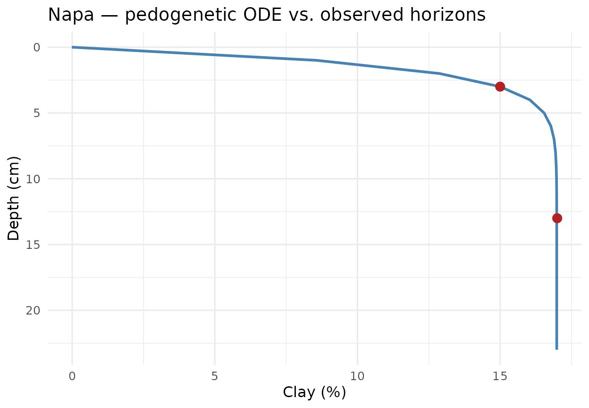

# Pilar 2 — Physics-Informed ML for Soil Depth Profiles

## Abstract

Classical Digital Soil Mapping harmonises horizon observations via
equal-area quadratic splines ([T. F. A. Bishop, McBratney, and Laslett
1999](#ref-Bishop1999); [Malone et al. 2009](#ref-Malone2009)) — a
purely mathematical object disconnected from pedogenesis. The **Pillar
2** of `edaphos` replaces that spline with two Physics-Informed Machine
Learning (PIML) ([Raissi, Perdikaris, and Karniadakis
2019](#ref-Raissi2019); [Karniadakis et al. 2021](#ref-Karniadakis2021);
[Willard et al. 2022](#ref-Willcox2021pinns)) models of the soil depth
profile: a parametric pedogenetic Ordinary Differential Equation (ODE)
integrated by `deSolve` ([Soetaert, Petzoldt, and Setzer
2010](#ref-Soetaert2010desolve)), and a Neural ODE ([Chen et al.
2018](#ref-Chen2018neuralode)) trained by back-propagation through a
fixed-step Runge-Kutta integrator on `torch` ([Falbel and Luraschi
2023](#ref-PichlerRtorch)). Both models are demonstrated on the
[`aqp::sp4`](https://ncss-tech.github.io/aqp/reference/sp4.html)
reference pedons and a hierarchical covariate-conditioned extension
closes the loop with Pillar 5.

## 1. Pedogenetic ODE

Let $y(z)$ denote a soil property (e.g. clay fraction, SOC) at depth
$z \geq 0$. The one-dimensional kinetic model of translocation ([Jenny
1941](#ref-Jenny1941); [Minasny and McBratney 2016](#ref-Minasny2016))
assumes a depth-dependent relaxation towards a parent-material asymptote
$y_{\infty}$ with rate $\lambda(z)$:
$$\frac{dy}{dz}\; = \; - \lambda(z)\,(y(z) - y_{\infty}),\qquad\lambda(z) = \lambda_{0}\, e^{- \mu z}.$$
Parameters $\left( \lambda_{0},\mu,y_{\infty},y_{0} \right)$ carry
explicit physical meaning: $\lambda_{0}$ is the surface pedogenetic
rate; $\mu$ controls how quickly that rate decays with depth; $y_{0}$ is
the surface intercept; and $y_{\infty}$ is the parent-material
extrapolation. The implementation
\[[`piml_profile_fit()`](https://hugomachadorodrigues.github.io/edaphos/reference/piml_profile_fit.md)\]\[piml_profile_fit\]
integrates (1) via
[`deSolve::lsoda`](https://rdrr.io/pkg/deSolve/man/lsoda.html) at every
loss evaluation and minimises
$$\mathcal{J}(\theta)\; = \;\sum\limits_{j}(y\left( z_{j};\theta \right) - y_{j})^{2}\; + \;\eta \parallel \theta \parallel_{2}^{2},$$
with Nelder–Mead and Tikhonov regularisation $\eta$.[¹](#fn1)

## 2. Dataset — `aqp::sp4`

We use the ten reference pedons of
[`aqp::sp4`](https://ncss-tech.github.io/aqp/reference/sp4.html) with
horizon concentrations of clay, sand, Ca, Mg, K, CEC and CF.

``` r
library(edaphos)
.torch_ok <- requireNamespace("torch", quietly = TRUE) &&
             isTRUE(tryCatch(torch::torch_is_installed(),
                             error = function(e) FALSE))
if (!requireNamespace("aqp", quietly = TRUE)) {
  knitr::knit_exit("Package `aqp` not installed — skipping vignette.")
}
data(sp4, package = "aqp")
sp4$depth <- (sp4$top + sp4$bottom) / 2
head(sp4[, c("id", "name", "top", "bottom", "depth", "clay", "K")])
#>       id name top bottom depth clay   K
#> 1 colusa    A   0      3   1.5   21 0.3
#> 2 colusa  ABt   3      8   5.5   27 0.2
#> 3 colusa  Bt1   8     30  19.0   32 0.1
#> 4 colusa  Bt2  30     42  36.0   55 0.1
#> 5  glenn    A   0      9   4.5   25 0.2
#> 6  glenn   Bt   9     34  21.5   34 0.3
unique(sp4$id)
#>  [1] "colusa"         "glenn"          "kings"          "napa"          
#>  [5] "san benito"     "shasta"         "tehama"         "mariposa"      
#>  [9] "mendocino"      "shasta-trinity"
```

## 3. Mono-pedon fit: clay translocation in `napa`

The `napa` pedon is a canonical argillic-horizon case: clay increases
with depth through illuviation then converges to a plateau in the parent
material. The ODE (1) captures that dynamics without prescribing the
sign of $y_{\infty} - y_{0}$.

``` r
napa <- subset(sp4, id == "napa")
napa[, c("name", "depth", "clay")]
#>    name depth clay
#> 10    A     3   15
#> 11   Bt    13   17
fit_napa <- piml_profile_fit(
  depths = napa$depth,
  values = napa$clay
)
fit_napa
#> <edaphos_piml_profile>
#>   dy/dz = -lambda0 * exp(-mu*z) * (y - y_inf)
#>   lambda0 = 0.6964    mu = -0.01849
#>   y_inf   = 16.98     y0 = -0.01188
#>   n obs   = 2         rmse = 0.01209
#>   converged = TRUE
```

``` r
grid_z <- seq(0, max(napa$depth) + 10, by = 1)
pred_napa <- data.frame(depth = grid_z,
                         clay  = predict(fit_napa, grid_z))
```

``` r
library(ggplot2)
ggplot() +
  geom_line(data = pred_napa, aes(clay, depth),
            linewidth = 1, colour = "steelblue") +
  geom_point(data = napa, aes(clay, depth),
             size = 3, colour = "firebrick") +
  scale_y_reverse() +
  labs(x = "Clay (%)", y = "Depth (cm)",
       title = "Napa — pedogenetic ODE vs. observed horizons") +
  theme_minimal(base_size = 12)
```



## 4. Multi-pedon diagnostics

Fitting the full `sp4` dataset recovers an interpretable table where
every row has a direct pedological meaning.

``` r
fits <- piml_profile_fit_group(
  sp4, id = "id", depth = "depth", value = "clay"
)
tab <- do.call(rbind, lapply(names(fits), function(k) {
  p <- fits[[k]]$params
  data.frame(
    pedon   = k,
    lambda0 = signif(p$lambda0, 3),
    mu      = signif(p$mu,      3),
    y_inf   = signif(p$y_inf,   3),
    y0      = signif(p$y0,      3),
    rmse    = signif(fits[[k]]$rmse, 3)
  )
}))
tab
#>                       pedon  lambda0      mu  y_inf      y0   rmse
#> log_lambda0          colusa 5.29e-03 -0.0964 61.900 22.8000 1.7600
#> log_lambda01          glenn 2.62e-01 -0.0541 34.000 -0.0232 0.0239
#> log_lambda02          kings 5.91e-02 -0.1090 27.000 -0.3850 0.0155
#> log_lambda03       mariposa 1.15e-06  2.0900 10.000 30.2000 3.1100
#> log_lambda04      mendocino 5.18e-01  0.0943 23.100  6.4900 0.0281
#> log_lambda05           napa 6.96e-01 -0.0185 17.000 -0.0119 0.0121
#> log_lambda06     san benito 3.81e-02 -0.7500 19.000  0.6070 0.0135
#> log_lambda07         shasta 3.21e-02  1.8600  0.247 14.2000 0.0103
#> log_lambda08 shasta-trinity 4.43e-02 -0.0160 75.800 18.7000 1.6100
#> log_lambda09         tehama 5.77e-03 -0.5500 32.000 23.9000 0.0290
```

## 5. Non-physical baselines

Two baselines bound the improvement claim: the mean predictor and the
linear-in-depth regression. A meaningful PIML gain should come from the
physical constraint, *not* from extra parameters.

``` r
baseline_rmse <- function(sub, target) {
  y <- sub[[target]]
  c(mean   = sqrt(mean((y - mean(y))^2)),
    linear = sqrt(mean(stats::residuals(
                     stats::lm(y ~ sub$depth))^2)))
}
bench <- do.call(rbind, lapply(split(sp4, sp4$id), function(sub) {
  bl <- baseline_rmse(sub, "clay")
  data.frame(pedon = sub$id[1],
             piml  = fits[[sub$id[1]]]$rmse,
             mean_baseline = bl["mean"],
             linear_baseline = bl["linear"])
}))
bench
#>                         pedon       piml mean_baseline linear_baseline
#> colusa                 colusa 1.75694932     12.871966       3.0163775
#> glenn                   glenn 0.02392376      4.500000       0.0000000
#> kings                   kings 0.01548473      9.797959       2.5628166
#> mariposa             mariposa 3.11248566      3.112475       2.7467763
#> mendocino           mendocino 0.02812509      4.320494       2.5935243
#> napa                     napa 0.01209286      1.000000       0.0000000
#> san benito         san benito 0.01352761      3.500000       0.0000000
#> shasta                 shasta 0.01031422      0.000000       0.0000000
#> shasta-trinity shasta-trinity 1.61442621     16.697305       3.0480840
#> tehama                 tehama 0.02900815      3.559026       0.8360796
```

## 6. Neural ODE variant

For profiles where the mono-asymptotic prior is violated — illuviated
bulges, E horizons beneath A, buried paleosols — `edaphos` offers a
Neural ODE alternative ([Chen et al. 2018](#ref-Chen2018neuralode)):
$$\frac{dy}{dz} = f_{\theta}(z,y),\qquad f_{\theta} = \text{MLP}(z,y;\,\theta).$$
The forward map is a fixed-step RK4 integrator written directly in
`torch`, so training back-propagates the squared-error loss through the
whole trajectory: \$\$ \mathcal{J}\_{\text{NODE}}(\theta)
\\=\\\sum\_{j}\Bigl(
\underbrace{\int\_{0}^{z\_{j}}f\_{\theta}(z,y(z))\\dz
+y\_{0}}\_{\text{RK4 rollout}} \\-\\y\_{j}\Bigr)^{2}. \$\$

``` r
nn_fit <- piml_neural_ode_fit(
  depths  = napa$depth, values = napa$clay,
  hidden  = c(16L, 16L), epochs = 500L,
  seed    = 1L, verbose = FALSE
)
nn_fit
pred_nn <- data.frame(depth = grid_z,
                       clay  = predict(nn_fit, grid_z))
```

``` r
ggplot() +
  geom_line(data = pred_napa, aes(clay, depth,
            colour = "Parametric ODE"), linewidth = 1) +
  geom_line(data = pred_nn,   aes(clay, depth,
            colour = "Neural ODE"),     linewidth = 1) +
  geom_point(data = napa, aes(clay, depth),
             size = 3, colour = "firebrick") +
  scale_y_reverse() +
  scale_colour_manual(values = c("Parametric ODE" = "steelblue",
                                  "Neural ODE"    = "darkgreen")) +
  labs(x = "Clay (%)", y = "Depth (cm)",
       colour = NULL,
       title = "Napa — parametric vs. Neural ODE") +
  theme_minimal(base_size = 12)
```

## 7. Pillar 2 × Pillar 5 — the physics gate

Given a PIML fit (parametric or neural), the helper
\[[`al_physics_gate_piml()`](https://hugomachadorodrigues.github.io/edaphos/reference/al_physics_gate_piml.md)\]\[al_physics_gate_piml\]
constructs a rejection function: candidates whose predicted target falls
outside the envelope
$\left\lbrack \min\left( y_{0},y_{\infty} \right),\,\max\left( y_{0},y_{\infty} \right) \right\rbrack$
inflated by a `safety_factor` are eliminated from the greedy
Active-Learning selection (see the Pillar 5 vignette).

``` r
gate <- al_physics_gate_piml(fit_napa, safety_factor = 1.2)
cand_dummy <- data.frame(dummy = 1:4)
gate(cand_dummy, predicted_mean = c(10, 25, 200, -5))
```

A hierarchical extension
(\[[`piml_hierarchical_fit()`](https://hugomachadorodrigues.github.io/edaphos/reference/piml_hierarchical_fit.md)\]\[piml_hierarchical_fit\])
jointly fits a covariate-conditioned Neural ODE across pedons,
delivering a **per-location** envelope that
\[[`al_physics_gate_piml_hierarchical()`](https://hugomachadorodrigues.github.io/edaphos/reference/al_physics_gate_piml_hierarchical.md)\]\[al_physics_gate_piml_hierarchical\]
feeds back into Pillar 5.

## 8. Bayesian posterior over the ODE parameters

\[[`piml_profile_fit()`](https://hugomachadorodrigues.github.io/edaphos/reference/piml_profile_fit.md)\]\[piml_profile_fit\]
returns a single point estimate. For any honest downstream use —
propagating parametric uncertainty into a SOC-stock prediction, tuning a
Pillar 5 Active-Learning acquisition under correct epistemic variance,
reporting publishable parameter intervals — we need the **posterior**
$p\left( \lambda_{0},\mu,y_{\infty},y_{0} \mid \text{depths},\text{values} \right)$,
not just the MAP.

The function
\[[`piml_profile_fit_bayesian()`](https://hugomachadorodrigues.github.io/edaphos/reference/piml_profile_fit_bayesian.md)\]\[piml_profile_fit_bayesian\]
returns that posterior through two nested approximations:

1.  **Laplace approximation** (default, O(ms) per pedon). Gaussian
    posterior whose mean is the MAP and whose covariance is the inverse
    observed Fisher information at the MAP ([C. M. Bishop 2006, sec.
    4.4](#ref-Bishop2006PRML)). Accurate when the posterior is
    well-identified; every call pre-samples 2 000 draws from
    $N\left( \text{MAP},\Sigma \right)$ for predictive convenience.
2.  **Adaptive random-walk Metropolis** ([Haario, Saksman, and Tamminen
    2001](#ref-Haario2001)) (~seconds per pedon). Proposal covariance
    starts at the Laplace covariance, scaled by the Roberts–Gelman–Gilks
    optimal factor $(2.38)^{2}/d$, and is updated online by Haario
    recursion after a warm-up period — so non-Gaussian or multimodal
    posteriors are captured faithfully where Laplace would paper over
    them.

``` r
library(edaphos)

depths <- c(5, 15, 30, 60, 100)
values <- c(25, 18, 12, 8, 6.5)

fit_bayes <- piml_profile_fit_bayesian(depths, values,
                                         method = "laplace", seed = 1L)
fit_bayes
#> <edaphos_piml_bayes>
#>   method     : laplace
#>   n draws    : 2000
#>   sigma (noise): 0.1653
#>   posterior summary (natural scale):
#>  parameter      mean       sd      q2.5       q50    q97.5
#>    lambda0  0.049297 0.002576  0.044338  0.049178  0.05456
#>         mu  0.004304 0.005185 -0.006121  0.004381  0.01402
#>      y_inf  6.099539 0.494554  5.152917  6.092925  7.08908
#>         y0 30.235724 0.457493 29.318151 30.236646 31.14020
```

``` r
predict(fit_bayes,
         newdepths         = c(10, 20, 40, 80),
         interval          = 0.95,
         include_obs_noise = TRUE,
         seed              = 1L)
#>   depth      mean        sd     lower     upper
#> 1    10 20.993046 0.2151183 20.584167 21.390906
#> 2    20 15.493301 0.2146955 15.061513 15.954735
#> 3    40 10.056425 0.2279395  9.605178 10.494935
#> 4    80  7.031722 0.2363028  6.633251  7.457589
```

`include_obs_noise = TRUE` adds Gaussian observation noise with the
MAP-estimated $\sigma$ onto every predictive draw, so the returned
interval represents the predictive distribution of a *future
observation* rather than the uncertainty on the mean function alone.

For the Neural-ODE variant the variational analogue is a **deep
ensemble** ([Lakshminarayanan, Pritzel, and Blundell
2017](#ref-Lakshminarayanan2017ensemble)): `K` independent networks
trained from different random seeds produce an empirical posterior whose
mean and variance approximate the Bayesian predictive posterior ([Wilson
and Izmailov 2020](#ref-Wilson2020bayesian)).

``` r
ens <- piml_neural_ode_fit_ensemble(depths, values,
                                       K = 5L, epochs = 300L, seed = 1L)
predict(ens, newdepths = c(10, 20, 40, 80), interval = 0.9)
```

## 9. Discussion and roadmap

The parametric ODE is mono-asymptotic and therefore optimal for
properties that decay monotonically toward a parent-material value (SOC,
some nutrients) but suboptimal for bimodal profiles, which the Neural
ODE handles by construction. Three complementary directions remain on
the roadmap:

- **Mass-conservation soft constraints** — augment the Neural ODE loss
  with a term penalising deviations from an integrated mass balance
  ([Minasny et al. 2017](#ref-Minasny2017)).
- **Adjoint-method Neural ODE** — for pedons deeper than 2 m, the
  back-propagation graph becomes memory-bound; the adjoint method of
  ([Chen et al. 2018](#ref-Chen2018neuralode)) eliminates that scaling.
- **Hierarchical Bayesian pooling** — extending
  \[[`piml_hierarchical_fit()`](https://hugomachadorodrigues.github.io/edaphos/reference/piml_hierarchical_fit.md)\]\[piml_hierarchical_fit\]
  to the posterior regime that
  \[[`piml_profile_fit_bayesian()`](https://hugomachadorodrigues.github.io/edaphos/reference/piml_profile_fit_bayesian.md)\]\[piml_profile_fit_bayesian\]
  already exposes for single pedons, with covariate-conditioned priors
  over $\left( \lambda_{0},\mu,y_{\infty},y_{0} \right)$.

## References

Bishop, C. M. 2006. *Pattern Recognition and Machine Learning*.
Springer.

Bishop, T. F. A., A. B. McBratney, and G. M. Laslett. 1999. “Modelling
Soil Attribute Depth Functions with Equal-Area Quadratic Smoothing
Splines.” *Geoderma* 91 (1-2): 27–45.
<https://doi.org/10.1016/S0016-7061(99)00003-8>.

Chen, R. T. Q., Y. Rubanova, J. Bettencourt, and D. K. Duvenaud. 2018.
“Neural Ordinary Differential Equations.” In *Advances in Neural
Information Processing Systems*. Vol. 31.

Falbel, D., and J. Luraschi. 2023. *Torch: Tensors and Neural Networks
with ’GPU’ Acceleration*.

Haario, H., E. Saksman, and J. Tamminen. 2001. “An Adaptive Metropolis
Algorithm.” *Bernoulli* 7 (2): 223–42.
<https://doi.org/10.2307/3318737>.

Jenny, Hans. 1941. *Factors of Soil Formation: A System of Quantitative
Pedology*. New York: McGraw-Hill.

Karniadakis, G. E., I. G. Kevrekidis, L. Lu, P. Perdikaris, S. Wang, and
L. Yang. 2021. “Physics-Informed Machine Learning.” *Nature Reviews
Physics* 3: 422–40. <https://doi.org/10.1038/s42254-021-00314-5>.

Lakshminarayanan, B., A. Pritzel, and C. Blundell. 2017. “Simple and
Scalable Predictive Uncertainty Estimation Using Deep Ensembles.” In
*Advances in Neural Information Processing Systems*, 30:6402–13.

Malone, B. P., A. B. McBratney, B. Minasny, and G. M. Laslett. 2009.
“Mapping Continuous Depth Functions of Soil Carbon Using Equal-Area
Splines.” *Geoderma* 154 (1-2): 138–52.
<https://doi.org/10.1016/j.geoderma.2009.10.007>.

Minasny, B., B. P. Malone, A. B. McBratney, D. A. Angers, D. Arrouays,
A. Chambers, V. Chaplot, et al. 2017. “Soil Carbon 4 Per Mille.”
*Geoderma* 292: 59–86. <https://doi.org/10.1016/j.geoderma.2017.01.002>.

Minasny, B., and A. B. McBratney. 2016. “Digital Soil Mapping: A Brief
History and Some Lessons Learned.” *Geoderma* 264: 301–11.
<https://doi.org/10.1016/j.geoderma.2015.07.017>.

Raissi, M., P. Perdikaris, and G. E. Karniadakis. 2019.
“Physics-Informed Neural Networks: A Deep Learning Framework for Solving
Forward and Inverse Problems Involving Nonlinear Partial Differential
Equations.” *Journal of Computational Physics* 378: 686–707.
<https://doi.org/10.1016/j.jcp.2018.10.045>.

Soetaert, K., T. Petzoldt, and R. W. Setzer. 2010. *Solving Differential
Equations in R: Package deSolve*. Vol. 33. 9. Journal of Statistical
Software. <https://doi.org/10.18637/jss.v033.i09>.

Willard, J., X. Jia, S. Xu, M. Steinbach, and V. Kumar. 2022.
“Integrating Scientific Knowledge with Machine Learning for Engineering
and Environmental Systems.” *ACM Computing Surveys* 55 (4): 66:1–37.
<https://doi.org/10.1145/3514228>.

Wilson, A. G., and P. Izmailov. 2020. “Bayesian Deep Learning and a
Probabilistic Perspective of Generalization.” In *Advances in Neural
Information Processing Systems*, 33:4697–4708.

------------------------------------------------------------------------

1.  Physics is imposed by the *forward model itself* — the optimiser
    cannot produce a profile that violates the exponential approach to
    $y_{\infty}$, irrespective of data. This is the strong-PIML regime
    sensu ([Karniadakis et al. 2021](#ref-Karniadakis2021)).
