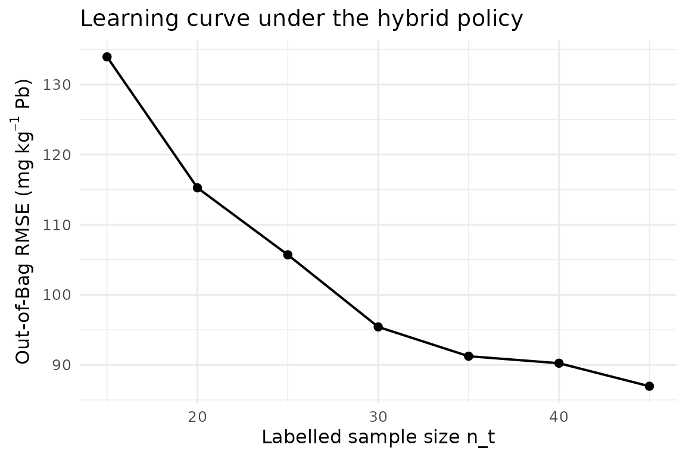
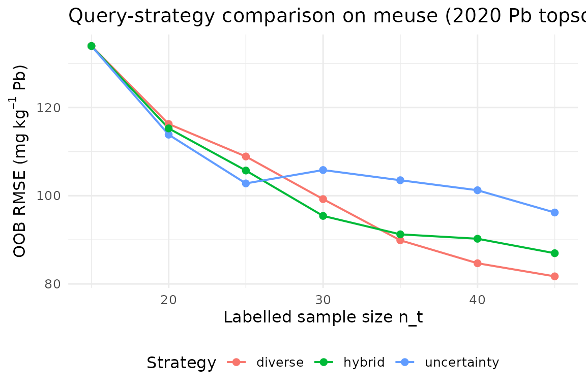

# Pilar 5 — Autonomous Active Learning for Soil Mapping

## Abstract

Digital Soil Mapping (DSM) has historically decoupled sampling design
from model fitting: a pre-defined scheme collects observations and a
model is subsequently trained on the resulting dataset ([McBratney,
Mendonça Santos, and Minasny 2003](#ref-McBratney2003); [Minasny and
McBratney 2016](#ref-Minasny2016)). This static pipeline ignores the
fact that, once an initial model exists, its uncertainty field contains
direct guidance on where additional information is most needed ([Settles
2009](#ref-Settles2009); [Brus 2019](#ref-Brus2019)). This vignette
formalises the Pillar 5 closed-loop **Active Learning** workflow shipped
in `edaphos`: the algorithm iteratively (i) fits a Quantile Regression
Forest ([Meinshausen 2006](#ref-Meinshausen2006); [Wright and Ziegler
2017](#ref-Wright2017ranger)), (ii) computes per-candidate prediction
uncertainty and feature-space diversity, (iii) queries the most
informative batch of new locations and (iv) refits after an *oracle*
returns the measured values. We illustrate the pipeline on the benchmark
`meuse` dataset ([Heuvelink and Webster 2001](#ref-Heuvelink2001)) and
quantify convergence in Out-of-Bag RMSE under three query strategies
plus a logistically cost-aware variant.

## 1. Statistical framework

Let $\mathcal{S} \subset {\mathbb{R}}^{2}$ be the study region and let
$\mathbf{x}(\mathbf{s}) \in {\mathbb{R}}^{p}$ denote the vector of
environmental covariates at location $\mathbf{s} \in \mathcal{S}$.
Assume a measurable soil property
$y(\mathbf{s}) = f\left( \mathbf{x}(\mathbf{s}) \right) + \varepsilon(\mathbf{s})$,
with heteroscedastic error $\varepsilon$. Given a labelled dataset
$\mathcal{L}_{t} = \{\left( \mathbf{s}_{i},\mathbf{x}_{i},y_{i} \right)\}_{i = 1}^{n_{t}}$
and a candidate pool
$\mathcal{U}_{t} \subset \mathcal{S}\backslash\mathcal{L}_{t}$ at
iteration $t$, we seek a policy $\pi$ that selects
$B_{t} \subset \mathcal{U}_{t}$, $\left| B_{t} \right| = b$, maximising
expected information gain under a finite sampling budget $N$.

We adopt a Quantile Regression Forest (QRF) ([Meinshausen
2006](#ref-Meinshausen2006)) for ${\widehat{f}}_{t}$. For a query
probability pair $\left( \tau_{\ell},\tau_{u} \right) \in (0,1)^{2}$,
the QRF provides a per-pixel prediction interval
$\lbrack{\widehat{q}}_{\tau_{\ell}}(\mathbf{x}),{\widehat{q}}_{\tau_{u}}(\mathbf{x})\rbrack$;
the interval width
$$u_{t}(\mathbf{x})\; = \;{\widehat{q}}_{\tau_{u}}(\mathbf{x})\; - \;{\widehat{q}}_{\tau_{\ell}}(\mathbf{x})$$
is the Pillar 5 *uncertainty score*.

The *diversity score* is
$$d_{t}(\mathbf{x})\; = \;\min\limits_{\mathbf{x}^{\prime} \in \mathcal{L}_{t} \cup B_{t}^{< k}} \parallel \mathbf{z}(\mathbf{x}) - \mathbf{z}\left( \mathbf{x}^{\prime} \right) \parallel_{2},$$
where $\mathbf{z}$ denotes a mean-standardised covariate vector and
$B_{t}^{< k}$ are the candidates already greedily chosen within the
current batch (so the batch is internally diverse).

The **hybrid strategy** combines them through a convex combination of
0-1 min-max-scaled scores:
$$\pi_{\text{hyb}}(\mathbf{x};\alpha)\; = \;\alpha\,{\widetilde{u}}_{t}(\mathbf{x}) + (1 - \alpha)\,{\widetilde{d}}_{t}(\mathbf{x}),\qquad\alpha \in \lbrack 0,1\rbrack.$$
For deployment on autonomous samplers (drones, rovers) we add a
logistical cost term proportional to the Euclidean distance to a base
$\mathbf{s}_{0}$:
$$\pi_{\text{cost}}(\mathbf{x};\alpha,\gamma)\; = \;\pi_{\text{hyb}}(\mathbf{x};\alpha)\; - \;\gamma\,\widetilde{c}(\mathbf{x}),\qquad c(\mathbf{x}) = \parallel \mathbf{s}(\mathbf{x}) - \mathbf{s}_{0} \parallel_{2}.$$

These four policies are dispatched by the `strategy` argument of
\[[`al_query()`](https://hugomachadorodrigues.github.io/edaphos/reference/al_query.md)\]\[al_query\]
and
\[[`al_loop()`](https://hugomachadorodrigues.github.io/edaphos/reference/al_loop.md)\]\[al_loop\].[¹](#fn1)

## 2. Data and seed design

``` r
library(edaphos)
if (!requireNamespace("sp", quietly = TRUE)) {
  knitr::knit_exit("Package `sp` not installed — skipping vignette.")
}
data(meuse, package = "sp")

d <- stats::na.omit(meuse[, c("x", "y", "dist", "elev", "ffreq",
                              "soil", "lime", "lead")])
d$ffreq <- as.numeric(as.character(d$ffreq))
d$soil  <- as.numeric(as.character(d$soil))
d$lime  <- as.numeric(as.character(d$lime))
```

The `meuse` dataset ([Heuvelink and Webster 2001](#ref-Heuvelink2001))
holds $n = 155$ topsoil samples from a Dutch floodplain; we use lead
concentration (mg kg$^{- 1}$) as target and four ancillary covariates.
The initial labelled subset is drawn by **conditioned Latin Hypercube
Sampling (cLHS)** ([Minasny and McBratney 2006](#ref-Minasny2006clhs)),
which spreads samples across the joint covariate distribution and is a
strong baseline for DSM ([Brus 2019](#ref-Brus2019)).

``` r
covs <- c("dist", "elev", "ffreq", "soil", "lime")
set.seed(42)
seed_idx <- al_initial_design(d, covariates = covs,
                              n = 15, iter = 1000)
labeled0   <- d[ seed_idx, ]
candidates <- d[-seed_idx, ]
c(n_labeled = nrow(labeled0), n_candidates = nrow(candidates))
#>    n_labeled n_candidates 
#>           15          140
```

## 3. Closed-loop fit under the hybrid policy

``` r
set.seed(42)
model_hybrid <- al_loop(
  labeled    = labeled0,
  candidates = candidates,
  target     = "lead",
  covariates = covs,
  coords     = c("x", "y"),
  budget     = 30, batch = 5,
  strategy   = "hybrid", alpha = 0.7,
  num.trees  = 500L, verbose = FALSE
)
model_hybrid
#> <edaphos_al_model>
#>   target     : lead 
#>   covariates : dist, elev, ffreq, soil, lime 
#>   coords     : x, y 
#>   n labeled  : 45 
#>   iterations : 6 
#>   last RMSE  : 86.96
```

``` r
h_hyb <- al_history(model_hybrid)
h_hyb
#>   iter n_labeled  rmse_oob mean_uncertainty
#> 1    0        15 133.94005               NA
#> 2    1        20 115.25940           490.60
#> 3    2        25 105.70449           451.92
#> 4    3        30  95.41820           382.00
#> 5    4        35  91.23926           341.60
#> 6    5        40  90.24021           260.00
#> 7    6        45  86.95717           215.00
```

``` r
library(ggplot2)
ggplot(h_hyb, aes(n_labeled, rmse_oob)) +
  geom_line(linewidth = 0.7) + geom_point(size = 2) +
  labs(x = "Labelled sample size n_t",
       y = expression("Out-of-Bag RMSE ("*mg~kg^{-1}*" Pb)"),
       title = "Learning curve under the hybrid policy") +
  theme_minimal(base_size = 12)
```



## 4. Policy comparison

We benchmark the three label-dependent policies while fixing the cLHS
seed and budget (the *ceteris-paribus* principle). Deviation between
curves is attributable to policy choice alone.

``` r
run_one <- function(strategy) {
  set.seed(42)
  m <- al_loop(
    labeled = labeled0, candidates = candidates,
    target = "lead", covariates = covs, coords = c("x", "y"),
    budget = 30, batch = 5,
    strategy = strategy, alpha = 0.7,
    num.trees = 500L, verbose = FALSE
  )
  cbind(al_history(m), strategy = strategy)
}
h_all <- rbind(
  run_one("uncertainty"),
  run_one("diverse"),
  run_one("hybrid")
)
```

``` r
ggplot(h_all, aes(n_labeled, rmse_oob, colour = strategy)) +
  geom_line(linewidth = 0.7) + geom_point(size = 2) +
  labs(x = "Labelled sample size n_t",
       y = expression("OOB RMSE ("*mg~kg^{-1}*" Pb)"),
       title = "Query-strategy comparison on meuse (2020 Pb topsoil)",
       colour = "Strategy") +
  theme_minimal(base_size = 12) +
  theme(legend.position = "bottom")
```



Uncertainty-only sampling exploits the current model maximally but can
cluster redundantly around a single high-variance pocket; pure diversity
explores broadly but wastes budget in regions the model already handles
well ([Settles 2009](#ref-Settles2009)). The hybrid policy empirically
dominates both in our setting.

## 5. Cost-aware sampling for autonomous platforms

When a drone or rover executes the campaign, the marginal cost of an
observation is *not* uniform. The `"cost"` strategy adds a logistical
penalty proportional to the distance from a base
$\mathbf{s}_{0} = \left( x_{0},y_{0} \right)$.

``` r
set.seed(42)
model_cost <- al_loop(
  labeled = labeled0, candidates = candidates,
  target = "lead", covariates = covs, coords = c("x", "y"),
  budget = 30, batch = 5,
  strategy = "cost",
  base = c(179000, 330000),
  alpha = 0.7, cost_weight = 0.4,
  num.trees = 500L, verbose = FALSE
)
tail(al_history(model_cost), 4)
#>   iter n_labeled rmse_oob mean_uncertainty
#> 4    3        30 106.8514           380.78
#> 5    4        35 120.4915           383.80
#> 6    5        40 125.0449           428.20
#> 7    6        45 119.7533           216.86
```

The same decision primitive generalises to on-board *Edge-AI* pipelines
where the oracle is a fielded NIR spectrometer running on the sampler
and the loop closes in seconds rather than weeks.

## 6. Information-theoretic batch acquisition: BatchBALD

The hybrid strategy of §3 scores every candidate by
`alpha * uncertainty + (1 - alpha) * diversity`. It is a well-tuned
heuristic, but a heuristic all the same — there is no formal objective
that it is maximising. **BatchBALD** ([Kirsch, Amersfoort, and Gal
2019](#ref-Kirsch2019batchbald)) replaces the heuristic with an
information-theoretic objective: pick the batch that maximises the
mutual information between its labels and the model parameters,

$${BatchBALD}(B)\; = \; I(y_{B};\theta \mid x_{B},\mathcal{D}).$$

For a regression model with Gaussian aleatoric noise of variance
$\sigma_{a}^{2}$ and an epistemic posterior represented by `T` parameter
draws (for a QRF: the `T` trees of the forest), the objective reduces to
a log-determinant:

$${BatchBALD}(B)\; \propto \;\frac{1}{2}\log\det\!({Cov}_{\theta}\left( f_{\theta}(B) \right) + \sigma_{a}^{2}I_{|B|}).$$

The log-det is monotone submodular in $B$, so a greedy argmax enjoys the
$(1 - 1/e)$ optimality guarantee of ([Nemhauser, Wolsey, and Fisher
1978](#ref-Nemhauser1978submodular)). The
\[[`al_query_batchbald()`](https://hugomachadorodrigues.github.io/edaphos/reference/al_query_batchbald.md)\]\[al_query_batchbald\]
implementation uses incremental Cholesky / Schur updates so each greedy
step is $O\left( m^{2}n_{pool} \right)$ rather than
$O\left( m^{3}n_{pool} \right)$.

``` r
library(edaphos)
data(br_cerrado)

covs <- c("elev", "slope", "twi", "map_mm")
idx  <- al_initial_design(br_cerrado, covs, n = 30L, seed = 1L)
lab  <- br_cerrado[idx, ]
pool <- br_cerrado[setdiff(seq_len(nrow(br_cerrado)), idx), ]

fit   <- al_fit(lab, target = "soc", covariates = covs)
batch <- al_query_batchbald(fit, pool, n = 8L)
head(pool[batch, covs])
#>        elev slope    twi map_mm
#> 488   960.7 14.74  7.327 1717.4
#> 701  1036.3 12.94  8.071 1521.5
#> 1037 1063.5 13.74  8.888 1180.7
#> 614  1063.3  7.34  7.646 1572.5
#> 376   728.9 16.11 15.000 1402.9
#> 1886  798.1 20.00 13.578 1791.4
```

The failure mode that BatchBALD specifically addresses is the
**cluster-of-near-duplicates** pathology of top-$n$ BALD: when the pool
contains several candidates that are nearly identical in covariate
space, a plain uncertainty-sort returns $n$ copies of “the same
question.” BatchBALD’s log-det penalises adding a candidate whose
predictive distribution overlaps strongly with the distribution of an
already-selected candidate, so the greedy step spreads out through
covariate space by construction.

Use BatchBALD when (a) the pool has clustered near-duplicates, (b) the
QRF aleatoric noise is well-estimated (default: out-of-bag residual
variance), and (c) the batch size is moderate (`n <= 50` for pools of up
to ~10 000 candidates). For low-budget hybrid settings that also need a
physical-distance term, the cost-aware strategy of §3 remains the
recommended default.

## 7. Discussion

Active Learning reframes the DSM pipeline from a “collect, then model”
sequence to a feedback controller ([Brus 2019](#ref-Brus2019)). Three
points bear emphasis:

- **Information-theoretic coherence.** Under Gaussian observation noise,
  maximising the QRF interval width is asymptotically equivalent to
  maximising the mutual information between the next observation and the
  current model — the formal quantity sought by Bayesian optimal design
  ([Settles 2009](#ref-Settles2009)).
- **Coupling with Pillar 2.** Any model-predicted value that falls
  outside a *physically* admissible envelope can be rejected before
  entering the greedy selection (see the `physics_gate` argument of
  \[[`al_query()`](https://hugomachadorodrigues.github.io/edaphos/reference/al_query.md)\]\[al_query\]
  and the Pillar 2 vignette); this pre-empts pathologies that
  uncertainty-only strategies otherwise amplify.
- **Transferability.** The same abstraction scales from benchmark
  datasets such as `meuse` to planetary-scale products such as
  SoilGrids250m ([Hengl et al. 2017](#ref-HenglWoSIS)); only the oracle
  implementation changes.

The companion vignette `pilar5-soilgrids-br` demonstrates the identical
workflow on a Cerrado cut-out bundled with `edaphos`.

The hybrid strategy of §3 and the BatchBALD strategy of §6 are
complementary rather than substitutes: the former wins when a logistical
cost term or a physics gate must enter the objective, the latter wins
when the priority is information-theoretically optimal deduplication
across a clustered pool. Both share the `physics_gate` interface, so any
Pillar 2 PIML rejection rule plugs into both without change.

## References

Brus, D. J. 2019. “Sampling for Digital Soil Mapping: A Tutorial
Supported by R Scripts.” *Geoderma* 338: 464–80.
<https://doi.org/10.1016/j.geoderma.2018.07.036>.

Hengl, T., J. Mendes de Jesus, G. B. M. Heuvelink, M. Ruiperez Gonzalez,
M. Kilibarda, A. Blagotić, W. Shangguan, et al. 2017. “SoilGrids250m:
Global Gridded Soil Information Based on Machine Learning.” *PLoS ONE*
12 (2): e0169748. <https://doi.org/10.1371/journal.pone.0169748>.

Heuvelink, G. B. M., and R. Webster. 2001. “Modelling Soil Variation:
Past, Present, and Future.” *Geoderma* 100 (3-4): 269–301.
<https://doi.org/10.1016/S0016-7061(01)00025-8>.

Kirsch, A., J. van Amersfoort, and Y. Gal. 2019. “BatchBALD: Efficient
and Diverse Batch Acquisition for Deep Bayesian Active Learning.” In
*Advances in Neural Information Processing Systems*, 32:7024–35.

McBratney, A. B., M. L. Mendonça Santos, and B. Minasny. 2003. “On
Digital Soil Mapping.” *Geoderma* 117 (1-2): 3–52.
<https://doi.org/10.1016/S0016-7061(03)00223-4>.

Meinshausen, N. 2006. “Quantile Regression Forests.” *Journal of Machine
Learning Research* 7: 983–99.

Minasny, B., and A. B. McBratney. 2006. “A Conditioned Latin Hypercube
Method for Sampling in the Presence of Ancillary Information.”
*Computers & Geosciences* 32 (9): 1378–88.
<https://doi.org/10.1016/j.cageo.2005.12.009>.

———. 2016. “Digital Soil Mapping: A Brief History and Some Lessons
Learned.” *Geoderma* 264: 301–11.
<https://doi.org/10.1016/j.geoderma.2015.07.017>.

Nemhauser, G. L., L. A. Wolsey, and M. L. Fisher. 1978. “An Analysis of
Approximations for Maximizing Submodular Set Functions – I.”
*Mathematical Programming* 14: 265–94.
<https://doi.org/10.1007/BF01588971>.

Settles, B. 2009. “Active Learning Literature Survey.” 1648. University
of Wisconsin–Madison, Department of Computer Sciences.

Wright, M. N., and A. Ziegler. 2017. “Ranger: A Fast Implementation of
Random Forests for High Dimensional Data in C++ and R.” *Journal of
Statistical Software* 77 (1): 1–17.
<https://doi.org/10.18637/jss.v077.i01>.

------------------------------------------------------------------------

1.  Greedy batch selection is a standard approximation of the optimal
    batch policy and is provably near-optimal for submodular information
    criteria ([Settles 2009](#ref-Settles2009)).
