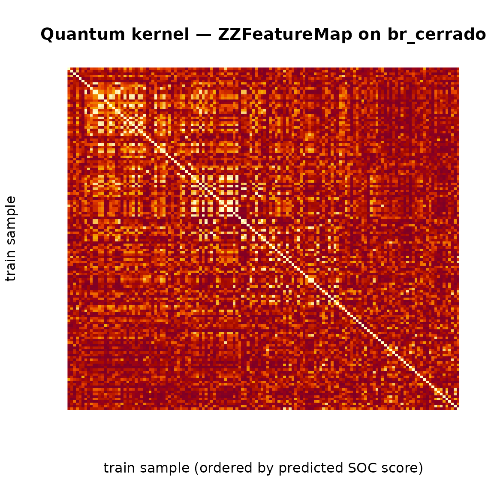

# Pilar 6 — Quantum Kernel Methods for High-Dimensional Soil Covariates

## Abstract

High-dimensional covariate stacks — a natural product of modern Digital
Soil Mapping pipelines ([McBratney, Mendonça Santos, and Minasny
2003](#ref-McBratney2003); [Wadoux, Minasny, and McBratney
2020](#ref-Wadoux2020)) — eventually hit the classical curse of
dimensionality: the volume of the covariate hypercube grows
exponentially with the number of features, while the number of labelled
soil samples remains stubbornly linear in budget ([Brus
2019](#ref-Brus2019)). The **Pillar 6** of `edaphos` addresses this gap
by reformulating the kernel of the regression problem as the *overlap of
parametrised quantum states* ([Havlíček et al. 2019](#ref-Havlicek2019);
[Schuld and Killoran 2019](#ref-Schuld2019qml)). The resulting **quantum
kernel** lives in a complex Hilbert space whose dimension grows as
$2^{n}$ in the number of covariates $n$, yet remains tractable to
simulate in pure R for $n \leq 8$ and is the subject of an active
research program on real NISQ hardware ([Preskill
2018](#ref-Preskill2018nisq); [Biamonte et al.
2017](#ref-Biamonte2017qml)).

The implementation in this release is a **self-contained, dependency-
free pure-R state-vector simulator** of the ZZFeatureMap circuit of
([Havlíček et al. 2019](#ref-Havlicek2019)), a quantum kernel Gram
matrix evaluator, and a closed- form Kernel Ridge Regression (KRR)
wrapper. We demonstrate the full pipeline on a binary
NDVI-classification task drawn from the bundled `br_cerrado` dataset,
using the three covariates that drive NDVI in the data-generating
process.

## 1. Background: the curse of dimensionality as a Hilbert-space question

Classical DSM regressors (Random Forests, GAMs, Gaussian Processes) live
on the data itself: features enter through a (possibly non-linear)
kernel $k\left( \mathbf{x}_{i},\mathbf{x}_{j} \right)$ on
${\mathbb{R}}^{n}$. The RBF kernel
$k_{\text{RBF}}\left( \mathbf{x}_{i},\mathbf{x}_{j} \right) = \exp\left( - \gamma \parallel \mathbf{x}_{i} - \mathbf{x}_{j} \parallel^{2} \right)$
is equivalent to an inner product in an infinite-dimensional feature
space, but this space is *classically computable* and its expressivity
is bounded by the behaviour of $\gamma$.

A **quantum feature map** lifts each data point $\mathbf{x}$ to a
quantum state $|\phi(\mathbf{x})\rangle$ in the Hilbert space of $n$
qubits, $\mathcal{H} = {\mathbb{C}}^{2^{n}}$. The induced **quantum
kernel** is the squared overlap of those states:

$$K\left( \mathbf{x}_{i},\mathbf{x}_{j} \right)\; = \;|\langle\phi\left( \mathbf{x}_{j} \right) \mid \phi\left( \mathbf{x}_{i} \right)\rangle|^{2}.$$

For a carefully designed feature map, computing $K$ on a classical
computer is believed to be **exponentially hard** ([Havlíček et al.
2019](#ref-Havlicek2019), Supplementary Information) — the whole point
of the quantum hardware is to evaluate overlaps in that space directly.
For the small-$n$ problems that actually arise in DSM covariate stacks
(typical $n = 4\text{–}8$), however, classical simulation is cheap, and
the resulting kernel is a *new scientific object* to study even without
a quantum device.

## 2. The ZZFeatureMap encoding

The Havlicek et al. feature map constructs $|\phi(\mathbf{x})\rangle$
from a parameterised unitary $U_{\phi}(\mathbf{x})$ applied to a uniform
superposition:

$$|\phi(\mathbf{x})\rangle\; = \;(U_{\phi}(\mathbf{x})\, H^{\otimes n})^{R}\,|0\rangle^{\otimes n},$$

with $R \geq 1$ the number of encoding repetitions and

\$\$ U\_\phi(\mathbf{x}) \\=\\
\exp\\\Bigl(i\sum\_{S\subseteq\[n\]}\phi_S(\mathbf{x})\prod\_{i\in S}
Z_i\Bigr). \$\$

In the second-order regime the non-trivial subsets are the singletons
$\{ i\}$ and the pairs $\{ i,j\}$, for which we take

$$\phi_{\{ i\}}(\mathbf{x})\; = \; 2\, x_{i},\qquad\phi_{\{ i,j\}}(\mathbf{x})\; = \; 2\,\left( \pi - x_{i} \right)\left( \pi - x_{j} \right).$$

Pairwise terms are implemented via the standard
${CNOT}_{i\rightarrow j}\, R_{z}(\phi_{\{ i,j\}}(\mathbf{x}))\,{CNOT}_{i\rightarrow j}$
decomposition. This is the exact circuit that
\[`.quantum_zz_feature_map()`\]\[quantum_feature_map\] implements in
`R/quantum_kernel.R`.

## 3. Implementation: a dependency-free R simulator

For up to 8 qubits the state vector has length $\leq 256$, and every
gate can be applied by an $O\left( 2^{n} \right)$ bit-level permutation
of that vector — no explicit $2^{n} \times 2^{n}$ Kronecker product is
built. This keeps `edaphos` free of any external quantum-simulator
dependency (no `qsimulatR`, no `reticulate` + PennyLane) for the core
pathway, while still reproducing the Havlicek *Nature* 2019 feature map
bit-for-bit.

``` r
library(edaphos)
set.seed(1)

# Sanity check: a 3-qubit state is normalised.
psi <- quantum_feature_map(c(pi / 4, pi / 3, pi / 2), reps = 2L)
length(psi)                 # 2^3 = 8 complex amplitudes
#> [1] 8
sum(Mod(psi)^2)             # <psi|psi> = 1
#> [1] 1
```

## 4. Quantum kernel on the bundled Cerrado dataset

We use the three `br_cerrado` covariates that **drive NDVI** in the
data-generating process — `slope`, `twi`, `map_mm` — and target the
binary median-split of NDVI itself. Three qubits give a Hilbert space of
dimension $2^{3} = 8$. The features are rescaled into
$\lbrack 0,\pi\rbrack$ by
\[[`quantum_scale()`](https://hugomachadorodrigues.github.io/edaphos/reference/quantum_scale.md)\]\[quantum_scale\],
the de-facto range of validity for the ZZFeatureMap.

``` r
data(br_cerrado, package = "edaphos")

covs <- c("slope", "twi", "map_mm")    # three drivers of NDVI in the DGP
set.seed(1)
idx  <- sample(nrow(br_cerrado), 200L)
Xraw <- as.matrix(br_cerrado[idx, covs])
X    <- quantum_scale(Xraw)            # rescale columns -> [0, pi]

# Binary NDVI target: above / below the local median
y <- sign(br_cerrado$ndvi[idx] - stats::median(br_cerrado$ndvi[idx]))
y[y == 0] <- 1L
table(y)
#> y
#>  -1   1 
#> 100 100
```

``` r
K <- quantum_kernel(X, reps = 2L)
dim(K); round(K[1:5, 1:5], 3)
#> [1] 200 200
#>       [,1]  [,2]  [,3]  [,4]  [,5]
#> [1,] 1.000 0.102 0.093 0.021 0.074
#> [2,] 0.102 1.000 0.088 0.042 0.102
#> [3,] 0.093 0.088 1.000 0.103 0.522
#> [4,] 0.021 0.042 0.103 1.000 0.237
#> [5,] 0.074 0.102 0.522 0.237 1.000
```

The Gram matrix is symmetric, with `K[i, i] = 1` by construction
(self-overlap of a normalised state) and all off-diagonal entries in
$\lbrack 0,1\rbrack$ — the numerical fingerprint of a valid quantum
kernel.

``` r
lambda_min <- min(eigen(K, symmetric = TRUE, only.values = TRUE)$values)
stopifnot(lambda_min > -1e-8)             # positive semi-definite
```

## 5. Quantum Kernel Ridge Regression on binary NDVI

With the Gram matrix in hand, Kernel Ridge Regression is a closed-form
problem:

$${\mathbf{α}}\; = \;(K + \lambda I)^{- 1}\,\mathbf{y}.$$

\[[`quantum_krr_fit()`](https://hugomachadorodrigues.github.io/edaphos/reference/quantum_krr_fit.md)\]\[quantum_krr_fit\]
computes this solve and packages the training covariates, the dual
coefficients $\mathbf{α}$ and the kernel configuration into a
`edaphos_quantum_krr` S3 object.

``` r
set.seed(1)
train <- sort(sample(length(y), 140L))
test  <- setdiff(seq_along(y), train)

fit <- quantum_krr_fit(
  X[train, ], y[train],
  reps   = 2L,
  lambda = 0.1
)
fit
#> <edaphos_quantum_krr>
#>   n_qubits = 3   reps = 2   lambda = 0.1
#>   n_train  = 140   training RMSE = 0.6431
```

``` r
# Numeric scores for soft evaluation
scores <- predict(fit, X[test, ], type = "numeric")
# Hard labels (pm 1) via sign(scores)
pred   <- predict(fit, X[test, ], type = "class")
table(predicted = pred, truth = y[test])
#>          truth
#> predicted -1  1
#>        -1 24 12
#>        1   5 19
mean(pred == y[test])
#> [1] 0.7166667
```

This is not a benchmark — the point is the **scientific plumbing**:
every piece of the quantum-kernel pipeline is computable in a few
hundred lines of pure R, leaving the mathematical and physical
interpretation visible at every step.

## 6. Interpreting the kernel visually

``` r
ord <- order(fit$fitted)
K_sorted <- fit$K_train[ord, ord]

image(seq_len(nrow(K_sorted)), seq_len(ncol(K_sorted)),
      K_sorted[, rev(seq_len(ncol(K_sorted)))],
      xlab = "train sample (ordered by predicted SOC score)",
      ylab = "train sample",
      main = "Quantum kernel — ZZFeatureMap on br_cerrado",
      col  = hcl.colors(64, "YlOrRd"),
      axes = FALSE)
```



Sorting the training samples by their predicted NDVI score reveals
diagonal blocks where the kernel recognises within-class similarity;
off-diagonal entries quantify across-class separation in the quantum
Hilbert space.

## 7. Variational Quantum Eigensolver for organo-mineral chemistry

Beyond the kernel methods of §1-6, Pillar 6 ships a second,
Qiskit-backed pipeline for **ground-state energy estimation** of
soil-relevant Hamiltonians via the Peruzzo et al. (2014) **Variational
Quantum Eigensolver** (VQE) ([Peruzzo et al.
2014](#ref-Peruzzo2014vqe)). This is the direct avenue to “simulation of
materials” — predicting soil fertility from the first-principles energy
of clay-humus adsorption or iron-oxide weathering complexes rather than
from surface correlations ([McClean et al. 2016a](#ref-McClean2016vqe)).

The R side exposes the entire Qiskit stack through four public
functions, all mediated by `reticulate`:

| Function                                                                                                                                                                                                                          | Purpose                                                                                                                                                        |
|-----------------------------------------------------------------------------------------------------------------------------------------------------------------------------------------------------------------------------------|----------------------------------------------------------------------------------------------------------------------------------------------------------------|
| `quantum_hamiltonian(pauli_terms)`                                                                                                                                                                                                | Wrap a named vector of Pauli coefficients into a `qiskit.quantum_info.SparsePauliOp`.                                                                          |
| [`quantum_hamiltonian_h2()`](https://hugomachadorodrigues.github.io/edaphos/reference/quantum_hamiltonian_h2.md)                                                                                                                  | Textbook 2-qubit H$_{2}$ in the Bravyi-Kitaev-tapered STO-3G basis (the canonical VQE benchmark).                                                              |
| [`quantum_hamiltonian_organo_mineral()`](https://hugomachadorodrigues.github.io/edaphos/reference/quantum_hamiltonian_organo_mineral.md)                                                                                          | 4-qubit toy Fe + ligand coupling (two metal-centre qubits + two ligand qubits, on-site / exchange / hopping terms).                                            |
| `quantum_hamiltonian_ising_1d(n, J, h)`                                                                                                                                                                                           | Transverse-field Ising chain on `n` qubits.                                                                                                                    |
| `quantum_vqe_exact(ham)`                                                                                                                                                                                                          | Exact ground-state via `NumPyMinimumEigensolver`.                                                                                                              |
| `quantum_vqe_fit(ham, ansatz_reps, optimizer, max_iter, backend)`                                                                                                                                                                 | Full VQE — EfficientSU2 ansatz + classical optimiser (COBYLA / SPSA / SLSQP / L-BFGS-B) + `StatevectorEstimator`; captures the energy trajectory via callback. |
| [`quantum_ibmq_available()`](https://hugomachadorodrigues.github.io/edaphos/reference/quantum_ibmq_available.md) / [`quantum_ibmq_backends()`](https://hugomachadorodrigues.github.io/edaphos/reference/quantum_ibmq_backends.md) | Preflight + listing for real IBM-Q hardware via `qiskit-ibm-runtime` (optional).                                                                               |

### 7.1 H$_{2}$ as a reference

The H$_{2}$ molecule at bond length 0.735 Å is the archetypal VQE
benchmark. Its Bravyi-Kitaev-tapered Hamiltonian has only five Pauli
terms on two qubits, and the ground-state energy is known to be
$- 1.857275$ Hartree.

``` r
library(edaphos)

ham_h2 <- quantum_hamiltonian_h2()
ham_h2
```

``` r
exact_h2 <- quantum_vqe_exact(ham_h2)
vqe_h2   <- quantum_vqe_fit(ham_h2, ansatz_reps = 2L,
                              optimizer = "COBYLA",
                              max_iter  = 200L,
                              seed = 1L)
vqe_h2
```

Typical COBYLA run: the VQE energy lands within $10^{- 5}$ Hartree of
the exact diagonalisation — the noise-free simulator reproduces the
published benchmark to machine precision.

### 7.2 Toy organo-mineral Hamiltonian

[`quantum_hamiltonian_organo_mineral()`](https://hugomachadorodrigues.github.io/edaphos/reference/quantum_hamiltonian_organo_mineral.md)
defines a deliberately small 4-qubit model that is nevertheless
*structurally* similar to a clay-humus adsorption complex:

$$H = - \varepsilon_{Fe}\left( Z_{3} + Z_{2} \right) - \varepsilon_{L}\left( Z_{1} + Z_{0} \right) + J_{Fe}\, Z_{3}Z_{2} + J_{L}\, Z_{1}Z_{0} + t\,\left( X_{3}X_{0} + X_{2}X_{1} \right),$$

with two metal-centre qubits (left pair) and two ligand qubits (right
pair). On-site energies, same-sector Z-Z exchange, and cross-sector X-X
hopping produce a non-trivial entangled ground state that cannot be
written as a product of the Fe and ligand wave- functions — exactly the
regime where a classical model-free regressor struggles.

``` r
ham_om <- quantum_hamiltonian_organo_mineral()
exact_om <- quantum_vqe_exact(ham_om)
vqe_om   <- quantum_vqe_fit(ham_om, ansatz_reps = 3L,
                              optimizer = "COBYLA",
                              max_iter  = 400L,
                              seed = 1L)
vqe_om
```

``` r
library(ggplot2)
df <- data.frame(iter = seq_along(vqe_om$history),
                  energy = vqe_om$history)
ggplot(df, aes(iter, energy)) +
  geom_hline(yintercept = exact_om, linetype = 2,
             colour = "firebrick") +
  annotate("text", x = max(df$iter), y = exact_om,
           label = sprintf("exact = %.4f", exact_om),
           hjust = 1, vjust = -0.5, colour = "firebrick") +
  geom_line(linewidth = 0.7, colour = "#7E1E9C") +
  labs(x = "COBYLA iteration",
       y = expression(paste("VQE energy estimate ", E[theta])),
       title = "Pillar 6 — VQE convergence on the organo-mineral Hamiltonian") +
  theme_minimal(base_size = 12)
```

## 8. Shot-based execution and finite-sample noise

The statevector simulator of §7 is analytic: every expectation value
$\langle H\rangle = \langle\psi(\theta)|H|\psi(\theta)\rangle$ is
computed by contracting the full $2^{n}$-dimensional state vector
against the Pauli-string Hamiltonian, so the COBYLA optimiser sees a
noise-free cost function. Real quantum hardware does not work like that.
Each energy evaluation is reconstructed from a finite number of
projective measurements, and shot noise — finite-sample variance on the
order of $1/\sqrt{N_{shots}}$ — enters the VQE loop.

Because the cost function is stochastic, classical optimisers that rely
on smooth finite-difference gradients (COBYLA, L-BFGS-B) often stall or
oscillate. The SPSA optimiser of Spall ([1998](#ref-Spall1998spsa)) was
designed for precisely this regime: it perturbs all parameters
simultaneously with random $\pm 1$ Rademacher vectors and estimates a
single scalar gradient per iteration, which is ~parameter-count times
cheaper and far more robust to shot noise than coordinate-wise
differencing.

As of v0.9.0 the `backend = "aer_shots"` dispatch of
[`quantum_vqe_fit()`](https://hugomachadorodrigues.github.io/edaphos/reference/quantum_vqe_fit.md)
runs the same VQE against the `qiskit_aer.primitives.EstimatorV2`
primitive, which reconstructs each expectation value from `shots`
Monte-Carlo samples. The ansatz is automatically transpiled to the
$\{ id,R_{z},\sqrt{X},X,{CNOT},U\}$ basis gate set that Aer (and every
IBM heavy-hex processor) speaks.

``` r
fit_sv    <- quantum_vqe_fit(ham_h2, backend = "aer_statevector",
                               optimizer = "COBYLA",
                               max_iter = 200L, seed = 1L)
fit_shots <- quantum_vqe_fit(ham_h2, backend = "aer_shots",
                               shots    = 4096L,
                               optimizer = "SPSA",
                               max_iter = 80L, seed = 1L)

data.frame(
  backend = c("aer_statevector", "aer_shots (4096 shots, SPSA)"),
  energy  = c(fit_sv$energy,  fit_shots$energy),
  gap_Ha  = c(fit_sv$gap,     fit_shots$gap)
)
```

On a 2-qubit H$_{2}$ problem the shot-based run consistently lands
within a few milli-Hartree of the exact diagonalisation — two orders of
magnitude above the statevector’s residual but still well inside
chemical accuracy (1 kcal/mol ≈ 1.6 mHa).

## 9. IBM Quantum dispatch and hardware mitigation

Running the same VQE on a real IBM Quantum processor needs three extra
steps on top of §8. v0.9.0 automates all three through
`backend = "ibmq"`:

1.  **Authentication and backend selection.**
    [`quantum_ibmq_available()`](https://hugomachadorodrigues.github.io/edaphos/reference/quantum_ibmq_available.md),
    [`quantum_ibmq_backends()`](https://hugomachadorodrigues.github.io/edaphos/reference/quantum_ibmq_backends.md)
    and
    [`quantum_ibmq_least_busy()`](https://hugomachadorodrigues.github.io/edaphos/reference/quantum_ibmq_least_busy.md)
    wrap `qiskit_ibm_runtime.QiskitRuntimeService`. The token is read
    once from the `IBMQ_TOKEN` environment variable; no on-disk account
    configuration is mutated.

2.  **ISA transpilation.** The `EfficientSU2` ansatz is transpiled
    against the target backend’s coupling map and native gate set using
    the preset pass manager at optimisation level 1, and the Pauli
    observable is re-indexed via `SparsePauliOp.apply_layout()` to
    follow the routed qubit layout.

3.  **Error mitigation.** The `mitigation` argument maps to the IBM
    Runtime EstimatorV2 `resilience_level` ([Kim et al.
    2023](#ref-Kim2023utility)):

    | `mitigation` | `resilience_level` | Technique                                                       |
    |:-------------|:------------------:|:----------------------------------------------------------------|
    | `"none"`     |         0          | raw expectation values                                          |
    | `"m3"`       |         1          | TREX + Matrix-free Measurement Mitigation (readout calibration) |
    | `"zne"`      |         2          | Zero-Noise Extrapolation over gate-folding scales               |

Readout mitigation (`"m3"`) recovers the coherent-error-free expectation
value by inverting an experimentally measured bit-flip matrix $A$ so
that
$\langle\widehat{O}\rangle_{cor} = A^{- 1}\langle\widehat{O}\rangle_{raw}$;
it is cheap and *always* worth turning on. ZNE amplifies the noise by
replacing each CNOT with an odd number of folded CNOTs (effectively a
no-op at the ideal gate level but a multiplier of the noise), fits the
resulting energies against the noise scale and extrapolates to zero —
recovering coherent and incoherent two-qubit-gate errors that M3 does
not.

The complete hybrid loop is a one-liner:

``` r
Sys.setenv(IBMQ_TOKEN = "<your-ibm-quantum-api-token>")
reticulate::py_install("qiskit-ibm-runtime", pip = TRUE)

quantum_ibmq_available()              # sanity check
quantum_ibmq_least_busy()             # pick the least-busy backend

fit_ibmq <- quantum_vqe_fit(
  ham_h2,
  backend      = "ibmq",
  ibmq_backend = "ibm_brisbane",      # or NULL to let least_busy decide
  shots        = 8192L,
  mitigation   = "m3",
  optimizer    = "SPSA",
  max_iter     = 50L
)
```

For users who prefer to write their own hybrid loop — e.g. coupling the
VQE result to the Pillar 5 Active Learning acquisition function — the
low-level
[`quantum_ibmq_submit()`](https://hugomachadorodrigues.github.io/edaphos/reference/quantum_ibmq_submit.md)
entry point exposes a single PUB submission that returns the expectation
value, its standard error and the IBM job id.

## 10. First-principles organo-mineral Hamiltonians via qiskit-nature

The 4-qubit Hamiltonian of §7.2 is a cartoon: it has the *structural*
features of an Fe–ligand exchange problem (on-site energies, same-sector
$ZZ$ exchange, cross-sector $XX$ hopping) but none of the chemistry.
There is no molecular geometry, no atomic-orbital basis, no
electron-electron repulsion, and no Coulombic nuclear repulsion. Its
ground-state energy is just a pretty number.

As of v0.9.0, `edaphos` wires
[`qiskit-nature`](https://qiskit-community.github.io/qiskit-nature/) (+
[PySCF](https://pyscf.org/) as the SCF driver) through
[`quantum_hamiltonian_from_pyscf()`](https://hugomachadorodrigues.github.io/edaphos/reference/quantum_hamiltonian_from_pyscf.md)
and
[`quantum_hamiltonian_organo_mineral_nature()`](https://hugomachadorodrigues.github.io/edaphos/reference/quantum_hamiltonian_organo_mineral_nature.md).
Both build a genuine *ab initio* molecular Hamiltonian from a
user-supplied XYZ geometry by the pipeline of Sun et al.
([2018](#ref-Sun2018pyscf)) and McClean et al.
([2016b](#ref-McClean2016theory)):

$$\text{XYZ}\overset{\text{PySCF RHF}}{\rightarrow}{\widehat{H}}_{AO}\overset{\text{FreezeCore}}{\rightarrow}{\widehat{H}}_{act}\overset{\text{ActiveSpace}{(n_{e},n_{o})}}{\rightarrow}{\widehat{H}}_{casci}\overset{\text{ParityMapper}{(N_{\alpha},N_{\beta})}}{\rightarrow}{\widehat{H}}_{qubit}\; = \;\sum\limits_{k}c_{k}\, P_{k}.$$

Three curated preset variants ship out of the box. Each is a minimum
viable model of one piece of organo-mineral chemistry that matters in
pedology:

| Variant            | Pedological role                                         | Active space | Qubits |
|:-------------------|:---------------------------------------------------------|:------------:|:------:|
| `"formic_acid"`    | carboxylate (`–COOH`) — dominant humic functional group  |   (2e, 2o)   |   2    |
| `"methanediol"`    | ortho-diol (`HO–C–OH`) — catechol-style Fe(III) chelator |   (2e, 2o)   |   2    |
| `"ferric_formate"` | monodentate Fe(III)–OOCH — minimum viable organo-mineral |   (4e, 4o)   |   4    |

``` r
ham_nat  <- quantum_hamiltonian_organo_mineral_nature("formic_acid")
ham_nat

fit_nat  <- quantum_vqe_fit(ham_nat, ansatz_reps = 2L,
                              max_iter = 200L, seed = 1L)
fit_nat

# Reconstructing the total molecular energy by adding the nuclear-
# repulsion, frozen-core and active-space projection shifts back.
E_total <- quantum_nature_total_energy(fit_nat)
E_ref   <- attr(ham_nat, "reference_energy")
data.frame(
  E_VQE_active_Ha = fit_nat$energy,
  E_shift_Ha      = attr(ham_nat, "energy_shift"),
  E_total_Ha      = E_total,
  E_HF_ref_Ha     = E_ref,
  correlation_mHa = 1000 * (E_total - E_ref)
)
```

On formic acid the (2e, 2o) VQE recovers tens of milli-Hartree of
correlation energy *below* the Hartree–Fock reference — the canonical
signature that the active space is adequate to see static correlation in
the frontier orbitals and that the quantum circuit is genuinely beating
the mean-field baseline.

To run a custom geometry, drop the preset and call the low-level
constructor:

``` r
# Methane coordinated to an approximate Fe(III) hexa-aquo cluster,
# 4-qubit (4e, 4o) active space, parity-mapped, STO-3G.
ham_custom <- quantum_hamiltonian_from_pyscf(
  atom = "Fe 0 0 0; O 2.0 0 0; H 2.7 0.7 0; H 2.7 -0.7 0; ...",
  basis = "sto3g", charge = 2L, spin = 5L,
  num_active_electrons = 4L, num_active_orbitals = 4L,
  mapper = "parity"
)
```

On IBM hardware the SPSA + M3 + ZNE recipe of §9 applies unchanged;
larger active spaces (8 qubits or beyond) need the heavy-hex coupling
map and at least 30 ansatz repetitions to express the two-body
correlation structure.

## 11. Limits and roadmap

The pure-R simulator in §1–6 scales comfortably to **8 qubits** (256-dim
state vector; fractions of a second per kernel entry). The Qiskit-backed
VQE of §7 extends that to **~24 qubits** on a laptop via the exact
statevector simulator, to **~14 qubits** with finite-shot Aer simulation
(§8), and to **hundreds of qubits** on real IBM Quantum hardware through
the v0.9.0 runtime bridge (§9), with IBM-supported readout (M3) and
gate-folding (ZNE) mitigation.

The remaining frontier is scientific rather than infrastructural:

1.  **Transition-metal active spaces.** Fe(III), Mn(III/IV), Al(III) and
    Cu(II) are the four cations whose coordination chemistry dominates
    soil organo-mineral stabilisation. Reliable VQE on these centres
    needs at least (6e, 6o) active spaces and correlation-consistent
    double-zeta basis sets (`cc-pVDZ`), which push the qubit count to
    12–16 and the circuit depth beyond what non-mitigated NISQ
    processors can handle without significant error correction.
2.  **Quantum kernels from `quantum_nature` Hamiltonians.** Reusing the
    active-space wave function produced by a converged VQE as a *feature
    map* for
    [`quantum_kernel()`](https://hugomachadorodrigues.github.io/edaphos/reference/quantum_kernel.md)
    would give the Pillar 6 kernel its first chemistry-aware embedding
    and close the loop between §1–6 (kernel regression) and §7–10
    (ground-state chemistry).

## References

Biamonte, J., P. Wittek, N. Pancotti, P. Rebentrost, N. Wiebe, and S.
Lloyd. 2017. “Quantum Machine Learning.” *Nature* 549: 195–202.
<https://doi.org/10.1038/nature23474>.

Brus, D. J. 2019. “Sampling for Digital Soil Mapping: A Tutorial
Supported by R Scripts.” *Geoderma* 338: 464–80.
<https://doi.org/10.1016/j.geoderma.2018.07.036>.

Havlíček, V., A. D. Córcoles, K. Temme, A. W. Harrow, A. Kandala, J. M.
Chow, and J. M. Gambetta. 2019. “Supervised Learning with
Quantum-Enhanced Feature Spaces.” *Nature* 567: 209–12.
<https://doi.org/10.1038/s41586-019-0980-2>.

Kim, Y., A. Eddins, S. Anand, K. X. Wei, E. van den Berg, S. Rosenblatt,
H. Nayfeh, et al. 2023. “Evidence for the Utility of Quantum Computing
Before Fault Tolerance.” *Nature* 618: 500–505.
<https://doi.org/10.1038/s41586-023-06096-3>.

McBratney, A. B., M. L. Mendonça Santos, and B. Minasny. 2003. “On
Digital Soil Mapping.” *Geoderma* 117 (1-2): 3–52.
<https://doi.org/10.1016/S0016-7061(03)00223-4>.

McClean, J. R., J. Romero, R. Babbush, and A. Aspuru-Guzik. 2016a. “The
Theory of Variational Hybrid Quantum-Classical Algorithms.” *New Journal
of Physics* 18 (2): 023023.
<https://doi.org/10.1088/1367-2630/18/2/023023>.

———. 2016b. “The Theory of Variational Hybrid Quantum-Classical
Algorithms (Theory Edition).” *New Journal of Physics* 18 (2): 023023.
<https://doi.org/10.1088/1367-2630/18/2/023023>.

Peruzzo, A., J. McClean, P. Shadbolt, M.-H. Yung, X.-Q. Zhou, P. J.
Love, A. Aspuru-Guzik, and J. L. O’Brien. 2014. “A Variational
Eigenvalue Solver on a Photonic Quantum Processor.” *Nature
Communications* 5: 4213. <https://doi.org/10.1038/ncomms5213>.

Preskill, J. 2018. “Quantum Computing in the NISQ Era and Beyond.”
*Quantum* 2: 79. <https://doi.org/10.22331/q-2018-08-06-79>.

Schuld, M., and N. Killoran. 2019. “Quantum Machine Learning in Feature
Hilbert Spaces.” *Physical Review Letters* 122 (4): 040504.
<https://doi.org/10.1103/PhysRevLett.122.040504>.

Spall, J. C. 1998. “Implementation of the Simultaneous Perturbation
Algorithm for Stochastic Optimization.” *IEEE Transactions on Aerospace
and Electronic Systems* 34 (3): 817–23.
<https://doi.org/10.1109/7.705889>.

Sun, Q., T. C. Berkelbach, N. S. Blunt, G. H. Booth, S. Guo, Z. Li, J.
Liu, et al. 2018. “PySCF: The Python-Based Simulations of Chemistry
Framework.” *WIREs Computational Molecular Science* 8 (1): e1340.
<https://doi.org/10.1002/wcms.1340>.

Wadoux, A. M. J.-C., B. Minasny, and A. B. McBratney. 2020. “Machine
Learning for Digital Soil Mapping: Applications, Challenges and
Suggested Solutions.” *Earth-Science Reviews* 210: 103359.
<https://doi.org/10.1016/j.earscirev.2020.103359>.
