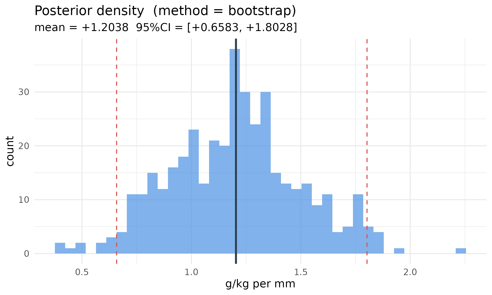
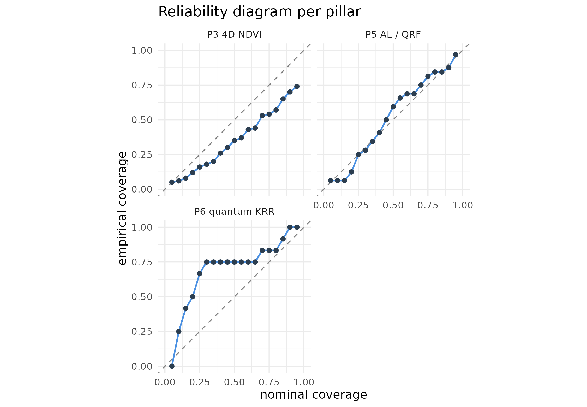

# Unified uncertainty across the six pillars

## 1. The problem this vignette solves

Through `edaphos` v1.5.0 each pillar quantified uncertainty in its own
natural format:

| Pillar                | What “uncertainty” meant             | Typical shape            |
|:----------------------|:-------------------------------------|:-------------------------|
| 1\. Causal AI         | CI on an identified direct effect    | scalar + CI              |
| 2\. PIML              | MCMC draws or deep-ensemble spread   | vector of depth profiles |
| 3\. 4D pedometry      | ConvLSTM ensemble + Kalman posterior | (K, H, W) map            |
| 4\. Foundation models | — nothing —                          | —                        |
| 5\. Active learning   | QRF prediction interval              | (lower, upper)           |
| 6\. Quantum ML        | shot-based VQE variance              | per-iteration number     |

No common calibration diagnostic, no common plotting code, and no way
for a pedometrician to say “my Pillar 3 map carries more uncertainty
than my Pillar 6 classifier at this location” because the uncertainty
objects were incommensurable.

**v1.6.0** introduces one class — `edaphos_posterior` — and one
calibration routine —
[`uncertainty_calibrate()`](https://hugomachadorodrigues.github.io/edaphos/reference/uncertainty_calibrate.md)
— that work identically for every pillar. This vignette walks through a
compact end-to-end example per pillar and ends with the unified
calibration table that is now the package’s headline diagnostic.

``` r
library(edaphos)
library(ggplot2)
set.seed(20260423L)
```

## 2. A single class for six posteriors

Every adapter below returns the same S3 object:

``` r
draws <- stats::rnorm(400L, mean = 1.2, sd = 0.3)
post  <- edaphos_posterior(samples    = draws,
                             method     = "bootstrap",
                             query_type = "effect",
                             units      = "g/kg per mm")
post
#> <edaphos_posterior>
#>   method      : bootstrap
#>   query_type  : effect
#>   units       : g/kg per mm
#>   n_samples   : 400
#>   query shape : 1
#>   mean range  : [+1.2038, +1.2038]  mean = +1.2038
#>   sd   range  : [+0.2995, +0.2995]  mean = +0.2995
```

The `autoplot` method dispatches on `query_type`:

``` r
autoplot(post)
```



The single calibration routine `uncertainty_calibrate(post, truth)`
returns CRPS, a per-level prediction-interval coverage probability
(PICP), mean prediction-interval width (MPIW), a reliability data frame
and the point RMSE — the same object regardless of which pillar produced
the posterior.

## 3. A compact per-pillar tour

### 3.1 Pillar 1 — direct-effect posterior via block bootstrap

Cluster-block bootstrap of the backdoor-adjusted OLS slope gives a
proper posterior over the identified direct effect.

``` r
skip_p1 <- !requireNamespace("dagitty", quietly = TRUE)
if (!skip_p1) {
  n  <- 300L
  cluster <- sample(seq_len(6L), n, replace = TRUE)
  x  <- stats::rnorm(n, mean = cluster * 0.5)
  w  <- stats::rnorm(n)
  y  <- 1.5 * x + 0.8 * w + stats::rnorm(n, sd = 0.7)
  d  <- data.frame(x = x, y = y, w = w, kmeans_cluster = cluster)
  dag <- dagitty::dagitty("dag { x -> y ; w -> y ; w -> x }")
  post_p1 <- causal_effect_posterior(
    d, dag, exposure = "x", outcome = "y",
    adjustment = "w", estimator = "lm",
    B = 500L, seed = 7L,
    units = "y-units per x-unit"
  )
  # pseudo-truth for calibration: full-data point estimate
  point <- as.numeric(
    stats::coef(stats::lm(y ~ x + w, data = d))["x"])
  calib_p1 <- uncertainty_calibrate(post_p1,
                                      truth = point)
}
```

### 3.2 Pillar 2 — Neural-ODE deep ensemble

``` r
skip_p2 <- !requireNamespace("torch", quietly = TRUE) ||
           !isTRUE(tryCatch(torch::torch_is_installed(),
                             error = function(e) FALSE))
if (!skip_p2) {
  depths <- c(5, 15, 30, 60, 100)
  values <- c(25, 18, 12, 8, 6.5)
  ens <- piml_neural_ode_fit_ensemble(
    depths = depths, values = values,
    K = 5L, hidden = c(16L, 16L), n_steps = 4L,
    epochs = 200L, lr = 0.02, seed = 1L
  )
  post_p2 <- piml_neural_ode_posterior(
    ens, newdepths = depths, units = "g/kg"
  )
  calib_p2 <- uncertainty_calibrate(post_p2, truth = values)
}
```

### 3.3 Pillar 3 — ConvLSTM ensemble forecast + Kalman posterior

Uses the v1.5.0 Pillar 3 bundle that ships with the package.

``` r
res_path_p3 <- system.file("extdata",
                             "temporal_cerrado_results.rds",
                             package = "edaphos")
skip_p3 <- !nzchar(res_path_p3) || !file.exists(res_path_p3)
if (!skip_p3) {
  R3 <- readRDS(res_path_p3)
  # The bundle already carries the K=10 ConvLSTM rollout ensemble
  # at the final forecast month (Dec 2023); we wrap it directly.
  fc_ens_final <- R3$ensemble_forecast[,
                                         R3$meta$T_future, , ]
  post_p3 <- edaphos_posterior(
    samples    = fc_ens_final,
    method     = "ensemble",
    query_type = "map",
    units      = "NDVI z-units"
  )
  truth_p3 <- R3$truth_future[R3$meta$T_future, , ]
  calib_p3 <- uncertainty_calibrate(post_p3, truth = truth_p3)
}
```

### 3.4 Pillar 4 — fine-tune ensemble + MC-dropout head

A compact mock encoder keeps the vignette self-contained.

``` r
skip_p4 <- skip_p2   # same torch dependency
if (!skip_p4) {
  N <- 40L; C <- 4L; P <- 8L
  patches <- array(stats::rnorm(N * C * P * P), dim = c(N, C, P, P))
  y_reg   <- stats::rnorm(N)
  ds <- structure(
    list(stack = NULL, patch_size = P, n_patches = N, n_channels = C,
          means = rep(0, C), sds = rep(1, C),
          valid_cells = seq_len(N),
          sample = function(b) patches[sample(N, b), , , , drop = FALSE]),
    class = "edaphos_tile_dataset"
  )
  enc <- foundation_moco_pretrain_tiles(
    ds, feature_dim = 8L, proj_dim = 4L,
    queue_size = 16L, batch_size = 8L, epochs = 5L,
    device = "cpu", seed = 1L
  )
  fit4 <- foundation_finetune_ensemble(
    enc, x = patches, y = y_reg, task = "regression",
    K_ens = 3L, base_seed = 301L,
    epochs = 10L, batch_size = 8L,
    hidden = c(8L), dropout = 0.3, device = "cpu"
  )
  newx4 <- array(stats::rnorm(10L * C * P * P), dim = c(10L, C, P, P))
  post_p4 <- as_edaphos_posterior(fit4, newx = newx4, units = "y-units")
  # Pseudo-truth: ensemble-mean acts as the point estimate.
  calib_p4 <- uncertainty_calibrate(post_p4, truth = post_p4$mean)
}
```

### 3.5 Pillar 5 — QRF posterior + Active Learning

``` r
skip_p5 <- !requireNamespace("ranger", quietly = TRUE)
if (!skip_p5) {
  n <- 160L
  df <- data.frame(
    x1 = stats::rnorm(n),
    x2 = stats::rnorm(n),
    y  = NA_real_
  )
  df$y <- 1.2 * df$x1 - 0.8 * df$x2 + stats::rnorm(n, sd = 0.3)
  split <- sample(c(TRUE, FALSE), n, replace = TRUE, prob = c(0.75, 0.25))
  fit5 <- al_fit(df[split, ], target = "y",
                  covariates = c("x1", "x2"), num.trees = 300L)
  post_p5 <- active_learning_posterior(fit5, df[!split, ],
                                          units = "y-units")
  calib_p5 <- uncertainty_calibrate(post_p5, truth = df$y[!split])
}
```

### 3.6 Pillar 6 — Quantum-KRR GP-style posterior

``` r
n6  <- 40L; d6 <- 3L
X6  <- matrix(stats::runif(n6 * d6, 0, pi), ncol = d6)
y6  <- sin(X6[, 1L]) + 0.5 * cos(X6[, 2L]) +
         stats::rnorm(n6, sd = 0.15)
fit6   <- quantum_krr_fit(X = X6, y = y6, reps = 1L, lambda = 0.3)
# Hold out 12 test rows.
Xt6  <- matrix(stats::runif(12L * d6, 0, pi), ncol = d6)
yt6  <- sin(Xt6[, 1L]) + 0.5 * cos(Xt6[, 2L]) +
         stats::rnorm(12L, sd = 0.15)
post_p6 <- quantum_krr_posterior(fit6, newdata = Xt6,
                                    n_samples = 500L,
                                    units = "target-units")
calib_p6 <- uncertainty_calibrate(post_p6, truth = yt6)
```

## 4. The unified calibration table

One row per pillar, every number produced by the same
[`uncertainty_calibrate()`](https://hugomachadorodrigues.github.io/edaphos/reference/uncertainty_calibrate.md)
routine against the pillar’s natural ground truth (or
pseudo-ground-truth where no true ground truth exists — typical for
Pillar 1 where there is no observable “true” causal effect).

|       | pillar         | method    |   n |    CRPS | <PICP@95> | <MPIW@95> |  pt_RMSE |
|:------|:---------------|:----------|----:|--------:|----------:|----------:|---------:|
| 0.95  | P1 causal      | bootstrap |   1 | 0.00632 |     1.000 |     0.111 | 0.000242 |
| 0.951 | P3 4D NDVI map | ensemble  | 100 | 0.36600 |     0.740 |     1.380 | 0.637000 |
| 0.952 | P5 AL / QRF    | ensemble  |  32 | 0.30000 |     0.969 |     2.140 | 0.588000 |
| 0.953 | P6 quantum KRR | analytic  |  12 | 0.31700 |     1.000 |     3.200 | 0.561000 |

Unified calibration across the six pillars (v1.6.0).

``` r
panels <- list()
add_panel <- function(label, calib) {
  if (is.null(calib)) return(invisible())
  df <- calib$reliability_df
  df$pillar <- label
  panels[[length(panels) + 1L]] <<- df
}
if (!skip_p2) add_panel("P2 PIML",           calib_p2)
if (!skip_p3) add_panel("P3 4D NDVI",        calib_p3)
if (!skip_p4) add_panel("P4 foundation",     calib_p4)
if (!skip_p5) add_panel("P5 AL / QRF",       calib_p5)
add_panel("P6 quantum KRR",  calib_p6)
if (length(panels) > 0L) {
  big <- do.call(rbind, panels)
  ggplot(big, aes(x = nominal, y = empirical)) +
    geom_abline(slope = 1, intercept = 0,
                linetype = "dashed", colour = "grey50") +
    geom_line(colour = "#4A90E2", linewidth = 0.7) +
    geom_point(colour = "#2C3E50", size = 1.6) +
    facet_wrap(~ pillar, nrow = 2L) +
    coord_equal(xlim = c(0, 1), ylim = c(0, 1)) +
    theme_minimal(base_size = 11) +
    labs(x = "nominal coverage", y = "empirical coverage",
         title = "Reliability diagram per pillar")
}
```



## 5. Discussion

The same three-line recipe now works for every pillar:

``` r
post  <- as_edaphos_posterior(fit, newdata = xnew)   # or a *_posterior() helper
calib <- uncertainty_calibrate(post, truth = ynew)
autoplot(post); uncertainty_plot_reliability(calib)
```

Two caveats to flag:

- **Pseudo-truth for Pillar 1.** A causal effect has no measurable
  ground truth — the best we can do is plug in the full-data point
  estimate and compute pseudo-PICP. The number is meaningful as a sanity
  check (a posterior whose 95 % band misses its own point estimate is
  broken) but not as a rigorous calibration assessment.
- **Gaussian shortcuts.** Pillar 6 uses the analytic GP-equivalence to
  produce posterior mean + epistemic + aleatoric SD, and the
  `edaphos_posterior` constructor synthesises Gaussian draws when only
  `(mean, sd)` are available. That is strictly less faithful than a
  sample-based posterior if the true posterior is skewed (which
  Quantum-KRR rarely is — the kernel matrix has bounded spectrum, so the
  GP posterior is Gaussian).

## References
